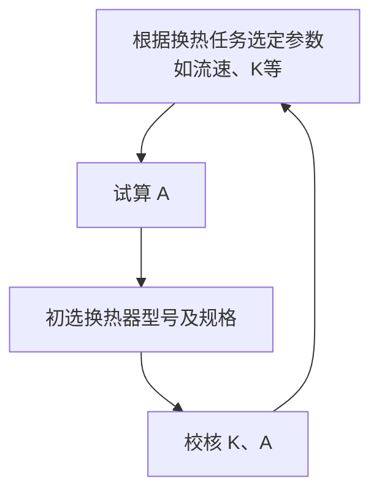

### 第一节 概述
传热有三种基本方式
- 热传导（导热）：相互接触物质间、静止物质内部、层流流动的物质内部
	- 机理：气体靠分子或原子的无规则若运动；固体金属靠自由电子，非金属靠晶格的震动；液体有两种观点（见教材）
- 对流传热：自然对流（流体内部）、强制对流（流体有宏观位移）
- 辐射传热：靠电磁波传热
### 第二节 热传导
#### 傅立叶定律
**传热速率**$Q \quad [\pu{J/s}]$：单位时间传递的热量
**热通量**$\displaystyle{ \vec{q}=\dfrac{ \text{d} Q }{ \text{d} \vec{A} } \quad [\pu{J/m2.s}] }$：单位传热面积上的传热速率，方向为传热面的法线方向
**等温面**：温度相同的点组成的面
**温度变化率** $\displaystyle{\frac{\Delta t}{\Delta l}}$：两等温面的温差与两等温面间的任一距离之比
**温度梯度** $\displaystyle{\lim_{ \Delta n \to 0 } \frac{\Delta t}{\Delta n}=\dfrac{ \partial t }{ \partial \vec{n} } }$：两等温面的温差与两等温面间的法向距离之比，垂直于等温面，以温度升高的方向为正方向
**傅立叶定律**
$$\vec{q}=\dfrac{ \text{d} Q }{ \text{d} \vec{A} } =-\lambda \dfrac{ \partial t }{ \partial \vec{n} } $$
其中$\lambda  \quad [\pu{W/m.K}]$称**导热系数**，为物质本身性质；负号表示$q$与温度梯度方向相反。
#### 热导率
代表单位温度梯度下的热通量大小，故物质的$\lambda$越大，导热性能越好。
一般地，导电固体>非导电固体，液体>气体
$\lambda$与物质的种类与浓度有关，与温度$T$有关，一般与压强$P$无关。
温度升高：
- 气体热导率增加
- 水和甘油热导率增加，其他液体下降
- 金属固体热导率下降，非金属固体热导率上升
#### 一维平壁稳态热传导
##### 无限大单层平壁稳态导热（无内热源）
一维导热，传热面积$A$为常数，传热速率、热通量$Q,q$为常数，则
$$Q=qA=-\lambda A \dfrac{ \partial t }{ \partial n } =-\lambda A\dfrac{ \text{d} t }{ \text{d} x } =Const.$$
若$\lambda$为常数，则
$$\dfrac{ \text{d} t }{ \text{d} x } =Const.=\frac{t_{2}-t_{1}}{b}$$
其中$t_{2}-t_{1}$为距离$b$两点的温差。因此，有$Q$表达式
$$Q=qA= \frac{t_{1}-t_{2}}{b/\lambda A}=\frac{\text{推动力(温差)}}{\text{热阻}}$$
##### 无限大多层平壁稳态导热（无内热源）
与单层平壁相同，且通过每一层的$Q,q$都相同，因此对每一层都有
$$Q=qA= \frac{t_{i}-t_{i+1}}{b_{i}/\lambda _{i}A}\xlongequal[]{ 和比定理 } \frac{t_{1}-t_{n+1}}{\sum _{i=1}^{n}b_{i}/\lambda _{i}A}=\frac{\text{总推动力(温差)}}{\text{总热阻}}$$

> [!hint] 导热和导电类比
> 温差类似于电压，热阻$b_{i}/\lambda _{i}A$类似于电阻，传热速率类似于电流，即两者之比。
> 对多层平壁，类似于电阻串联，总热阻等于各热阻之和，总温差等于各温差之和。

进一步考虑平壁低温端与环境进行对流传热（第三节详细展开）：
设环境温度为$t_{0}$，对流传热系数为$\alpha$，有**牛顿冷却定律**
$$Q=\alpha A(t_{1}-t_{2})$$
因此，对流传热热阻为$\displaystyle{\frac{\Delta t}{Q}=\frac{1}{\alpha A}}$，故传热量为
$$Q= \frac{t_{1}-t_{n+1}}{\sum _{i=1}^{n}b_{i}/\lambda _{i}A} + \frac{t_{n+1}-t_{0}}{1/\alpha A}\xlongequal[]{ 和比定理 }\frac{t_{1}-t_{0}}{\sum _{i=1}^{n} \dfrac{b_{i}}{\lambda _{i}A}+ \dfrac{1}{\alpha A}}$$
#### 一维圆筒壁稳态热传导
##### 无限长单层圆筒壁稳态导热（无内热源）
属一维导热，$A\neq$常数，$Q$为常数，$q\neq$常数
$$\left.\begin{aligned}Q=qA=-\lambda A\dfrac{ \text{d} t }{ \text{d} r } =Const.\\A=2\pi rL\end{aligned}\right\}\implies  \text{d}t= -\frac{Q}{2\pi rL\lambda}\text{d}r$$
其中$r$为传热点距圆筒轴距离（半径），$L$为圆筒长。
若$\lambda$为常数，在$(t_{1},t_{2})$区间积分得
$$t_{2}-t_{1}=\int _{t_{1}}^{t_{2}}\text{d}t= -\frac{Q}{2\pi L\lambda}\int _{r_{1}}^{r_{2}} \frac{\text{d}r}{r}=-\frac{Q(\ln r_{2}-\ln r_{1})}{2\pi L\lambda}$$
变形即有
$$Q=\dfrac{t_{1}-t_{2}}{\dfrac{\ln r_{2}/r_{1}}{2\pi L\lambda}}= \frac{推动力}{热阻}$$
引入**对数平均半径** $\displaystyle{r_{m}= \frac{r_{2}-r_{1}}{\ln r_{2}-\ln r_{1}}}$，则有原式变形得
$$Q=\frac{t_{1}-t_{2}}{b/2\pi L\lambda r_{m}}=\frac{t_{1}-t_{2}}{b/\lambda A_{m}}$$
表达式与平壁稳态热传导相同。

> [!quote] 对数平均半径
> 在$r_{2}/r_{1}=0.5-2$下，对数平均半径可用算术平均半径代替。
> $$\begin{aligned}\frac{r_{m}}{\bar{r}}&=\frac{r_{1}-r_{2}}{\ln r_{1}/r_{2}}{\huge/} \frac{r_{1}+r_{2}}{2}\\&\xlongequal[]{\varepsilon=r_{1}/r_{2}-1} \frac{2\varepsilon}{(2+\varepsilon)\ln (1+\varepsilon)} \\&\xlongequal[]{ \varepsilon\to  0 } \frac{2\varepsilon}{(2+\varepsilon)\left( \varepsilon-\dfrac{\varepsilon^{2}}{2} +o(\varepsilon^{2})\right)} \approx 1\end{aligned}$$
##### 无限长多层圆筒壁稳态导热（无内热源）
与单层圆筒壁相同，且通过每一层的$Q,q$都相同，因此对每一层都有
$$Q=qA= \frac{t_{i}-t_{i+1}}{b_{i}/\lambda_{i} A_{m_{i}}} \xlongequal[]{ 和比定理 } \frac{t_{1}-t_{n+1}}{\sum _{i=1}^{n}b_{i}/\lambda _{i}A_{m_{i}}}=\frac{\text{总推动力(温差)}}{\text{总热阻}}$$

> [!quote] e.g.1 降温添衣，保暖性好的衣服穿在里面好，还是穿在外面好？
> 将问题简化成无限长多层圆筒壁稳态导热模型，两圆筒厚度分别为$b_{1},b_{2}$，导热系数分别为$\lambda_{1},\lambda_{2}$，$\lambda_{1}<\lambda_{2}$，显然$\lambda_{1}$代表保暖性更好的衣服。
> 
> 比较$\lambda_{1}$在内和$\lambda_{2}$在内的两种情形的传热量，温差相同，比较热阻。
> $$R_{1}=\dfrac{\ln r_{2}/r_{1}}{2\pi L\lambda_{1}}+\dfrac{\ln r_{3}/r_{2}}{2\pi L\lambda_{2}},\quad R_{2}=\dfrac{\ln r_{2}'/r_{1}}{2\pi L\lambda_{2}}+\dfrac{\ln r_{3}/r_{2}'}{2\pi L\lambda_{1}}$$
> 作差比较大小
> $$R_{1}-R_{2}=\frac{1}{2\pi L\lambda_{1}}\ln \frac{r_{2}r_{2}'}{r_{1}r_{3}}+\frac{1}{2\pi L\lambda_{2}}\ln \frac{r_{1}r_{3}}{r_{2}r_{2}'}=\frac{\lambda_{2}-\lambda_{1}}{2\pi L\lambda_{1}\lambda_{2}} \ln\frac{r_{2}r_{2}'}{r_{1}r_{3}}$$
> 前面部分大于零，下分析对数部分
> $$\frac{r_{2}r_{2}'}{r_{1}r_{3}}=\frac{(r_{1}+b_{1})(r_{3}-b_{1})}{r_{1}r_{3}}=1+ \frac{b_{1}(r_{3}-r_{1}-b_{1})}{r_{1}r_{3}}=1+\frac{b_{1}b_{2}}{r_{1}r_{3}}>1$$
> 因此$\displaystyle{\ln\frac{r_{2}r_{2}'}{r_{1}r_{3}}>0}$，则有$R_{1}>R_{2},\quad Q_{1}<Q_{2}$。目标为保暖，即传热量要尽量小，因此保暖性好的衣服应该穿在里面。

> [!quote] e.g.2 考虑对流传热，圆管保温层越厚，保温效果越好吗？
> 对圆管，其总传热量为
> $$Q= \frac{总推动力}{总热阻} = \frac{t_{1}-t_{0}}{\dfrac{\ln r_{2}/r_{1}}{2\pi r\lambda}+ \dfrac{1}{2\pi Lr_{2}\alpha}}$$
> 考察传热量与圆管保温层厚度的关系，则求$Q$对$r_{2}$的导数
> $$\begin{aligned}\dfrac{ \text{d} Q }{ \text{d} r_{2} }&=2\pi L\lambda \alpha(t_{1}-t_{0})\frac{\text{d}}{\text{d}r_{2}} \left[  \frac{r_{2}}{\lambda+\alpha r_{2}\ln {r_{2}}/{r_{1}}} \right] \\  &=2\pi L\lambda \alpha(t_{1}-t_{0}) \frac{\lambda+\alpha r_{2}\ln {r_{2}}/{r_{1}}-r_{2}(\alpha \ln r_{2}/r_{1}+\alpha )}{\left( \lambda+\alpha r_{2}\ln {r_{2}}/{r_{1}} \right)^{2} } \\& =2\pi L\lambda \alpha(t_{1}-t_{0}) \frac{\lambda-\alpha r_{2}}{\left( \lambda+\alpha r_{2}\ln {r_{2}}/{r_{1}} \right)^{2}}\end{aligned}$$
> 由于$r_{2}>r_{1}>0$，因此导数为0的唯一解为$\displaystyle{r_{2}=\frac{\lambda}{\alpha}}$，称为**临界半径**$r_{c}$，对应$Q$的唯一极大值。因此，在临界半径时保温效果最好，此后反而会下降。
> 

若两固体之间未紧密接触，会产生额外的**接触热阻**，其影响因素包括：
- 接触材料的种类及硬度
- 接触面的粗糙程度
- 接触面的压紧力
- 空隙内的流体性质
接触热阻一般通过实验测定或凭经验估计。
### 第三节 对流传热
$$对流传热\begin{cases}\text{无相变} &\begin{cases}\text{强制对流传热} &\begin{cases}\text{内部流动} \\\text{外部流动}\end{cases} \\\text{自然对流传热} &\begin{cases}\text{大空间自然对流} \\\text{有限空间自然对流}\end{cases} \\\text{混合对流传热}\end{cases} \\\text{有相变} &\begin{cases}\text{沸腾传热} &\begin{cases}\text{大容器沸腾} \\\text{管内沸腾}\end{cases} \\\text{冷凝传热} &\begin{cases}\text{管外冷凝} \\\text{管内冷凝}\end{cases}\end{cases}\end{cases}$$
前已提及**牛顿冷却定律**
$$Q=\alpha A(t-t_{w})= \frac{t-t_{w}}{1/\alpha A}=\frac{\text{推动力(温差)}}{\text{对流热阻}}$$
其中$\alpha  \quad [\pu{W/m2.K}]$称**对流传热系数**，其不是物性，受多种因素影响。

$\alpha$获得的主要方法：
- 理论分析法：建立**理论方程式**，用数学分析的方法求出精确解或数值解。这种方法目前只适用于一些几何条件简单的几个传热过程，如管内层流、平板上层流等。
- 实验方法：用**因次分析法**、 再结合实验， 建立经验关系式。
#### 实验法求$\alpha$
影响对流传热系数 $\alpha$ 的主要因素
1.  **引起流动的原因**：自然对流和强制对流
2.  **流动型态**：层流或湍流
3.  **流体的性质**：$\rho$ (密度)、$\mu$ (粘度)、$c_p$ (比热容)、$\lambda$ (导热系数) 等
4.  **传热面的形状、大小、位置**：如圆管/平板、垂直/水平、管内/管外 ($l$: 特征长度)
5.  **有相变与无相变**：$c_p$ 或汽化潜热 $r$

由此列出$\alpha$的关系式
$$\alpha = f(\rho, \mu, c_p \text{ 或 } r, \lambda, l, u \text{ 或 } \beta \Delta t g)$$
其中**流速**$u$用于强制对流，**浮升力**$\beta \Delta t g$用于自然对流，反映流体因温度差引起密度变化而产生浮力的影响。

由$\pi$定理，变量数为7，基本因次数为4，因此无因次数群个数为$7 - 4 = 3$，有
$$\alpha=ku^{a}L^{b}(g\beta\Delta t)^{c}\mu^{d}\lambda^{e}\rho^{f}c_{p}^{h}$$
最终得到3个无因次数群:
- **努塞尔数** $\displaystyle{Nu=\frac{\alpha l}{\lambda}=\frac{l}{\lambda}{\huge{/}} \frac{1}{\alpha}}$：表示导热热阻和对流热阻之比
- **普朗特数** $\displaystyle{Pr=\frac{c_{p}\mu}{\lambda}}$：反映物性的影响，一般气体$Pr<1$，液体$Pr>1$
- **雷诺数** $\displaystyle{Re=\frac{\rho ul}{\mu}}$：表示惯性力与黏性力之比
	- 或**格拉晓夫数** $\displaystyle{Gr=\frac{\beta\Delta tgl^{3}\rho^{2}}{\mu^{2}}}$：代表升浮力的影响，相当于强制湍流的雷诺数

因此有 $\displaystyle{Nu=f(Re\text{或}Gr,Pr)}$。

**定性温度**：用于物性计算的温度，有两种
- **主体平均温度**：进口温度和出口温度的平均值
- **膜温**：管壁温度和主体温度的平均值
#### 各种情形下的经验式
##### 无相变
###### 管内层流
流体在圆形直管中层流，若传热不影响速度分布，则热量完全依靠导热。实际情况下，由于流体内部存在温差，必然存在自然对流给热。

在管径小和温差不大的情况下，即$Gr<25000$，自然对流的影响可以忽略，有
$$Nu=1.86\left( Re\cdot Pr\cdot \frac{d}{l} \right)^{1/3} \left( \frac{\mu}{\mu _{w}} \right)^{0.14}$$
适用范围：管进口段，$0.6<Pr<6700$，$Re<2300$， $RePr \dfrac{d}{l}>10$。

$Gr>25000$时，不能忽略自然对流的影响，原式要乘上一个校正因子$f_{1}$
$$f_{1}=0.8(1+0.015Gr^{1/3})$$
上式中，除$\mu _{w}$按壁温取值外，定性温度为流体进出口的算术平均值，定型尺寸取管内径。

###### 管内湍流
$$Nu=0.023Re^{0.8}Pr^{n}\begin{cases}n=0.4&液体被加热,气体\\n=0.3&液体被冷却\end{cases}$$
适用范围：$Re>10000$，$0.6<Pr<160$，充分发展段，即管长和管径之比$L/d>50$，低粘度，$\mu<2\mu _{水}$，且温差$t_{w}-t$较小。
- 将$Nu,Re$表达式代入，即有$\alpha \propto \dfrac{u^{0.8}}{d^{0.2}}$
- 对主体温度相同的同一种液体，加热时其在邻近管壁处温度较高、黏度较小，因而层流底层较薄，$\alpha$较大，因此$n=0.4$；
- 冷却时，其在壁面附近温度较低，黏度较大，层流底层较厚，因此$\alpha$较小，$n=0.3$；
- 对气体，$Pr$中的黏度和热导率均随温度升高而增加，总体不随温度变化，$n=0.4$。

不满足适用范围时，需要修正：
- $L/d<50$时，需要考虑**短管效应**（管内未充分发展，层流底层较薄，热阻较小），乘上一个大于1的校正系数
- 若壁面和流体主体**温差较大**，须加入一包括壁温下黏度的校正项 $$Nu=0.027 Re^{0.8} Pr^{0.33} \left( \frac{\mu}{\mu _{w}} \right)^{0.14}$$其中$\mu _{w}$取壁温下液体黏度，其余均按定性温度计算。由于取壁温会使计算复杂化，工程上$\displaystyle{\left( \frac{\mu}{\mu _{w}} \right)^{0.14}}$加热时取1.05，冷却时取0.95。
- $Re=2000-10000$时，为**过渡流区**，乘上一个校正因子
$$f_{2}= 1- \frac{6\times 10^{5}}{Re^{1.8}}$$
- 若流体在**弯管内流动**，离心力造成二次环流使扰动加剧，乘上一个校正因子
$$\alpha'=\left( 1+ \frac{1.77d}{R} \right) \alpha$$
- 若为**非圆形管中的强制湍流**，上各式仍适用，但需将管内径$d$改成当量直径$d_{e}$
$$d_{e}= \frac{4\times 管道截面积}{润湿周边}$$
###### 管外强制对流
流体在单根圆管外以垂直于该管的方向流过时，其前半周和后半周的情况并不相同，因此其局部给热系数$\alpha$也处处不同，其分布关系到管壁圆周上温度分布。
对于高温流体中换热管，确定**最高局部温度**有较大的实际意义；但在一般换热器计算中，需要的是沿整个管周的**平均给热系数**。

在换热器计算中，大量遇到的又是流体横向流过管束的换热器。此时，由于管与管间的相互影响，流动与给热要比流体垂直流过单根管外时复杂。管束的排列分**直列**和**错列**两种。
流体在**管束外横向流过**的给热系数
$$Nu=C_{1}C_{2}Re^{n}Pr^{0.4}$$

对于常用的列管式换热器，其壳体为圆筒，故各排管数不同，且大多装有折流挡板，液体绕过折流挡板时变更流向为顺着管外方向流动。由于流向和流速均不断变化，$Re>100$时即达到湍流。当$Re=2\times 10^{3}-2\times 10^{6}$时，有
$$Nu=0.36 Re^{0.55}Pr^{1/3}\left( \frac{\mu}{\mu _{w}} \right)^{0.14}$$
其中定性温度取流体温度平均值，$\mu _{w}$指壁温下流体黏度，由于取壁温会使计算复杂化，工程上$\displaystyle{\left( \frac{\mu}{\mu _{w}} \right)^{0.14}}$加热时取1.05，冷却时取0.95。
###### 自然对流
大空间（边界层不受干扰）中流体自然对流时，特征数在一定范围内满足
$$Nu=C(Pr\cdot Gr)^{n} \iff \alpha=C \frac{\lambda}{l} \left( \frac{\rho^{2}g\beta\Delta tl^{3}}{\mu^{2}}\cdot \frac{c_{p}\mu}{\lambda} \right)^{n}$$
其中特征长度$L$对竖板或竖管取其数值高度，水平管取其外径$d$；$\Delta t$取壁面温度与流体主体温度之差；定性温度为壁面和流体平均温度；$C,n$为经验常数。
##### 有相变$\displaystyle{ \begin{cases}冷凝\\沸腾\end{cases} }$
###### 冷凝传热
当纯的饱和蒸气与低于饱和温度的壁面相接触时，蒸气将放出潜热并冷凝成液体。
- 若冷凝液能润湿壁面，并形成一层完整的液膜向下流动，则称为**膜状冷凝**；
- 若冷凝壁面上存在一层油类物质或蒸气中混有油脂，冷凝液不能润湿壁面，结成滴状小液珠，逐渐长大，最终从壁面落下，重又露出冷凝面，则称为**滴状冷凝**。
由于膜状冷凝时壁面上始终覆盖着一层液膜，形成壁面和冷凝蒸气间的主要传热阻力，故滴状冷凝给热系数比膜状冷凝要大几倍到十几倍。
两种方式的冷凝通常同时存在，但工业中大多以膜状冷凝为主，下面仅讨论膜状冷凝。

**竖直壁面**：先层流，后湍流
- **层流**：冷凝液在重力作用下沿壁面向下流动，同时由于蒸气冷凝，新的冷凝液不断加入，故使液膜厚度从上至下不断增加，蒸气所放出的潜热通过冷凝液膜传到壁面。
	- 水平单管与理论公式符合得很好，若垂直壁面总高度为$H$，平均给热系数为
$$\alpha= \frac{4}{3}\left( \frac{r\rho^{2}g\lambda^{3}}{4\mu H\Delta t} \right) ^{1/4}=0.943\left( \frac{r\rho^{2}g\lambda^{3}}{\mu H\Delta t} \right) ^{1/4}$$
	- 对垂直板和垂直管，推导假定不能完全保证，需要进行修正 
$$\alpha= 1.13\left( \frac{r\rho^{2}g\lambda^{3}}{\mu H\Delta t} \right) ^{1/4}$$
- **湍流**：若壁面较长，热通量较大，离壁顶端一定距离处冷凝液积累，转变为湍流。
	- $Re>1800$时，有
$$\alpha ^{*}=\alpha \left( \frac{\mu^{2}}{\rho^{2}g\lambda^{3}} \right) ^{1/3}=0.0077Re^{0.4}$$

**水平圆管外**：蒸气膜状冷凝时的给热系数
$$\alpha= 0.725\times  \left( \frac{r\rho^{2}g\lambda^{3}}{\mu d_{0}\Delta t} \right) ^{1/4}$$
对于垂直方向上由多根管子组成的管束，在各管上跨过液层的温差相同的条件下，假定上排管流下的冷凝液是平稳地流到下排管而使液膜增厚，则从上至下各排的$\alpha$逐渐减小（冷凝膜逐渐增厚）直到基本稳定，只需**将定型尺寸由$d_{0}$改成$nd_{0}$** 得出管束的平均给热系数。

膜状冷凝传热的强化：
- 减薄冷凝液液膜厚度； 
- 选择正确的蒸汽流动方向；
- 在传热面上垂直方向上刻槽或安装若干条金属丝等；
- 用过热蒸汽；
- 及时排放不凝性气体。
###### 沸腾传热
工业上液体沸腾可分为两种情况，本章主要讨论**大容积沸腾**的情况。
- 一种是将加热面浸于相对静止且容积远大于加热体尺寸的液层中，液体在加热面外的**大容积内沸腾**，液体的运动只是由于自然对流和气泡扰动所引起；
- 另一种是液体在管内流动的同时在管内壁发生的沸腾，称为**管内沸腾**。这时在加热面上产生的气泡不能自由浮升，而是被迫与液体一起流动，出现复杂的气-液两相流动状态，其传热机理较大容积沸腾更为复杂。

产生沸腾现象的必要条件：**液体过热**、**有汽化核心**

**沸腾传热机理**：气泡的不断形成、长大、脱离壁面，热量随气泡被带入液体内部，同时引起液体的搅动。

大面积沸腾传热的沸腾曲线：
- 常压下，给热温差（壁温与水饱和温度间温差$\Delta t=t_{w}-t_{s}$）较小时，只在加热面少量汽化核心上形成气泡且气泡的长大速率很慢，边界层受到的搅动不大，因此给热以自然对流为主， 给热系数随温差增大的规律与**自然对流**时差别不大；
- 随着$\Delta t$加大，汽化核心数增加，气泡长大速率也较快，对液体产生强烈搅动，使给热系数随温差增加而急剧增大，这时的沸腾称为**核状沸腾**；
- $\Delta t$继续增加，汽化核心数和气泡长大速率进一步增加，直到大量气泡在加热表面上汇合形成一层蒸气膜，热量必须通过此蒸气膜才能传递到液体主流中去。由于蒸气的热导率比液体的小得多， 从而使给热系数迅速下降，这时的沸腾称为**膜状沸腾**；由核状沸腾转变为膜状沸腾时的温差称为**临界温差**，这时的热通量称为**临界热通量**；
- $\Delta t$再加大时，由于加热面具有甚高温度，**辐射影响增大**，使给热系数重又有所增大。

核状沸腾传热系数的主要影响因素：
- 表面粗糙度：粗糙表面的$\alpha$大，但达到一定极限后不再进一步增大
- 过热度：即沸腾给热温差$\Delta t=t_{w}-t_{s}$，$\alpha$与$\Delta t$的2-3次方成正比
- 操作压力：压力增大，饱和温度升高，液体表面张力和黏度下降，$\alpha$增大
- 液体性质：$\alpha$随热导率$\lambda$和密度$\rho$增大而增大，随表面张力$\sigma$和$黏度\mu$增大而减小
- 加热面布置

| 介质     | 对流类型 | 条件   | α (W/m²·K)     | 备注          |
| :----- | :--- | :--- | :------------- | :---------- |
| **空气** | 自然对流 | -    | 5 ~ 25         |             |
|        | 强制对流 | -    | 30 ~ 300       |             |
| **水**  | 自然对流 | -    | 200 ~ 1,000    |             |
|        | 强制对流 | -    | 1,000 ~ 8,000  |             |
|        | 冷凝   | 蒸汽冷凝 | 5,000 ~ 15,000 | **有相变**     |
|        | 沸腾   | 水沸腾  | 1,500 ~ 30,000 | **有相变**     |
| **油类** | 强制对流 | -    | 500 ~ 1,500    | 比水小         |
|        | 冷凝   | 蒸汽冷凝 | 500 ~ 3,000    | 比水小，**有相变** |

- $\alpha _{l}>\alpha _{g}$: 液体的对流系数 > 气体的对流系数
- $\alpha _{相变}>\alpha _{无相变}$: 有相变过程（沸腾、冷凝）的对流系数 > 无相变过程（对流）
- $\alpha _{强制}>\alpha _{自然}$: 强制对流的对流系数 > 自然对流的对流系数
### 第四节 辐射传热
由于热而发出辐射能的过程称为**热辐射**。能被物体吸收而转变为热能的辐射线主要为**可见光和红外线**两波段（波长在0.4-40 µm间），统称为**热射线**。
靠电磁波传热的方式，称为**辐射传热**。
投射在物体表面的总辐射能为$Q$，其部分能量$Q_{A}$被吸收，$Q_{R}$被反射，$Q_{D}$透过物体，有
$$Q_{A}+Q_{R}+Q_{D}=Q$$
自然引入定义**吸收率**$A'$、**反射率**$R$、**透过率**$D$
$$A'\equiv \frac{Q_{A}}{Q},\quad R\equiv \frac{Q_{R}}{Q},\quad D\equiv \frac{Q_{D}}{Q}\implies  A'+R+D=1$$
$A=1$：**（绝对）黑体**，全部吸收辐射能，自然界不存在
$R=1$：**（绝对）白体或镜体**，全部反射辐射能，自然界不存在
$D=1$：**透热体**，透过全部辐射能，如单原子或同原子双原子气体分子
$A(\lambda)=Const.$：**灰体**，以相同吸收率吸收所有波长热辐射，是一种假想近似
#### 物体的发射能力
**辐射（发射）能力**：单位时间、单位面积上对所有波长辐射线的辐射能量$E \quad [\pu{W.m-2}]$。
##### 黑体的辐射能力$E_{b}$
由量子理论，黑体的单色发射能力$E_{b\lambda}$（一定温度下，单位表面积、单位时间内发射的某一特定波长的能量）满足**普朗克定律**
$$E_{b\lambda}= \frac{C_{1}\lambda^{-5}}{e^{ C_{2}/\lambda T }-1}$$
因此，黑体的发射能力$E_{b}$可由$E_{b\lambda}$在$\lambda$全积分得
$$E_{b}= \int _{0}^{\infty}E_{b\lambda}\text{d}\lambda=\int _{0}^{\infty} \frac{C_{1}\lambda^{-5}}{e^{ C_{2}/\lambda T }-1}\text{d}\lambda=\sigma_{0}T^{4}=C_{0}\left( \frac{T}{100} \right)^{4}$$
此式称为**斯蒂芬-玻尔兹曼定律**。其中$T \quad [\pu{K}]$为温度，$\sigma_{0}=\pu{ 5.669\times10^{-8}W.m-2.K-4}$为黑体的发射常数，$C_{0}=10^{8}\sigma_{0}=\pu{ 5.669W.m-2.K-4}$。
##### 灰体的辐射能力$E$
显然，$E<E_{b}$，定义**黑度**
$$\varepsilon=\frac{E}{E_{b}}$$
$\varepsilon$取决于物体的种类、表面状况和温度，其值小于1。
##### 克希霍夫定律
设有两无限大平行壁：灰体壁I与黑体壁II，从一个壁面发射出来的能量可认为全部投射于另一壁面上。以$E,A'$和$E_{b},A_{b}'$分别表示壁面I、II的发射能力和吸收率。
以单位时间单位壁面积为基准，壁面I发射能量$E$投射于壁面Ⅱ表面上而被全部吸收，但壁面Ⅱ发射能量$E_{b}$投射于壁面I表面上时只有$A'E_{b}$部分被吸收，其余部分即$(1-A')E_{b}$被反射回去，仍落在壁面Ⅱ上而被完全吸收。
两壁面温度相等即辐射传热达到平衡时，壁面I所发射和吸收的能量必相等，即
$$E_{b}=(1-A')E_{b}\implies E=A'E_{b}\implies \varepsilon=A'$$
由壁面定义的任意性，此式表明，一切物体的发射能力与其吸收率的比值均相等，且等于同温度下绝对黑体的发射能力，其值只与温度有关。这就是**克希霍夫定律**。
#### 两固体间的相互辐射
工业上常遇到的辐射传热为两固体间的相互辐射，其在热辐射中都可视为**灰体**。
两物体之间的辐射传热量$Q_{AB}$不仅与两物体的发射能力有关，还与两者相互位置、周围环境对其辐射有关，很复杂。本节重点讨论两灰体组成的封闭体系的辐射传热速率的计算。
##### 角系数
从一个表面辐射的总能量被另一表面所拦截的分数称为**角系数**或几何因子$\varphi$，其数值与两表面的形状、表面积大小$A$、距离$r$与放置角度$\theta$有关。
可以证明，对任意形状、大小并任意放置的两物体表面，有
$$\left.\begin{aligned}\varphi _{ij}=\frac{1}{A_{i}}\int _0^{A_{i}}\int _0^{A_{j}} \frac{\cos\theta _{i}\cos\theta _{j}}{\pi r^{2}} \text{d}A_{j}\text{d}A_{i}\\\varphi _{ji}=\frac{1}{A_{j}}\int _0^{A_{j}}\int _0^{A_{i}} \frac{\cos\theta _{j}\cos\theta _{i}}{\pi r^{2}} \text{d}A_{i}\text{d}A_{j}\end{aligned}\right\}\implies A_{i}\varphi _{ij}=A_{j}\varphi _{ji}$$
对由$N$个面组成的闭合体，任一表面发射的全部能量必然完全辐射到各表面上去，则有$\displaystyle{ \sum _{k=1}^{N}\varphi _{ik}=1 }$。对两无限大平行面，一个平面发射的能量全部落在另一平面而不能直接辐射到本表面，则有
$$\varphi _{11}=\varphi _{22}=0,\quad \varphi _{12}=\varphi _{21}=1$$

##### 两灰体封闭体系
用$G$表示环境投入辐射，物体反射的辐射为$(1-\varepsilon)G$，本身放出辐射为$E$，则**有效辐射**
$$J=E+(1-\varepsilon)G$$
物体与环境交换的热量为
$$q=G-J$$
对灰体1表面作热量衡算，有
$$Q_{1-2}=Q_{1-环境}=(J_{1}-G_{1})A_{1}=-Q_{2-环境}=-(J_{2}-G_{2})A_{2}$$
又有灰体1, 2的有效辐射式
$$\begin{cases}J_{1}=E_{1}+(1-\varepsilon_{1})G_{1}=\varepsilon_{1}E_{b1} + (1-\varepsilon_{1})G_{1} \implies  G_{1} = \dfrac{J_{1}-\varepsilon_{1}E_{b1}}{1-\varepsilon_{1}}\\J_{2}=E_{2}+(1-\varepsilon_{2})G_{2}=\varepsilon_{2}E_{b2} + (1-\varepsilon_{2})G_{2} \implies  G_{2} = \dfrac{J_{2}-\varepsilon_{2}E_{b2}}{1-\varepsilon_{2}} \end{cases}$$
与上式联立得
$$\begin{cases}Q_{1-2} = \left( J_{1} - \dfrac{J_{1}-\varepsilon_{1}E_{b1}}{1-\varepsilon_{1}} \right)A_{1}= -\dfrac{\varepsilon_{1}E_{b1}-\varepsilon_{1}J_{1}}{1-\varepsilon_{1}} A_{1}= \dfrac{E_{b1}-J_{1}}{{\color{orange}{ \dfrac{1-\varepsilon_{1}}{\varepsilon_{1}A_{1}} }}} \quad {\color{orange}{ 表面热阻 }} \\
Q_{1-2} = -\left( J_{2} - \dfrac{J_{2}-\varepsilon_{2}E_{b2}}{1-\varepsilon_{2}} \right)A_{2}= \dfrac{\varepsilon_{2}E_{b2}-\varepsilon_{2}J_{2}}{1-\varepsilon_{2}} A_{2}= \dfrac{J_{2}-E_{b2}}{{\color{orange}{ \dfrac{1-\varepsilon_{2}}{\varepsilon_{2}A_{2}} }}}  \quad {\color{orange}{ 表面热阻 }}\end{cases}$$
又对灰体1与灰体2之间的任一面作热量衡算，有
$$Q_{1-2}=J_{1}A_{1}\varphi _{12} - J_{2}A_{2}\varphi_{21}\,\xlongequal[]{ \displaystyle{ A_{1}\varphi_{12}=A_{2}\varphi_{21} } }\, \frac{J_{1}-J_{2}}{ {\color{orange}{ \dfrac{1}{A_{1}\varphi_{12}} }}}=\frac{J_{1}-J_{2}}{ {\color{orange}{ \dfrac{1}{A_{2}\varphi_{21}} }}}\quad {\color{orange}{ 空间热阻 }}$$
对上三式，由加和定理有
$$Q_{1-2}= \frac{E_{b1}-E_{b2}}{ \dfrac{1}{A_{1}\varphi _{1-2}}+ \dfrac{1-\varepsilon_{1}}{\varepsilon_{1}A_{1}}+ \dfrac{1-\varepsilon_{2}}{\varepsilon_{2}A_{2}}}= \frac{推动力}{辐射热阻}$$
###### 两无限大平行灰体壁面之间
对两无限大平行壁面，$\varphi_{1-2}=1$，$A_{1}=A_{2}=A$，可得到**总发射系数**
$$C_{1-2}= \frac{C_{0}}{\dfrac{1}{\varepsilon_{1}}+\dfrac{1}{\varepsilon_{2}}-1}= \frac{1}{\dfrac{1}{C_{1}}+\dfrac{1}{C_{2}}-\dfrac{1}{C_{0}}}$$
于是，在面积均为$A$的两无限大平行面间的辐射传热速率为
$$Q_{1-2}=C_{1-2}A \left[ \left( \frac{T_{1}}{100} \right)^{4} - \left( \frac{T_{2}}{100} \right)^{4} \right]  \quad [\pu{W}]$$
###### 一物体被另一物体所包围时
如室内的散热体、加热炉中的被加热物体、同心圆球或无限长的同心圆筒之间的辐射等。这种情况下被包围体的角系数$\varphi_{1}=1$，总发射系数
$$C_{1-2} = \frac{C_{0}}{\dfrac{1}{\varepsilon_{1}} + \dfrac{A_{1}}{A_{2}} \left( \dfrac{1}{\varepsilon_{2}}-1 \right)}= \frac{1}{\dfrac{1}{C_{1}}+ \dfrac{A_{1}}{A_{2}} \left( \dfrac{1}{C_{2}}- \dfrac{1}{C_{0}} \right)}$$
进一步，若有外围物体可作为黑体，或$A_{1}\ll A_{2}$，则有
$$C_{1-2}=\varepsilon_{1}C_{0}$$

温度不变时，如何降低辐射传热？
- 表面黑度$\varepsilon$：黑度降低，$Q$降低
- 几何位置：$\varphi _{1-2}$改变
- 介质：如插入热屏，可增大热阻，减小$Q$

#### 气体热辐射的特点
在工程范畴内，只有不对称的双原子气体和多原子气体具有热辐射能力；
气体只在某些波段范围内具有热辐射能力；
气体的热辐射发生在整个体积内， 而不是在表面。且沿程变化。
- 一个分子要想吸收或发射电磁波，自己也必须能产生一个振荡的电场。分子内部能够产生电场的就是其正负电荷中心的分离，称之为电偶极矩。
#### 辐射、对流的联合传热
壁面通过气体与周围辐射传热时，壁面与气体间还同时会以对流方式传热，这种并联的传热方式常见于设备的热损失，属于辐射对流联合传热。 
许多设备的外壁温度常高于环境温度，因此热量将由壁面以对流和辐射两种方式散失：
由于对流而散失的热量为
$$Q_{C}=\alpha _{C}A_{w}(t_{w}-t)$$
由于辐射而散失的热量因角系数$\varphi=1$，为
$$Q_{R}= C_{1-2}A_{w} \left[ \left( \frac{T_{w}}{100} \right)^{4}- \left( \frac{T}{100} \right)^{4}\right] $$
将其改写成给热方程的形式，即定义**辐射给热系数**
$$\alpha _{R}=C_{1-2} \left[ \left( \frac{T_{w}}{100} \right)^{4}- \left( \frac{T}{100} \right)^{4}\right] {\Huge/}(t_{w}-t)$$
则设备散失的热量应等于对流传热和辐射传热两部分之和
$$Q_{T}=Q_{C}+Q_{R}=(\alpha _{C}+\alpha _{R})A_{w}(t_{w}-t)=\alpha _{T}A_{w}(t_{w}-t)$$
其中$\alpha _{T}$称为对流辐射联合给热系数。
### 第五节 间壁式换热器的传热
换热器：利用多股物料的温差实现物料热量传递的设备
- 控制温度，满足流体输送、反应、分离、排放的需求
- 充分利用原料与产物的热量，减少能源消耗
	- e.g. 用温度高、需要冷却的反应产物去加热需要升温的常温原料

换热器是导热方式、对流传热方式在工业应用中的典型代表。故在介绍完导热和对流传热之后，我们接着介绍换热器的传热过程及计算。首先，需简单了解一下换热器的结构。
#### 换热器简介
换热器按其传热特征可分为以下三大类：
- 直接接触式：传热效率高，结构简单、易防腐，适用于允许流体混合情况，如气体喷淋冷却
- 蓄热式：可耐高温，体积大，流体存在混合，适于气体余热回收
- **间壁式**：热量通过固体壁面传递，最广泛

间壁式换热器的主要类型
- 夹套式：容器的加热/冷却，传热面积小
- 套管式：并流/逆流，小容积流量流体传热，阻力大，体积较大
- 列管式（管壳式）：传热面积大、结构紧凑、效率高

谁走管程有无规定？ 
- 不洁净和易结垢的流体宜走管程，因为管程清洗比较方便。 
- 腐蚀性的流体宜走管程，以免管子和壳体同时被腐蚀 ，且管程便于检修与更换。
- 压力高的流体宜走管程，以免壳体受压，可节省壳体金属消耗量。
- 被冷却的流体宜走壳程，可利用壳体对外的散热作用，增强冷却效果。
- 饱和蒸汽宜走壳程，以便于及时排除冷凝液，且蒸汽较洁净，一般不需清洗。 
- 有毒易污染的流体宜走管程，以减少泄漏量。 
- 流量小或粘度大的流体宜走壳程，因流体在有折流挡板的壳程中流动，由于流速和流向的不断改变，在低Re(Re>100)下即可达到湍流，以提高传热系数。
- 若两流体温差较大，宜使对流传热系数大的流体走壳程，因壁面温度与α大的流体接近，以减小管壁与壳壁的温差，减小温差应力。
##### 列管式换热器
构造：顶盖（封头）、壳体、**管板、管束、挡板**（纵向、横向）
- 管板、管束、挡板：目的是增大壳体内流体湍动，Re>100进入湍流状态

管程数：单管程、双管程、多管程
壳程数：单壳程、双壳程、多壳程
##### 其他间壁式换热器简介
螺旋板换热器：两张钢板卷制，构成一对相互隔开的同心螺旋流道
- 传热效率高，在较低雷诺数下（Re=1400-1800）可形成湍流，传热效率为列管式换热器的1~3倍；
- 流体流速高，有自清洁能力，因其介质呈螺旋形流动，污垢不易沉积；清洗容易，可用蒸气或碱液冲洗；
- 操作压力和温度不能太高；流动阻力较大；检修和维护困难

板式换热器：由一组波纹金属板组成，板上有孔，供传热的两种流体通过。金属板片安装在一个侧面有固定板和活动压紧板的框架内，并用夹紧螺栓夹紧。
- 优点：传热系数高。板片上有波纹或沟槽，可使流体在很低的雷诺数 （Re=200）下达到湍流，而流动阻力却不大。结构紧凑。
- 缺点：允许的操作压力和温度都比较低。

板翅式换热器：
- 优点：结构紧凑轻巧，换热面积大，传热系数高，适用性强；
- 缺点：对制造要求高，容易堵塞，不耐腐蚀，检维修困难，故只适用于清洁液体。
#### 间壁式换热器的传热过程分析
##### 总传热速率方程
三个串联传热环节： 
- 热流体侧的对流传热，$\displaystyle{Q=\alpha_{1}A(T-T_{w})}$
- 间壁的导热，$\displaystyle{Q=\frac{T_{w}-t_{w}}{b/\lambda A_{m}}}$
- 冷流体侧的对流传热，$\displaystyle{Q=\alpha_{2}A(t_{w}-t)}$

则有
$$\begin{aligned}\text{d}Q&=\frac{T-T_{w}}{1/\alpha \text{d}A_{1}}=\frac{T_{w}-t_{w}}{b/\lambda \text{d}A_{m}}=\frac{t_{w}-t}{1/\alpha_{2}\text{d}A_{2}}\\&\xlongequal[]{ 加和定理 } \frac{T-t}{\dfrac{1}{\alpha_{1}\text{d}A_{1}}+\dfrac{b}{\lambda \text{d}A_{m}} + \dfrac{1}{\alpha_{2}\text{d}A_{2}}} = \frac{总推动力}{总热阻}= \frac{T-t}{\dfrac{1}{K'\text{d}A}}\end{aligned}$$
其中$K'$称为**局部传热系数**
$$\frac{1}{K'} \equiv \frac{1}{\alpha_{1}}+ \frac{b}{\lambda} +\frac{1}{\alpha_{2}} $$
积分有
$$Q=\int _{进}^{出}K'\Delta t\text{d}A=KA\Delta t_{m}$$
其中$K \quad [\pu{W.m-2.K-1}]$为**总（平均）传热系数**，$A \quad [\pu{m2}]$为**换热器总传热面积**，$\Delta t_{m} \quad [\pu{K}]$为平均传热温差。
- $K'$为变量，而$K$是不随壁面位置变化的常数。

此即**总传热速率方程**
$$Q=KA\Delta t_{m} = \frac{\Delta t_{m}}{\dfrac{1}{KA}}=\frac{总推动力}{总热阻}$$
##### 热量衡算方程
即在$K,A$未知情况下计算$Q$：传递的热量速率。
$Q$ = 传递的热量速率 ＝ 热流体放出的热量速率 ＝ 冷流体吸收的热量速率

无相变时
$$\begin{aligned}Q&=m_{s1}(H_{h1}-H_{h2})=m_{s1}C_{p1}(T_{1}-T_{2})\\ &=m_{s2}(H_{c2}-H_{c1})=m_{s2}C_{p2}(t_{2}-t_{1})\end{aligned}$$
有相变时
$$Q=m_{s}r$$
##### $K$的计算
$$\dfrac{1}{K'\text{d}A}=\dfrac{1}{\alpha_{1}\text{d}A_{1}}+\dfrac{b}{\lambda \text{d}A_{m}} + \dfrac{1}{\alpha_{2}\text{d}A_{2}}$$
虽然流体温度持续变化，但工程上通常基于某一定性温度将$\alpha$看作常数，$\lambda$是间壁材料的物性，所以也为常数。
对式中的$\text{d}A,\text{d}A_{1},\text{d}A_{m},\text{d}A_{2}$，可证明分别基于$A_{1}$和$A_{2}$的传热系数满足
$$\frac{K_{1}}{K_{2}}=\frac{q_{2}}{q_{1}}=\frac{\text{d}A_{1}}{\text{d}A_{2}}=\frac{d_{1}}{d_{2}}$$
约定上，统一用管外面积$A_{2}$表示传热面积。

考虑到实际传热时，间壁内侧和外侧还有**污垢热阻**，分别用$R_{s1}$和$R_{s2}$表示，有
$$\frac{1}{K_{2}}=\frac{1}{\alpha_{1}} \frac{d_{2}}{d_{1}}+R_{s1} \frac{d_{2}}{d_{1}} + \frac{b}{\lambda} \frac{d_{2}}{d_{m}} +R_{s2} + \frac{1}{\alpha_{2}}$$
若等号右边五项热阻中有一项特别大，则对总热阻数值其决定作用，这一最大热阻称为**控制热阻**。设法减小控制热阻的值，可以显著地改善换热器的传热效果。
##### $\Delta t_{m}$的计算
**恒温差传热**（两侧均有相变）：
$$\Delta t_{m}=\Delta t=T-t=Const.,\quad Q=KA\Delta t_{m}$$

**变温差传热**：$\Delta t$处处不等，$\Delta t_{m} \neq \Delta t$
###### LMTD 对数平均温差法
以冷、热流体均无相变、**逆流流动**为例（假定比热和K是常量，换热器无散热损失）
$$\left.\begin{aligned}\text{d}Q=-m_{h}C_{ph}\text{d}T\implies \dfrac{ \text{d} T }{ \text{d} Q } =- \frac{1}{m_{h}C_{ph}}\\ \text{d}Q=-m_{c}C_{pc}\text{d}t\implies \dfrac{ \text{d} t }{ \text{d} Q } =- \frac{1}{m_{c}C_{pc}}\end{aligned}\right\} \implies \frac{\text{d}(T-t)}{\text{d}Q}=\frac{1}{m_{c}C_{pc}}-\frac{1}{m_{h}C_{ph}}\equiv -B$$
将上微分式代入传热系数式，积分有
$$-\frac{\text{d}\Delta t}{B} = K\Delta t\text{d}A \implies \ln \frac{\Delta t_{2}}{\Delta t_{1}}=-BKA$$
对上微分式直接积分，又有
$$\text{d}Q= -\frac{\text{d}\Delta t}{B} \implies  \frac{\Delta t_{2}-\Delta t_{1}}{Q}=-B$$
合并两式，即得
$$Q=KA\frac{\Delta t_{1}-\Delta t_{2}}{\ln\Delta t_{1}/\Delta t_{2}}=KA\Delta t_{m}$$
即$\Delta t_{m}$为**对数平均温差**。
- 对数平均温差适用于**逆流、并流**，其它流动情况不适用。
- 当$\Delta t_{1}/\Delta t_{2}<2$时，可以用算术平均温差代替对数平均温差。
- 冷热流体进出口温度相同情况下，逆流$\Delta t_{m}$大于并流$\Delta t_{m}$。

若流动非逆 、并流，如错流、折流，则$\Delta t_{m}$需采用相应的复杂理论计算式。工程上，为简便计算，可先求假定两边流体为逆流的对数平均温差$\Delta t_{m,逆}$，再乘以一温差校正系数$\psi$
$$\Delta t_{m}=\psi \cdot \Delta t_{m,逆},\quad \psi=\psi(P,R)$$
其中$P$为冷流体实际温升与理论最大温升之比，$R$为两种流体的温升之比
$$P=\frac{t_{2}-t_{1}}{T_{1}-t_{1}},\quad R=\frac{T_{1}-T_{2}}{t_{2}-t_{1}}$$
由$P,R$值，查图得校正系数$\psi$。

LMTD法
- 特点：如果冷、热流体的进、出口温度（四个温度）均已知或知道其中三个，则很容易求出其它参数（进口温度通常是已知条件）
- 问题：如果冷、热流体的出口温度均未知，如何求解出口温度？
- 需要试差，很麻烦。呼唤新的计算方法
###### $\varepsilon-NTU$ 传热效率-传热单元数法
引入三个无量纲数群：
$$\left.\begin{aligned} 热容流量比 && C_{R1}=\frac{m_{s1}c_{p1}}{m_{s2}c_{p2}}\\ 传热效率&& \varepsilon _{1}=\frac{T_{1}-T_{2}}{T_{1}-t_{1}} \\ 传热单元数 && \begin{aligned}NTU_{1}&=\int _{T_{2}}^{T_{1}} \frac{\text{d}T}{T-t}\\&=\int _{0}^{A} \frac{K_{x}\text{d}A}{m_{s1}c_{p1}}\\&=\frac{KA}{m_{s1}c_{p1}}\end{aligned}\end{aligned}\right\} 热流体\qquad \left.\begin{aligned}  C_{R{2}}=\frac{m_{s2}c_{p2}}{m_{s1}c_{p1}}\\  \varepsilon _{2}=\frac{t_{2}-t_{1}}{T_{1}-t_{1}} \\ \begin{aligned}NTU_{2}&=\int _{t_{1}}^{t_{2}} \frac{\text{d}t}{T-t}\\&=\int _{0}^{A} \frac{K_{x}\text{d}A}{m_{s2}c_{p2}}\\&=\frac{KA}{m_{s2}c_{p2}}\end{aligned}\end{aligned}\right\} 冷流体$$
**传热效率**：定义自然，即为小热容量流体的进出口温差与冷、热流体的进口温差之比。 数值越大，表明流体的可用热量已被利用的程度高，即换热效果好。
$$\varepsilon=\frac{Q}{Q_{\text{max}}} =\frac{实际传热速率}{最大可能传热速率}$$
**传热单元数**：微元传热面$\text{d}A$的热量衡算和传热速率方程为
$$\text{d}Q=m_{s1}c_{p1}\text{d}T=m_{s2}c_{p2}\text{d}t= K\text{d}A (T-t)$$
对热流体，改写为
$$\frac{\text{d}T}{T-t}=\frac{K\text{d}A}{m_{s1}c_{p1}}$$
其积分定义为热流体的传热单元数$NTU$。若$K$为常数，$T-t=\Delta t_{m}$，简化为
$$\begin{aligned}NTU_{1}=\int _{T_{1}}^{T_{2}} \frac{\text{d}T}{T-t}&=\frac{T_{1}-T_{2}}{\Delta t_{m}}= \frac{热流体温度的变化}{换热过程的平均温差}=\frac{结果}{成本}
\\&=\frac{KA}{m_{s1}c_{p1}} = \frac{强度\times 规模}{流体的热惯性}=\frac{传热本领}{改变温度本征难度}\end{aligned}$$
将整个传热面分成若干段，且每一段均满足$\Delta t_{m,k}=T_{(k)}-T_{(k-1)}$，则有$NTU=1$，每一段可被看作一个传热单元，故称$NTU$为传热单元数。

以逆流为例，前面已推导得到
$$\ln \frac{\Delta t_{2}}{\Delta t_{1}}=-BKA$$
用上三个数群改写上式
$$-B=\frac{1}{m_{s2}c_{p2}}-\frac{1}{m_{s1}c_{p1}} = \frac{1}{m_{s2}c_{p2}}\left( 1- \frac{m_{s2}c_{p2}}{m_{s1}c_{p_{1}}} \right)=\frac{1-C_{R_{2}}}{m_{s2}c_{p2}} $$
$$\begin{aligned}\frac{\Delta t_{2}}{\Delta t_{1}}&= \frac{T_{2}-t_{1}}{T_{1}-t_{2}}=\frac{(T_{1}-t_{1})-(T_{1}-T_{2})}{(T_{1}-t_{1})-(t_{2}-t_{1})}\\ & = \frac{1- \dfrac{T_{1}-T_{2}}{T_{1}-t_{1}} \dfrac{t_{2}-t_{1}}{t_{2}-t_{1}}}{1 - \dfrac{t_{2}-t_{1}}{T_{1}-t_{1}}}=\frac{1- \dfrac{m_{s2}c_{p2}}{m_{s1}c_{p1}} \dfrac{t_{2}-t_{1}}{T_{1}-t_{1}}}{1 - \dfrac{t_{2}-t_{1}}{T_{1}-t_{1}}}=\frac{1-\varepsilon_{2}C_{R_{2}}}{1-\varepsilon_{2}}\end{aligned}$$
代入式中得到
$$\ln \frac{1-\varepsilon_{2}C_{R_{2}}}{1-\varepsilon_{2}}=KA\frac{1-C_{R_{2}}}{m_{s2}c_{p2}}=NTU_{2}(1-C_{R2})$$
改写成$\varepsilon_{2}$表达式，由$\varepsilon_{2}$选取任意性，即得**逆流总传热速率方程**
$$\varepsilon= \frac{1-\exp \left[ -(1-C_{R})NTU \right] }{1-C_{R}\exp \left[ -(1-C_{R})NTU \right] }\iff NTU=\frac{1}{1-C_{R}} \ln \left( \frac{1-C_{R}}{1-\varepsilon}+C_{R} \right) $$
- 若$C_{R}=1$，则
$$NTU= \frac{1}{1-\varepsilon}-1$$

类似地，可推导得**并流总传热速率方程**
$$\varepsilon= \frac{1-\exp[-(1+C_{R})NTU]}{1+C_{R}}$$
综上，$NTU=f(C_{R},\varepsilon)$，已知三者中任意两项，查图或用公式可方便求出另外一项。
- $C_{R}$一定时，$NTU\uparrow,\,\varepsilon \uparrow$；
- $NTU$一定时，$C_{R}\uparrow,\,\varepsilon \downarrow$

对逆流及并流，若$C_{R}=0$，表示为相变过程。
### 第六节 间壁式换热器介绍
间壁式换热器**按结构**，分为管式（列管式、套管式、盘管式、喷淋式等）、板式（螺旋板式）、夹套式、热管；**按用途**，分为加热器、冷却器、冷凝器、蒸发器、再沸器。
各种换热器中，**列管**式使用最广泛，技术最成熟，下面详细介绍，其它作一般性介绍。
#### 温度补偿问题
当壳体和管壁间温差在50 ℃以上时，由于两者热膨胀程度不同，管会出现扭曲或从管板上拉松，因此要考虑温度补偿问题。温度补偿方法有
- 补偿圈补偿：固定管板式换热器
	- 换热器两端管板和壳体连为一体，当壳体和管子间温差较小60-70℃且壳体承受压力不太高时，可采用**补偿圈**（又称膨胀节）。
	- 特点：结构简单、制造成本低，适用于壳体和管束温差小、管外物料比较清洁、不易结垢的场合。
- 浮头补偿：浮头式换热器
	- 一端管板用法兰与壳体连接固定，另一端在壳体中自由伸缩，整个管束可以由壳体中拆卸出来。
	- 特点：适用于壳体与管束间温差大、需经常进行管内、外清洗的场合。
- U型管补偿：U型管式换热器
	- 每根管子都为U形，可以自由伸缩。
	- 特点：用于壳体与管子间温差大的场合，但管内清洗比较困难。
#### 选用、设计简介
冷却剂或加热剂的选定
- 常用冷却剂：水、空气、液氨、冷冻盐水
- 常用加热剂：水蒸汽、热空气、热油、联苯混合物、烟道气

冷、热流体走向的一般原则
- 不洁净的或易结垢的流体：易于清洗侧
- 腐蚀性流体：管程 
- 压力高的：管程
- 温度远高于环境的或远低于环境的流体：管程
- 蒸汽：壳程 （便于排放冷凝液及不凝性气体）
- 粘度大的或流量较小的流体：壳程

管径、管长、管数、管子排布计算：按第一章和本章计算公式

设计方法和步骤：

#### 传热过程的强化
由传热计算公式
$$Q=KA\Delta t_{m}$$
强化传热的目的即用较少的传热面积或较小的设备$A$完成同样的传热任务$Q$，或使换热设备在单位时间、单位面积传递的热量$Q/A$尽可能地大。

强化传热的方法有
- 提高$\Delta t_{m}$（操作中采用此法不经济，工业上还要设法降低$\Delta t_{m}$）：设计上，可以
	- 采用逆流流动
	- 尽量采用高温加热剂或低温冷却剂
- 采用新型高效的换热设备，以提高$Q/A$
- 提高$K$：由$K$定义式 $$\frac{1}{K}=\frac{A}{\alpha_{1} A_{1}} + R_{s1} \frac{A}{A_{1}} + \frac{b}{\lambda} \frac{A}{A_{m}} +R_{s2} \frac{A}{A_{2}} + \frac{A}{\alpha_{2}A_{2}}$$要设法减小热阻较大项（控制热阻），才能有效地提高$K$值
	- 换热表面粗糙法：
		- 采用带环向凸出物的横纹管
		- 管壁上绕上细金属丝
		- 管壁上开槽
	- 流体旋转法：采用螺纹管、在管内插入纽带等，使流体作旋转流动
	- 换热表面扩展法：采用各种形状的肋片管
	- 换热表面特殊处理法：将换热表面经特殊处理，加工成表面多孔管，使换热表面具有大量稳定的汽化核心，可大大强化沸腾传热过程
