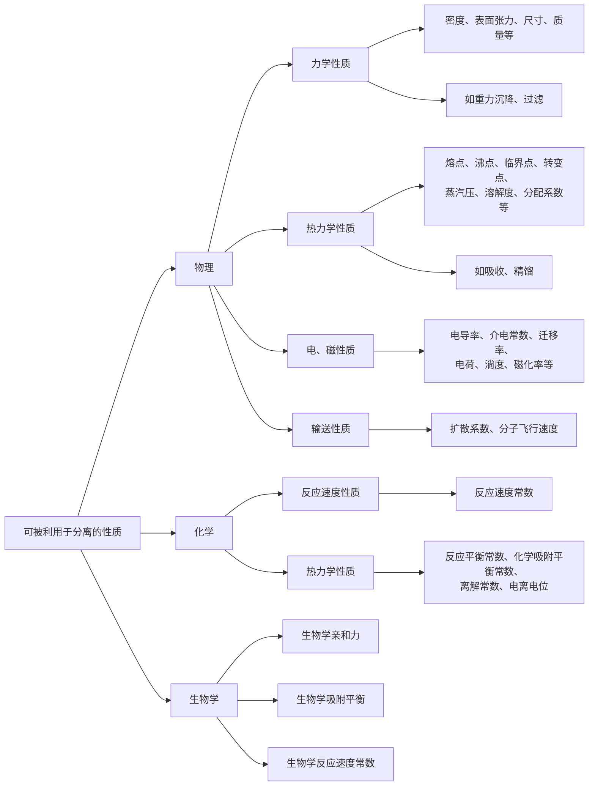

三传：动量传递（1、2章）、热量传递（5、6章）、**质量传递**
### 第一节 概述
#### 化工生产中的传质过程
由于系统内部不同位置存在化学势差，在化学势差的推动下，从一处向另一处转移的现象，称为**质量传递**，包括**相内传质**和**相际传质**两类。
质量传递的推动力是化学势差，影响因素有浓度、温度、压力、电磁力等。

分离均相混合物和非均相混合的方法，都利用于其某种特殊性质

化工生产中的常规分离方法：
- 气-液系统：如吸收、解吸等单元操作
- 汽-液系统：如蒸馏、精馏操作
- 液-液系统：如液液萃取操作
- 液-固系统：如结晶、浸取操作
- 气-固系统：如干燥操作
#### 相平衡
相际间传质的最终状态。两相浓度不变，达到平衡，净传质量为零。

与热平衡不同之处：
- 达到相平衡时，一般两相浓度不相等。
- 相平衡属动态平衡：达到相平衡时，传质过程仍在进行，只不过通过相界面的某一组分的净传质量为零。
#### 相组成的表示方法
摩尔分数：液相 $\displaystyle{x_{A}=\frac{n_{A}}{n}}$，气相 $\displaystyle{y_{A}=\frac{n_{A}}{n}}$
摩尔比：$\displaystyle{X_{A}(Y_{A})=\frac{n_{A}}{n_{B}}}$
物质的量浓度：$\displaystyle{c_{A}= \frac{n_{A}}{V} \,\pu{ [kmol.m-3]}}$
混合物总摩尔浓度：$\displaystyle{c=\frac{n}{V}}$

质量分数：$\displaystyle{w_{A}=\frac{m_{A}}{m}}$
质量比：$\displaystyle{\bar{w}_{A}= \frac{m_{A}}{m_{B}}}$
质量浓度：$\displaystyle{\rho _{A}=\frac{m_{A}}{V}\, \pu{ [kg.m-3]}}$
混合物总质量浓度：$\displaystyle{\rho=\frac{m}{V}}$

(1) 摩尔分数与质量分数
所有组分的摩尔分数之和和质量分数之和均为1
$$\sum _{i=1}^{C} x_{i}=1,\quad \sum _{i=1}^{C}w_{i}=1$$
两者之间满足
$$x_{A}=\frac{\dfrac{w_{A}}{M_{A}}}{\sum \limits_{i}  \dfrac{w_{i}}{M_{i}}},\quad w_{A}= \frac{x_{A}M_{A}}{\sum \limits_{i} x_{i}M_{i}}$$

(2) 摩尔/质量分数与摩尔/质量比
$$x=\frac{X}{1+X}\iff X=\frac{x}{1-x},\quad w=\frac{\bar{w}}{1+\bar{w}}\iff \bar{w}=\frac{w}{1-w}$$

(3) 组分摩尔/质量比与摩尔/质量浓度
$$c_{A}=x_{A}c,\quad \rho _{A}=w_{A}\rho,\quad c_{A}=\frac{\rho _{A}}{M_{A}}$$

(4) 理想气体的分压$p_{A}$表示
$$y_{A}=\frac{n_{A}}{n}=\frac{p_{A}}{P},\quad c_{A}=\frac{n_{A}}{V}=\frac{p_{A}}{RT},\quad c=\frac{n}{V}=\frac{P}{RT},\quad \rho _{A}=\frac{m_{A}}{V}=\frac{p_{A}M_{A}}{RT}$$
#### 传质方式
传质有两种方式：
- 分子扩散：发生在**静止流体、层流流动**的流体中，靠分子热运动进行。
- 对流传质/给质过程：发生在**湍流流动**的流体中，靠流体微团的脉动进行。

> [!quote] 比较分子扩散与对流传质
> 

### 第二节  分子扩散
#### 费克定律
分子扩散的机理完全依靠分子或原子的无规则热运动。
从微观上看，分子作随机热运动；从宏观上看，相内浓度均衡是自发的。在理论上，化学势表象为浓度，分子热运动的宏观表现为：从浓度高处向浓度低处传递。

定义任一组分$A$的**相对扩散通量**$J_{A,z}\, \pu{ [kmol.m-2.s-1]}$，有**费克第一定律**
$$J_{A,z}=-D_{AB} \dfrac{ \text{d} c_{A} }{ \text{d} z } $$
其中$D_{AB} \, \pu{ [m2.s-1]}$称为$A$在$B$中的扩散系数，$c_{A} \,\pu{ [kmol.m-3]}$为浓度，式中负号表示扩散方向与浓度梯度方向相反。
费克定律是Fick用与傅立叶定律类比的方法而不是用实验方法提出的，形式上高度相似
$$\begin{cases}牛顿黏性定律:\quad \tau=\mu \dfrac{ \text{d} u }{ \text{d} y } \\傅立叶定律:\quad \vec{q}=-\lambda\dfrac{ \partial t }{ \partial \vec{n} } \end{cases}$$
由相组成的不同表示，费克定律显然还有其他表达形式
$$J_{A,z}=-cD_{AB}\dfrac{ \text{d} x_{A} }{ \text{d} z }=- \frac{D_{AB}}{RT} \dfrac{ \text{d} p_{A} }{ \text{d} z }  $$

对费克定律的讨论：

(1) $J_{A,z},J_{B,z}$是相对扩散通量
组分$A$移走后，出现空位，其他分子（可能是$A$也可能是$B$）将会补位，若$A,B$分子量不等，那么质量中心会局部发生漂移。
$J_{A,z},J_{B,z}$是为了使$J_{A,z}+J_{B,z}=0$而定义的，即$J_{A,z},J_{B,z}$是相对于一个移动的扩散面而定义的扩散通量。

(2) $J_{A,z}=-J_{B,z}$
显然。

> [!quote] 分子扩散与导热对比
> 分子沿扩散方向移取后的空位会被其他分子填补，而导热无这一问题。
> 在费克定律中，$J_{A}$定义为**通过分子对称的截面**，即若有一个分子通过该截面，就有另一分子沿反方向通过同一截面填补原来分子留下的空位。
> 为满足这一分子对称条件，这种截面在空间中可能是固定的，也可能是移动的。
> - 分子对称：一去一回，等量、反向
> - 截面可能固定：等摩尔相互扩散、精馏等
> - 截面可能移动：吸收、蒸发等

(3) $D_{A,B}$是物性，$D_{A,B}=f(P,T,x)$
由于$D_{A,B}$与物质摩尔浓度$x$相关，显然液体和固体的扩散系数应当接近，均远小于气体。
- $D_{A,B(g)} \sim \pu{ 10^{-5}m2.s-1}$
- $D_{A,B(l)} \sim \pu{ 10^{-9}m2.s-1}$
- $D_{A,B(s)} \sim \pu{ 10^{-10}m2.s-1}$

(4) 对二元体系，两种组分的扩散系数相等。
- 对气体体系，严格成立
- 对液体体系，当$\rho=Const.$时可证得近似成立

对于二元气体扩散系数的估算，通常用较简单的由福勒 Fuller 等提出的公式
$$ D=\frac{1.013\times 10^{-5}T^{1.75}}{P\left[\left(\sum V_{A}\right)^{1/3}+\left(\sum V_{B}\right)^{1/3}\right]^{2}}\sqrt{ \frac{1}{M_{A}}+\frac{1}{M_{B}} }\quad\text{(低压，室温)} \implies D\propto \frac{T^{1.75}}{P} $$
对于很稀的非电解质溶液(溶质A+溶剂B)，其扩散系数常用Wilke-Chang公式估算
$$ D_{AB}=7.4\times 10^{-15}\frac{\left(\alpha M_{B}\right)^{1/2}T}{\mu V_{A}^{0.6}} \implies  T\uparrow,\mu\downarrow,D\uparrow $$
固体中的扩散系数需靠实验确定。
#### 广义费克定律
前面提到，相对扩散通量$J_{A,z}$是由总变化为零而定义的。相对地面（静止面）考察，就要引入**绝对扩散通量/传质通量**$N_{A}$，其等于分子扩散通量$J_{A,z}$与总体扩散通量之和。
广义费克定律就是描述流体中组分传质通量$N_{A,z}$的普遍关系式。

我们明确：$v_{A,z},v_{B,z}$分别表示$A,B$相对静止面的总摩尔速度，$v_{M,z}$表示其摩尔平均速度，也即宏观观测到的摩尔速度。因此，各通量定义明确：

**绝对扩散通量**$N_{A},N_{B},N\quad [\pu{kmol.m-2.s-1}]$：相对于静止面的摩尔传质速率
$$N_{A,z}=C_{A}v_{A,z},\quad N_{B,z}=C_{B}v_{B,z},\quad N_{z}=Cv_{M,z}=N_{A,z}+N_{B,z}$$
**相对扩散通量**$J_{A},J_{B} \quad [\pu{kmol.m-2.s-1}]$：相对于移动面的摩尔传质速率
$$J_{A,z}=C_{A}(v_{A,z}-v_{M,z}),\quad J_{B,z}=C_{B}(v_{B,z}-v_{M,z})$$
进一步地，相对扩散通量还可以变形
$$\begin{aligned}J_{A,z}&=C_{A}v_{A,z}-C_{A}v_{M,z}\\&=N_{A,z}-\frac{C_{A}}{C}\cdot Cv_{M,z}\\&=N_{A,z}-x_{A}N_{z}\\&=N_{A,z}-x_{A}(N_{A,z}+N_{B,z})\end{aligned}$$
由此，我们就得到了**广义费克定律**
$$\boxed{ \begin{aligned}\underset{ \begin{array}c 绝对扩散通量\\(相对于静止坐标)\end{array} }{ N_{A,z} }&= \underset{ \begin{array}c 相对扩散通量\\(相对于平均速度)\end{array} }{ J_{A,z} }+\underset{ \begin{array}c 总体扩散通量\\(相对于静止坐标)\end{array} }{ x_{A}(N_{A,z}+N_{B,z} })\\&=-D_{AB} \dfrac{ \text{d} c_{A} }{ \text{d} z }+x_{A}(N_{A,z}+N_{B,z}) \end{aligned}}$$
#### 双组分、一维稳态分子扩散举例
##### 等摩尔相互扩散
组分A和组分B相互扩散，摩尔数相等，$N_{A,z}=-N_{B,z}=Const. \implies N_{z}=0$。
$$\begin{cases}N_{A,z}=J_{A,z}+x_{A}(N_{A,z}+N_{B,z})\\N_{B,z}=J_{B,z}+x_{B}(N_{A,z}+N_{B,z})=-N_{A,z} \\ J_{A,z}=-J_{B,z}=Const.\end{cases}\implies N_{A,z}=J_{A,z}=-D \dfrac{ \text{d} c_{A} }{ \text{d} z } $$
对其积分
$$N_{A,z}\int _{z_{1}}^{z_{2}}\text{d}z=-D\int _{c_{A_{1}}}^{c_{A_{2}}} \text{d}c_{A}$$
整理得到
$$\begin{aligned}N_{A,z}&= \frac{D}{z_{2}-z_{1}}(c_{A_{1}}-c_{A_{2}})=\frac{c_{A_{1}}-c_{A_{2}}}{\Delta z/D}=\frac{推动力}{阻力}\\&=\frac{cD}{z_{2}-z_{1}}(y_{A_{1}}-y_{A_{2}})=\frac{D}{RT(z_{2}-z_{1})}(p_{A_{1}}-p_{A_{2}})\end{aligned}$$
因此，等摩尔相互扩散时，$c_{A},p_{A},y_{A}\propto z$，随其**线性变化**。
##### 单向扩散
单向扩散是指组分A通过停滞（或不扩散）组分B的分子扩散，$N_{B,z}=0,J_{B,z}\neq 0$。
$$\begin{cases}N_{A,z}=J_{A,z}+x_{A}(N_{A,z}+N_{B,z})\\N_{B,z}=J_{B,z}+x_{B}(N_{A,z}+N_{B,z})=0 \\ J_{A,z}=-J_{B,z}=Const.\end{cases}\implies N_{A,z}=J_{A,z}+x_{A}N_{A,z}$$
对其变形即得
$$N_{A,z}(1-x_{A})=N_{A,z}\left( 1-\frac{c_{A}}{c} \right)=J_{A,z}=-D \dfrac{ \text{d} c_{A} }{ \text{d} z } $$
对其积分
$$N_{A,z}\int _{z_{1}}^{z_{2}}\text{d}z=-cD\int _{c_{A_{1}}}^{c_{A_{2}}} \frac{\text{d}c_{A}}{c-c_{A}}$$
整理得到
$$N_{A,z}=-\frac{cD}{z_{2}-z_{1}}\ln \frac{c-c_{A_{2}}}{c-c_{A_{1}}}=-\frac{cD}{z_{2}-z_{1}}\ln \frac{c_{B_{2}}}{c_{B_{1}}}$$
因此，单向扩散时，$c_{A},p_{A},y_{A}$随$z$**呈对数函数变化**。

> [!quote] 组分分压（及气相总压）随扩散距离$z$的变化情况
> (a) A, B的等摩尔相互扩散；(b) A在B中的单向扩散
> 

引入截面1, 2上$C_{B}$的**对数平均值**$\displaystyle{c_{B_{m}}=\frac{c_{B_{2}}-c_{B_{1}}}{\ln c_{B_{2}}-\ln c_{B_{1}}}}$，则
$$\begin{aligned}N_{A,z}&=\frac{D}{z_{2}-z_{1}} \frac{c}{c_{B_{m}}}(c_{B_{2}}-c_{B_{1}})= \frac{c_{A_{1}}-c_{A_{2}}}{\Delta zc_{B_{m}}/cD}=\frac{推动力}{阻力}\\&=\frac{cD}{z_{2}-z_{1}} \frac{1}{y_{B_{m}}}(y_{A_{1}}-y_{A_{2}})\\&=\frac{D}{RT(z_{2}-z_{1})} \frac{P}{p_{B_{m}}}(p_{A_{1}}-p_{A_{2}})\end{aligned}$$
其中$y_{B_{m}},p_{B_{m}}$也分别表示对应物理量的对数平均值
$$y_{B_{m}}=\frac{y_{B_{2}}-y_{B_{1}}}{\ln y_{B_{2}}-\ln y_{B_{1}}},\quad p_{B_{m}}=\frac{p_{B_{2}}-p_{B_{1}}}{\ln p_{B_{2}}-\ln p_{B_{1}}}$$
定义$\displaystyle{\frac{c}{c_{B_{m}}}}, \frac{1}{y_{B_{m}}}, \frac{P}{p_{B_{m}}}$为**漂流因数**，显然均大于1，代表总体流动的影响。与等摩尔相互扩散相比，单向扩散就差在多了一个漂流因数。
混合物中A组分浓度$c_{A}\uparrow$，则$c_{B}\downarrow$，故$c_{B_{m}}\downarrow$，漂流因数↑

> [!quote] 漂流因数的微观解释
> 等分子相互扩散中，组分A移走后，出现的空位由组分B补位，故总$N_{z}=0$；
> 单向扩散中，A移走后的空位由周围混合物(A+B)补位，故总$N_{z}\neq 0$，产生总体流动，对$N_{A,z}$有贡献，因此扩散通量要更大。

### 第三节 对流传质
前面已述，对流传质发生在湍流流动的流体中，靠流体微团的脉动进行。
#### 对流传质机理分析
对流传质的机理：
- 湍流主体因浓度均一无传质阻力
- 层流底层传质方式为分子扩散，阻力最大
- 过渡区（湍流主体与层流底层之间）传质方式为分子扩散和对流传质（脉动）
#### 传质模型简介
传质模型：
- （双）膜模型：认为气液两相间存在稳定相界面，界面两侧分别存在气膜和液膜
	- 两相传质阻力完全在于通过两层膜的分子扩散，界面外侧为湍流区，阻力忽略
	- 溶质穿过相界面阻力极小，所需推动力为零；因此，界面上保持两相平衡
	- 若为单向扩散，在液相中有 $$N_{A}= \frac{D_{L}}{\delta _{L}}\cdot \frac{c}{c_{B_{m}}}\cdot(c_{A_{1}}-c_{A_{2}})$$对照**对流传质方程** $$N_{A}=k_{L}(c_{1}-c_{2})=k_{G}(p_{1}-p_{2})=\dots$$ 有 $$k_{L}= \frac{D_{L}}{\delta _{L}}\cdot  \frac{c}{c_{B_{m}}}$$ 因此，$k_{L}\propto D_{L}$
	- 双膜模型只适用于有固定相界面的情形，其结论 $k_{L}\propto D_{L}$ 与实际不符，且模型中不计界面阻力，存在争议
- 溶质渗透模型：
	- 强调形成稳定浓度梯度过渡阶段，推导得$k_{L}\propto \sqrt{ D_{L} }$，与实验结果吻合
	- 缺陷：认为各批漩涡与气相接触时间相同
- 表面更新模型：溶质渗透模型的修正
#### 对流传质方程
上面已经提到过**对流传质方程**
$$N_{A}=k_{L}(c_{1}-c_{2})=k_{G}(p_{1}-p_{2})=\dots$$
其中$k_{L},k_{G}$称为**对流传质系数**，其与牛顿冷却定律
$$q=\alpha(t-t_{w})$$
中的$\alpha$类似，不是物性。

对流传质系数的影响因素
- 流动状况
- 物性
- 操作温度和压力
- 传质面几何特性等
#### 对流传质系数经验式
获取$k$的途径：实验方法
$$Sh=f(Re,Sc)$$
舍伍德数：$\displaystyle{Sh=\frac{kl}{D}}$，与$Nu$相当
施密特数：$\displaystyle{Sc=\frac{\mu}{\rho D}}$，与$Pr$相当

湿壁塔：
$$Sh=0.023Re^{0.8}Sc^{0.44}$$
