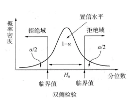
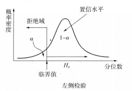
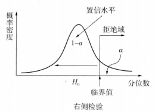
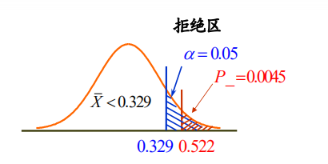
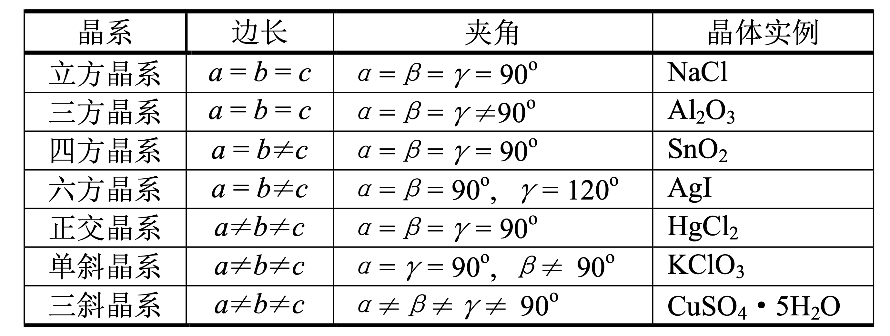

### 6 箱中粒子与能级 \[应用, 考点]
##### 一维无限深方势阱
###### 哈密顿量
$$
\hat{H}=- \frac{\hbar^{2}}{2m} \frac{ \partial^{2} }{ \partial x^{2} } +V(x), \ \ \  V(x)=\left\{ \begin{align}
&0, &0\leq x\leq a\\&\infty, &\text{otherwise}
\end{align} \right. \ \ 最简单的束缚态问题
$$
###### 定态薛定谔方程
$$
\left[ - \frac{\hbar^{2}}{2m}\frac{ \partial^{2} }{ \partial x^{2} } +V(x) \right] \phi(x)=E\phi(x)\implies \frac{ \partial^{2} }{ \partial x^{2} } \phi(x)= \frac{2m}{\hbar^{2}}\left[ V(x)-E \right]\phi(x) 
$$势阱外的势能无穷大，粒子不能穿过势阱壁，根据波函数的统计诠释有 $$
\phi(0)=\phi(a)=0 \leftarrow 边界条件
$$
###### 方势阱内部
$$
\frac{ \partial^{2} }{ \partial x^{2} } \phi(x)=- \frac{2mE}{\hbar^{2}}\phi(x)\equiv -k^{2}\phi(x), \text{ where } k =\frac{\sqrt{ 2mE }}{\hbar}\text{ and } E= \frac{\hbar^{2}k^{2}}{2m}
$$通解为 $$
\phi(x)=A\sin kx+B\cos kx
$$由待定系数确定边界条件 $$
\left\{\begin{align}&\phi(0)=0 \implies B=0 \\&\phi(a)=0\implies A\sin ka+B\cos ka=A\sin ka=0\end{align} \right.\implies k=\frac{n\pi}{a},\ n=0,\pm 1,\pm 2, \cdots
$$所以本征态为 $$
\phi _{n}(x)=A\sin \frac{n\pi}{a}x, \ E_{n}= \frac{{n^{2}\pi^{2} \hbar^{2}}}{2ma^{2}},\ n=0,\pm 1, \pm 2,\cdots \ \ 本征能量
$$
**一些讨论**
1.  $$若\ n=0,\ \phi _{n}(x)\equiv 0，波函数无意义$$
2. （-n）为负数时的波函数与其相应正数n的波函数本质上相同，只相差常因子-1，故可以只考虑n为正。 $$
\phi _{n}(x)=A\sin \frac{n\pi}{a}x, \ \ n=1,2,\cdots$$
3. 本征态的波函数需要进行归一化 $$
\begin{align} \int_{-\infty}^{\infty} \left| \phi(x) \right| ^{2} \, \text{d}x&=A^{2}\int_{0}^{a} \frac{1}{2}\left( 1-\cos \frac{2n\pi x}{a} \right) \, \text{d}x= A^{2} \frac{a}{2}=1\implies A=\sqrt{ \frac{2}{a} } \\ &\implies \phi _{n}(x)=\sqrt{ \frac{2}{a} }\sin \frac{n\pi}{a}x, \ \ E_{n} = \frac{n^{2}\pi^{2}\hbar^{2}}{2ma^{2}},\ n=1,2,\cdots \end{align}
$$
**本征态性质**
1. 当n为奇数时，波函数关于$x=\frac{a}{2}$对称；当n为偶数时，波函数关于$x=\frac{a}{2}$反对称；
2. 若不考虑边界，第n个本征态的波函数有(n-1)个节点；
3. 体系的最低能量不为0，而是 $\frac{h^{2}\pi^{2}}{2ma^{2}}$，这一能量称为**零点能** \[注意]；
4. 本征能量表现为离散的能级，$E \propto n^{2}$，能量越高，能级越稀疏；
5. 本征态之间具有正交归一性，任意波函数可以用本征态线性展开。
$$
\begin{align}  \int_{0}^{a} \phi _{m}^{*}(x)\phi _{n}(x) \, \text{d}x =\frac{2}{a}\int_{0}^{a} \sin \frac{m\pi x}{a}\sin \frac{n\pi x}{a} \, \text{d}x = \delta _{mn}\implies \braket{ \phi _{m} | \phi _{n} } = \delta_{mn} \\\implies \psi(x)=\sum_{n=1}^{\infty} c_{n}\phi _{n}(x)=\sqrt{ \frac{2}{a} }\sum_{n=1}^{\infty} c_{n}\sin\left( \frac{n\pi}{a}x \right)  \end{align} 
$$
###### 含时薛定谔方程的通解
初始波函数用本征态展开 $$
\ket{\psi(0)} =\sum_{n=1}^{\infty} c_{n}\ket{\phi _{n}}$$其中展开系数为 $$
c_{n}=\braket{ \phi _{n} | \psi(0) } .
$$
含时波函数可以普适表达为 $$
\begin{align}\ket{\psi (t)} &=\hat{U}(t,0)\ket{\psi(0)} =\sum_{n=1}^{\infty} c_{n}\hat{U}(t,0)\ket{\phi _{n}} \implies \ket{\psi(t)} =\sum_{n=1}^{\infty} c_{n}e^{ - i\hat{H}t/\hbar }\ket{\phi _{n}}\\& \implies \ket{\psi(t)} =\sqrt{ \frac{2}{a} }\sum_{n=1}^{\infty} c_{n}e^{ -i(n^{2}\hbar\pi^{2} /2ma^{2})t}\sin \frac{n\pi x}{a}\end{align} 
$$
##### 三维无限深方势箱
###### 哈密顿量
$$
\hat{H}=- \frac{\hbar^{2}}{2m}\nabla^{2}+V(\mathbf{x}),\ \  V(\mathbf{x})=\left\{ \begin{align}  & 0, & 0\leq x\leq L_{x},0\leq y\leq L_{y}, 0\leq z\leq L_{z} \\&\infty, &\text{otherwise} \end{align} \right. $$
###### 方势箱内部的定态薛定谔方程
$$
\nabla^{2}\phi(\mathbf{x})= -\frac{2mE}{\hbar^{2}}\phi(\mathbf{x})
$$势箱在三个方向上都等价，可以进行变量分离 $$
\begin{align} &\phi(\mathbf{x})=\phi _{x}(x)\phi _{y}(y)\phi _{z}(z) \implies \phi _{y}\phi _{z}\frac{ \partial^{2}\phi _{x} }{ \partial x^{2} } +\phi _{x}\phi _{z}\frac{ \partial^{2}\phi _{y} }{ \partial y^{2} }+\phi _{x}\phi _{y}\frac{ \partial^{2}\phi _{z} }{ \partial z^{2} } =-k^{2}\phi _{x}\phi _{y}\phi _{z} \\ &\implies \phi _{x}^{-1}\frac{ \partial^{2}\phi _{x} }{ \partial x^{2} } +\phi _{y}^{-1}\frac{ \partial^{2}\phi _{y} }{ \partial y^{2} } +\phi _{z}^{-1}\frac{ \partial^{2}\phi _{z} }{ \partial z^{2} } =-k^{2}\implies k^{2}=k_{x}^{2}+k_{y}^{2}+k_{z}^{2}\ \ \leftarrow  与坐标无关 \\ & \implies \frac{ \partial^{2}\phi _{x} }{ \partial x^{2} } =-k_{x}^{2}\phi _{x},\ \ \frac{ \partial^{2}\phi _{y} }{ \partial y^{2} } =-k_{y}^{2}\phi _{y},\ \ \frac{ \partial^{2}\phi _{z} }{ \partial z^{2} } =-k_{z}^{2}\phi _{z} \end{align} $$
边界条件 $$
\phi _{x}(0)=\phi _{x}(L_{x})=0,\ \phi _{y}(0)=\phi _{y}(L_{y})=0, \ \phi _{z}(0)=\phi _{z}(L_{z})=0$$
###### 本征态波函数和本征能量
$$
\begin{align}& \phi(\mathbf{x})=\phi _{x}(x)\phi _{y}(y)\phi _{z}(z)=\sqrt{ \frac{8}{L_{x}L_{y}L_{z}} }\sin \left(\frac{n_{x}\pi}{L_{x}}x\right)\sin \left( \frac{n_{y}\pi}{L_{y}}y \right)\sin \left( \frac{n_{z}\pi}{L_{z}}z \right)\\ \frac{2mE}{\hbar^{2}}=\frac{\pi^{2}}{L_{x}^{2}}n_{x}^{2}+\frac{\pi^{2}}{L_{y}^{2}} & n_{y}^{2}+\frac{\pi^{2}}{L_{z}^{2}}n_{z}^{2} \implies E= \frac{\hbar^{2}\pi^{2}}{2m}\left( \frac{n_{x}^{2}}{L_{x}^{2}}+\frac{n_{y}^{2}}{L_{y}^{2}}+\frac{n_{z}^{2}}{L_{z}^{2}} \right), \ \ n_{x},n_{y},n_{z}=1,2,3\cdots   \end{align} 
$$
###### 能级态密度
$$
\left\{ \begin{align}& L_{x}=L_{y}=L_{z}\implies E= \frac{\hbar^{2}\pi^{2}}{2mL^{2}}(n_{x}^{2}+n_{y}^{2}+n_{z}^{2})= \frac{\hbar^{2}\pi^{2}}{2mL^{2}}n^{2} \implies \Delta E \approx \frac{\hbar^{2}\pi^{2}}{mL^{2}}n\Delta n\\& \Delta N=N(n+\Delta n)-N(n)=\frac{1}{8}\left[ \frac{4}{3} \pi(n+\Delta n)^{3} - \frac{4}{3} \pi n^{3} \right] \approx \frac{\pi}{2}n^{2}\Delta n \end{align} \right. 
$$ $$
\implies \rho(E)=\frac{\Delta N}{\Delta E}=\frac{mL^{2}}{2\hbar^{2}\pi}n=\frac{mL^{2}}{2\hbar^{2}\pi}\sqrt{ \frac{2mL^{2}E}{\hbar^{2}\pi^{2}} }=\frac{L^{3}}{\hbar^{3}\pi^{2}}\sqrt{ \frac{m^{3}E}{2} }\ \ 三维情形
$$
类似地，二维情形 $$
\rho(E)= \frac{L^{2}}{2\pi \hbar^{2}}m
$$一维情形 $$
\rho(E)=\frac{L}{2\pi \hbar}\sqrt{ \frac{2m}{E} }
$$
##### 一维有限深方势阱
###### 哈密顿量
$$
\hat{H}= - \frac{\hbar^{2}}{2m}\frac{ \partial^{2} }{ \partial x^{2} } +V(x),\ \ V(x)= \left\{ \begin{align}
&0, & -a\leq x\leq  a \\ & V_{0}, &\text{otherwise}
\end{align}\right.
$$
###### $|x|>a$区域
$$
\begin{aligned}& \frac{ \partial^{2} }{ \partial x^{2} } \phi(x)= \frac{2m}{\hbar^{2}}(V_{0}-E)\phi(x)\equiv \beta^{2}\phi(x)\implies \left\{ \begin{align}
&\phi(x)|_{x<-a}=A_{1}e^{ -\beta x }+A_{2}e^{ \beta x }\\&\phi(x)|_{x>a}=B_{1}e^{ -\beta x }+B_{2}e^{ \beta x } \end{align}\right.
\\&\phi(-\infty)=\phi(\infty)=0 \implies \left\{  \begin{aligned}& \phi(x)|_{x<-a}=Ae^{ \beta x }\\&\phi(x)|_{x>a}=Be^{ -\beta x }\end{aligned} \right. , \ \ \beta=\sqrt{ \frac{2m}{\hbar^{2}}(V_{0}-E) }
\end{aligned} 
$$
###### $|x|<a$区域
$$
\frac{ \partial^{2} }{ \partial x^{2} } \phi (x)= - \frac{2mE}{\hbar^{2}}\phi(x)\equiv -k^{2}\phi(x)\implies \phi(x)=C\cos kx+C'\sin kx
$$由于势能函数满足 $V(x)=V(-x)$，则定态薛定谔方程的每个解具有确定的奇偶性。
**偶对称性情形： $\phi(x)=C\cos kx$**
$$
\begin{align}& 波函数连续性\ &\phi(a)=C\cos ka=Be^{ -\beta a },\ \phi(-a)=C\cos ka=Ae^{ -\beta a }\\& 波函数导数连续性(动量可计算要求) &\phi'(a)=-Ck\sin ka=-B\beta e^{ -\beta a }, \ \phi'(-a)=Cl\sin ka=A\beta e^{ -\beta a } \\&&\implies A=B=Ce^{ \beta a }\cos ka, k\tan ka=\beta\end{align} 
$$
$$
\left\{ \begin{align}
&ka=\xi \\ &\beta a=\eta \end{align} \right. \implies \left\{ \begin{aligned}&  k\tan ka=\beta\implies \xi \tan \xi=\eta\\ &\xi^{2}+\eta^{2}=\frac{2mV_{0}a^{2}}{\hbar^{2}}  \end{aligned} \right.$$
**奇对称性情形**：$\phi(x)=C\sin kx$
$$
同前得到:-A=B=e^{ \beta a }C\sin ka ,\ k\cot ka=-\beta
$$$$
\left\{ \begin{align}
&ka=\xi \\ &\beta a=\eta \end{align} \right. \implies \left\{ \begin{aligned}&  k\tan ka=\beta\implies -\xi \cot \xi=\eta\\ &\xi^{2}+\eta^{2}=\frac{2mV_{0}a^{2}}{\hbar^{2}}  \end{aligned} \right.
$$
作出 $\eta -\xi$ 关系曲线，交点为体系允许的状态，势阱越浅，允许状态越少。

###### 本征态波函数和能级

##### 三维无限深球形势箱 \[非考点]
###### 哈密顿量和定态薛定谔方程
$$
\hat{H}=-\frac{\hbar^{2}}{2m}\nabla^{2}+V(\mathbf{r}),\ V(\mathbf{r})=\left\{ \begin{align}& 0, &0\leq r\leq a \\ &\infty, &\text{otherwise} \end{align} \right.
$$$$
\hat{H}\psi(\mathbf{r})=E\psi(\mathbf{r})\implies  \nabla^{2}\psi(\mathbf{r})=- \frac{2m(E-V(\mathbf{r}))}{\hbar^{2}}\psi(\mathbf{r})
$$
###### 球坐标系
[哈密顿与拉普拉斯算符在柱坐标与球坐标下的形式](https://zhuanlan.zhihu.com/p/463059528)
$$
\nabla^{2}=\frac{ \partial^{2} }{ \partial x^{2} } +\frac{ \partial^{2} }{ \partial y^{2} } +\frac{ \partial^{2} }{ \partial z^{2} } = \frac{1}{r^{2}}\frac{ \partial  }{ \partial r}\left( r^{2}\frac{ \partial   }{ \partial r }  \right)+\frac{1}{r^{2}\sin\theta}\frac{ \partial   }{ \partial \theta } \left( \sin\theta \frac{ \partial   }{ \partial \theta }  \right)+\frac{1}{r^{2}\sin ^{2}\theta}\frac{ \partial^{2} }{ \partial \phi^{2} }  
$$
分离变量：假设波函数为径向和角向函数之积 $$
\begin{align} \psi(r,\theta,\phi)&=R(r)Y(\theta,\phi)\\ &\implies \nabla^{2}\psi(r,\theta,\phi)= \frac{Y}{r^{2}}\frac{ \partial  }{ \partial r}\left( r^{2}\frac{ \partial  R }{ \partial r }  \right)+\frac{R}{r^{2}\sin\theta}\frac{ \partial   }{ \partial \theta } \left( \sin\theta \frac{ \partial  Y }{ \partial \theta }  \right)+\frac{R}{r^{2}\sin ^{2}\theta}\frac{ \partial^{2}Y }{ \partial \phi^{2} } =\frac{2m(E-V)}{\hbar^{2}}RY  \\ &\implies \underbrace{\left[ \frac{1}{R}\frac{ \partial  }{ \partial r}\left( r^{2}\frac{ \partial  R }{ \partial r }  \right) +\frac{2m(E-V)r^{2}}{\hbar^{2}} \right]}_{等于一个常数\triangleq l(l+1)，即径向方程} +\underbrace{\left[ \frac{1}{Y\sin\theta}\frac{ \partial   }{ \partial \theta } \left( \sin\theta \frac{ \partial  Y }{ \partial \theta }  \right)+\frac{1}{Y\sin ^{2}\theta}\frac{ \partial^{2}Y }{ \partial \phi^{2} } \right] }_{等于一个常数\triangleq -l(l+1)，即角向方程}=0\end{align} $$
###### 角向方程
$$
\sin\theta\frac{ \partial   }{ \partial \theta } \left( \sin\theta \frac{ \partial  Y }{ \partial \theta }  \right)+\frac{ \partial^{2}Y }{ \partial \phi^{2} }=-l(l+1)Y(\theta,\phi)\sin ^{2}\theta
$$
分离变量： $$
\begin{align} Y(\theta,\phi)&=\Theta(\theta)\Phi(\phi)\\& \implies \Phi \sin\theta \frac{ \partial   }{ \partial \theta } \left( \sin\theta \frac{ \partial \Theta }{ \partial \theta }  \right)+\Theta \frac{ \partial^{2}\Phi }{ \partial \phi^{2} } =-l(l+1)\Theta \Phi \sin ^{2}\theta \\&\implies \underbrace{ \left[ \frac{1}{\Theta}\sin\theta \frac{ \partial   }{ \partial \theta } \left( \sin \theta \frac{ \partial \Theta }{ \partial \theta }  \right)+l(l+1)\sin ^{2}\theta\right] }_{ 等于一个常数\triangleq m^{2}，即角向\theta方程 }+\underbrace{ \left[ \frac{1}{\Phi}\frac{ \partial^{2}\Phi }{ \partial \phi^{2} }  \right] }_{\triangleq -m^{2}，即角向\phi方程} =0  \end{align} 
$$
**角向**$\phi$**方程**
$$
\frac{ \partial^{2}\Phi }{ \partial \phi^{2} } =-m^{2}\Phi\implies \Phi=e^{ im\phi }
$$若为正数，则$\Phi$不满足周期性，与$\phi$定义性质不符，故只能为负数 $-m^{2}$ $$
\Phi(\phi)=\Phi(\phi+2\pi)\implies e^{ im\phi }=e^{ im\phi }e^{ i 2m\pi }\implies m=0,\pm  1,\pm  2, \cdots$$
**角向**$\theta$**方程**
$$
\sin\theta \frac{ \partial   }{ \partial \theta } \left( \sin\theta \frac{ \partial \Theta }{ \partial \theta }  \right)+[l(l+1)\sin ^{2}\theta-m^{2}]\Theta=0\implies \Theta=AP_{l}^{m}(\cos \theta)
$$其中连带勒让德函数 $$
P_{l}^{m}(x)\equiv (1-x^{2})^{|m|/2}\left( \frac{ \text{d}   }{ \text{d} x }  \right)^{|m|}P_{l}(x)
$$其中勒让德多项式 $$
P_{l}(x)\equiv \frac{1}{2^{l}l!}\left( \frac{ \text{d}   }{ \text{d} x }  \right)^{l}(x^{2}-1)^{l}
	$$由连带勒让德函数的定义知，若 $|m|>l$，则连带勒让德多项式的阶数为0，函数归零，无物理意义，因此有 $$
角量子数 \, l=0,1,2,\cdots\qquad 磁量子数\,|m|\leq l\implies m=0,\pm  1,\pm  2,\cdots,\pm  l
$$
###### 球谐函数
$$
Y_{l}^{m}(\theta,\phi)=\sqrt{ \frac{{2l+1}}{4\pi} \frac{{(l-|m|)!}}{(l+|m|)!} }P_{l}^{|m|}(\cos\theta)e^{ im\phi }
$$
满足正交归一性 $$
\int_{0}^{2\pi}  \, \text{d}\phi \int_{0}^{\pi}  \, \text{d}\theta[Y_{l}^{m}(\theta,\phi)]^{*}[Y^{m'}_{l'}(\theta,\phi)]\sin\theta=\delta _{ll'}\delta _{mm'}  
$$

###### 径向$r$方程
$$
\begin{align}& \frac{ \partial   }{ \partial r } \left( r^{2}\frac{ \partial R }{ \partial r }  \right)+\frac{2m(E-V)r^{2}}{\hbar^{2}}R=l(l+1)R \\ & \xrightarrow{ R\equiv \frac{u(r)}{r} } \frac{ \partial   }{ \partial r } \left( r\frac{ \partial u }{ \partial r } -u \right)+\frac{2m(E-V)r}{\hbar^{2}}u=\frac{l(l+1)u}{r}\\&\implies \frac{ \partial^{2}u }{ \partial r^{2} } +\frac{2m(E-V)}{\hbar^{2}}u=\frac{l(l+1)u}{r^{2}} \\&\implies - \frac{\hbar^{2}}{2m}\frac{ \partial^{2}u(r) }{ \partial r^{2} } +\underbrace{ \left( V(r)+\frac{\hbar^{2}}{2m} \frac{l(l+1)}{r^{2}} \right) }_{ 有效势能  }u(r)=Eu(r)\end{align} 
$$
###### 势箱内部
$$
\frac{ \partial^{2}u(r) }{ \partial r^{2} } =\left[ \frac{l(l+1)}{r^{2}}-\frac{2mE}{\hbar^{2}} \right]u(r)=\left[ \frac{l(l+1)}{r^{2}}-k^{2} \right] u(r),\, k=\sqrt{ \frac{2mE}{\hbar^{2}} } 
$$
方程通解为 $$
u(r)=ArJ_{l}(kr)+BrN_{l}(kr)
$$其中球形贝塞尔函数 $$
J_{l}(x)\equiv (-x)^{l}\left( \frac{1}{x} \frac{ \text{d}   }{ \text{d} x }  \right)^{l} \frac{{\sin x}}{x}
$$球形诺伊曼函数 $$
N_{l}(x)\equiv -(-x)^{l}\left( \frac{1}{x} \frac{ \text{d}   }{ \text{d} x } \right)^{l} \frac{{\cos x}}{x}
$$在 $x\to 0$时发散，故由波函数物理性质，$B=0$，因此 $$
R(r)=\frac{u(r)}{r}=AJ_{l}\left( \frac{\sqrt{ 2mE }r}{\hbar} \right)
$$满足边界条件 $$
R(a)=AJ_{l}\left( \frac{\sqrt{ 2mE }a}{\hbar} \right)=0
$$

记$J_{l}(x)$第n个零点为$\beta _{nl}$，则 $$
\frac{\sqrt{ 2mE }a}{\hbar}=\beta _{nl}\implies E_{nl}=\frac{\hbar^{2}\beta _{nl}^{2}}{2ma^{2}}$$
本征态为 $$
\psi _{nml}(r,\theta,\phi)=\underset{ 归一化常数 }{ A_{nl} }J_{l}\left( \frac{\beta _{nl}r}{a} \right)Y_{l}^{m}(\theta,\phi)$$
n为主量子数，能量$E_{nl}$为(2l+1)重简并。

