#### 1. 晶体及其性质
固体物质
- 晶态：晶态物质内部的原子、离子或分子在空间中按照某种规律周期性地排列。
- 非晶态：非晶态物质内部的原子、分子排列无序，不具有周期性，通常也称为玻璃体、无定型物。 

晶体内部原子、离子或分子在空间中按照某种规律周期性地排列。(长程有序)
##### 晶体的均匀性
一块晶体内部各部分的宏观性质是相同的，如具有相同的密度、化学组成等
##### 晶体的各向异性

##### 晶体的对称性
晶体的外观与内部微观都具有特定的对称性
晶体的对称性与晶体内部周期性排列的原子或分子的排列方式密切相关
##### 晶体自范性
晶体自发形成多面体外形
晶体在生长过程自发形成晶面，晶面相交形成晶棱，晶棱汇聚成顶点，使晶体具有凸多面体外形
$$\underset{ 晶面 }{ F }+\underset{ 顶点 }{ V }-\underset{ 晶棱 }{ E }=2$$
e.g. NaCl立方体，F=6, V=8, E=12
##### 晶体有确定的熔点
##### 晶体具有衍射图样
#### 2. 晶体的周期性和点阵结构
##### 晶体的周期性
$\ce{ \alpha-SiO_{2}}$在a-b面上原子周期性排列（平移对称性）
1. 周期性重复出现的内容，称为**结构基元**
   原子分子的种类，数量及排列方式
2. 重复周期的大小与方向，称为**平移矢量**

将结构基元抽象为一个点阵点，则周期性晶体结构可抽象为点阵
##### 点阵和平移群
###### 点阵
一组**无限**的点，连接其中任意两点可得一向量，将各点按此向量平移可使其复原
点阵是对周期性排列物体的**数学抽象表达**，**平移群**是其代数描述
每个点阵点具有**完全相同的周围环境** → 点阵包括无数个点
###### 直线点阵
一维方向上等间隔排列的无穷点列几何形式

**基本周期**：相邻两点的距离$a$
**平移群**：点阵的代数形式，能使点阵复原的全部平移向量的集合
一维直线点阵平移群的代数描述：
$$\mathbf{T}=m\cdot \mathbfit{a},\quad m=0,\pm 1,\dots$$
###### 平面点阵
在二维方向上等周期排布点阵

平面点阵中，可以找到两个独立的不平行的基本向量
平面点阵平移群的代数描述：
$$\mathbf{T}_{mn}=m\cdot \mathbfit{a}+n\cdot \mathbfit{b},\quad m,n=0,\pm 1,\dots$$
**平面格子**：沿两个方向将全部点阵点连结起来

整个平面点阵可视为无数个这样的平行四边形格子并置而成
**素单位/素格子/素胞**：摊到一**个点阵点**的单位，网格中最小的平行四边形
**复单位/复格子/复胞**：摊到一个以上点阵点的单位
**正当单位**：按照【尽可能形状规则、对称性高、面积较小的平行四边形】要求选择的格子
平面点阵的正当单位有四种形状（正方形、长方形、60°菱形、一般平行四边形），五种型式（夹心矩形）

> [!quote] 平面正方点阵不存在带心正方点阵形式
> 平面正方点阵的心和顶点可形成更小的正方正当单位
###### 空间点阵
空间点阵的平移群描述：
$$\mathbf{T}_{mnp}=m\cdot \mathbfit{a}+n\cdot \mathbfit{b}+p\cdot \mathbfit{c},\quad m,n,p=0,\pm 1,\dots$$
**素单位**：平行六面体，包含六个点阵参数 $\mathbfit{a},\mathbfit{b}, \mathbfit{c},\alpha,\beta,\gamma$
**正当单位**：按较规则形状、体积较小的原则，空间点阵的正当单位可有7种形状，14种空间点阵形式
因此，空间点阵一共有
###### 7个晶系
- 立方（等轴）Cubic c
- 四方 Tetragonal t
- 斜方（正交） Orthorhombic o
- 三方（菱方） Rhombohedral r
- 六方 Hexagonal h
- 单斜 Monoclinic m
- 三斜 Triclinic a
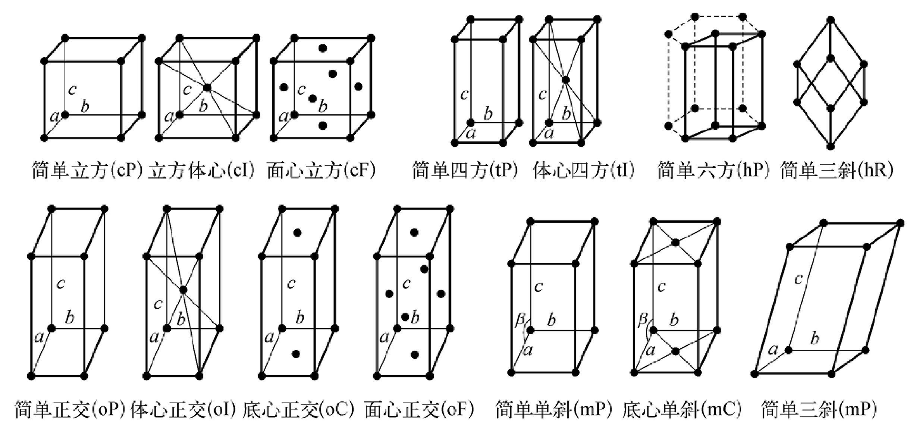
晶系之间的关系
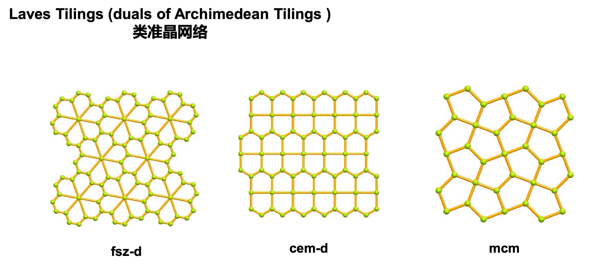
###### 14种Bravais格子
- 简单 Primitive P
- 体心 Body-centered I
- 面心 Face-centered F
- 底心 C-Face-centered C
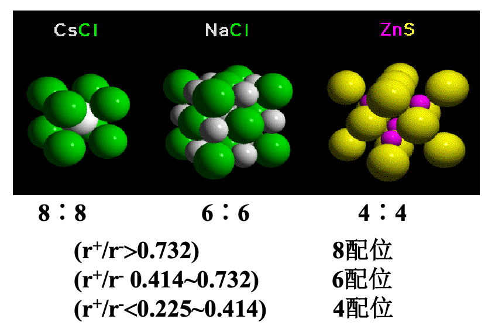
- 三方晶系的六方晶胞就是简单六方 hP = cP
- 三方晶系的菱方晶胞就是R心六方 hR

> [!quote] 立方点阵为何没有底心点阵形式，四方点阵为何没有面心或底心？
> 1.失去了立方点阵的体对角线三重对称性，退化为一个小的简单四方点阵；
> 

也就是说，满足条件的布拉维点阵必须保持晶系的特征对称性。即**任何点阵类型（P、I、F、C）都不能降低其所属晶系的特征对称性操作数**。

**立方**
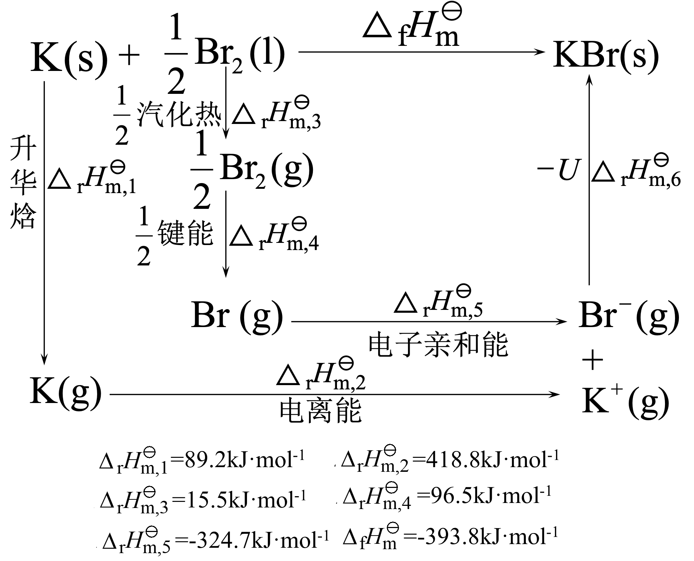
**六方**
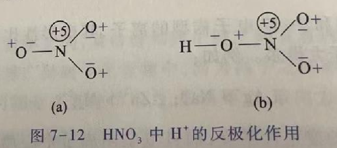

> [!quote] R心六方的推导
> R心六方只有三次对称轴，体对角线上三点（其中一点为八个等价点之一）$(0,0,0)\quad \left( \frac{2}{3}, \frac{1}{3}, \frac{1}{3} \right)\quad (\frac{1}{3}, \frac{2}{3}, \frac{2}{3})$ 
> 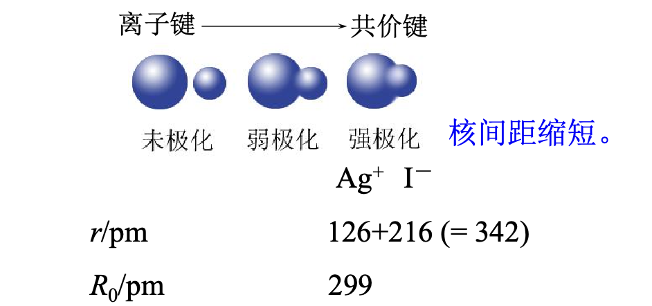

**四方**与**正交**
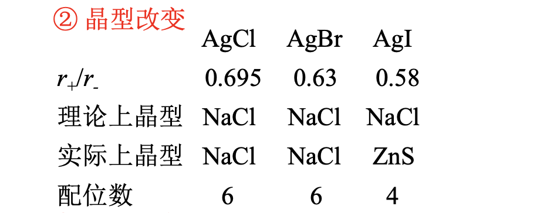
**单斜**与**三斜**
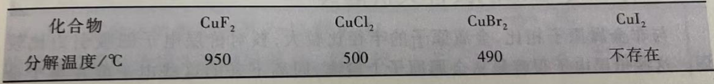
不同晶系的代表矿物晶体
- 立方晶体倾向于呈等角、等尺寸形状
- 立方体、四方体和正交晶体通常具有多个垂直面
- 六方晶体和四方晶体可能包含与长尺寸平行的柱面
- 六方晶体可能包含相交于120度的柱面
- 三角晶体通常呈现3倍对称性
- 斜方晶体通常呈薄片状（在一个维度）
- 正交晶体常常具有整体鞋盒形状
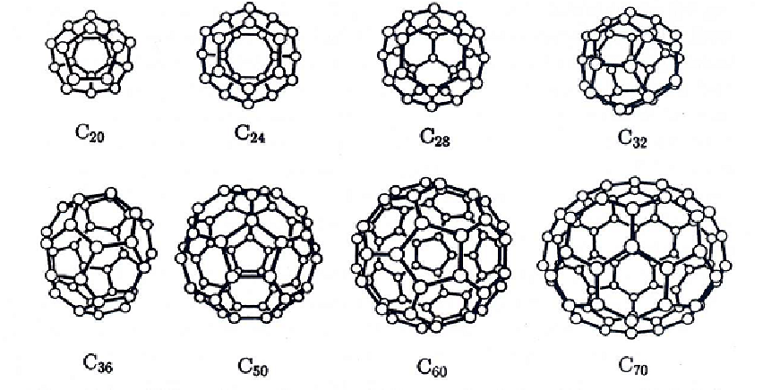
##### 晶体的点阵结构
**点阵结构**：能被某一点阵所代表的结构
**结构基元**：把晶体结构抽象为点阵的过程中点阵点所代表的内容(包括原子分子的种类，数量及在空间的排列方式)
**重复周期**：某一方向上结构基元移动的距离——周期，也就是重复向量的方向和长短
$$晶体结构=\underset{ (周期性) }{ 点阵 }+\underset{ (周期重复基元内容) }{ 结构基元 }$$

> [!quote] e.g.1 等径圆球排列形成的一密置列——(一维晶体)
> 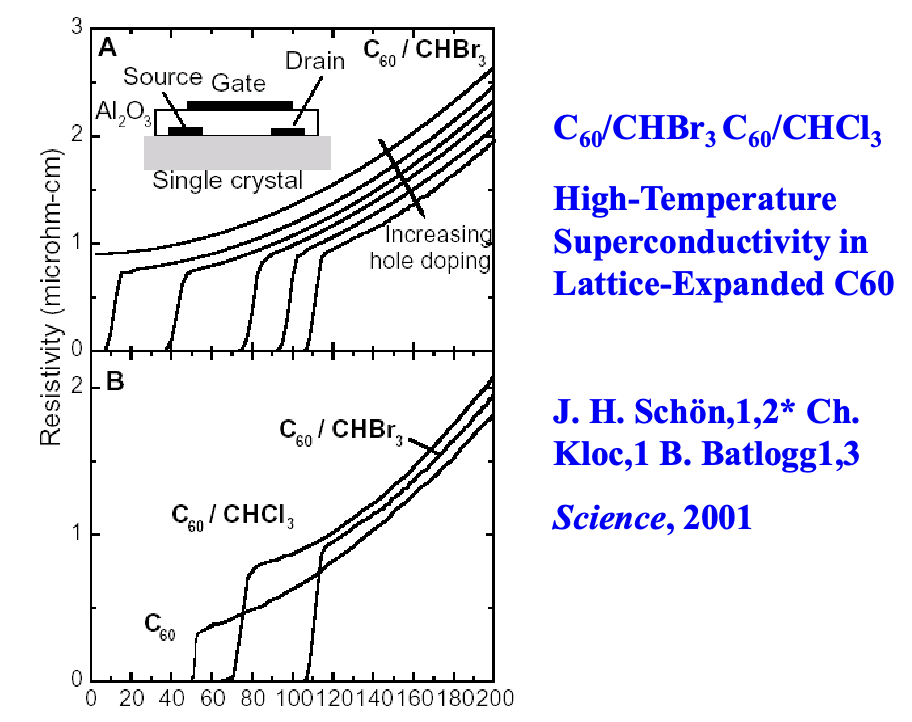
> 结构基元：一个球，一个点阵点代表一个球
> 平移周期（点阵）：
> $$\mathbfit{T}=n\mathbfit{a},\quad a=2r$$

> [!quote] e.g.2 无限伸长的聚乙烯长链高分子 (一维晶体)
> 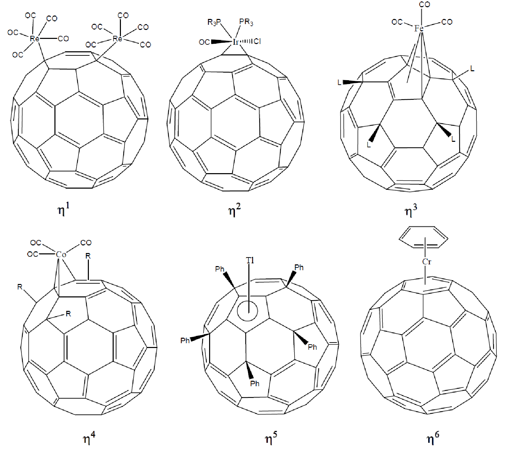
> 结构基元：$\ce{ C_{2}H_{4}}$
> 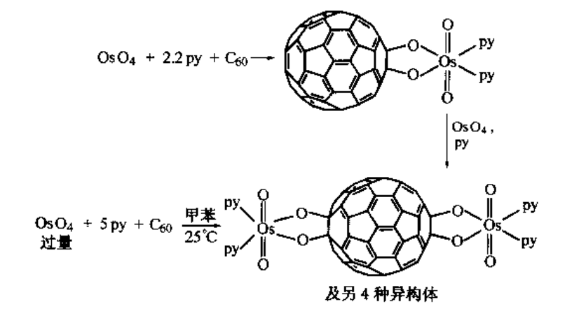
> 平移周期（点阵）：
> $$\mathbfit{T}=n\mathbfit{a}$$

通过等同点判断结构基元
- **等同点**：内容相同，周围环境也相同的原子叫一套等同点
- 一套等同点内容相同，周围环境也相同；套与套之间，重复的周期一样，即方向大小一样，即点阵周期
- 结构基元的内容是各套中的一个原子。如聚乙烯结构基元内容为2套碳原子及与它们连接的4套氢原子，即$\ce{ C_{2}H_{4}}$
- 晶体是多套等同点的集合（包括方向和位置）

> [!quote] e.g.3 $\ce{ CaF_{2}}$在（100）投影方向的原子排布，找出其所对应结构基元及二维点阵
> 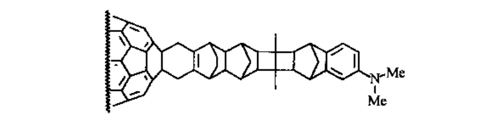
> 2套等同点：一套$\ce{ Ca}$，一套$\ce{ F}$
> 结构基元：$\ce{ Ca F}$
> 点阵形式：正方平面

> [!quote] e.g.4 石墨的点阵结构和结构基元
> 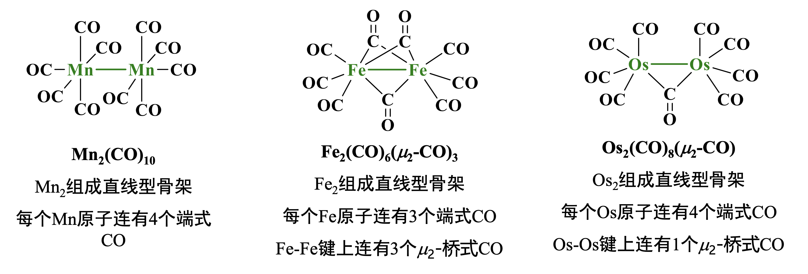
> 2套等同点：2个$\ce{ C}$
> 结构基元：两个$\ce{ C}$
> 点阵形式：平面六方点阵
#### 3. 晶胞和晶体结构
##### 晶胞
晶体组成的基本单元，它可以是仅包括一个点阵点的素单胞，也可以是包括两个以上点阵点的复胞
###### 两个要素
晶胞的大小、形式：由晶轴$\mathbfit{a},\mathbfit{b},\mathbfit{c}$及其夹角$\alpha,\beta,\gamma$确定
晶胞的内容：由组成原子/分子及其在晶胞中位置确定
##### 晶体结构
晶胞坐标系一般采用晶胞基矢a, b, c构成的三维坐标系。
晶胞内原子的分数坐标
$$OP=x\mathbfit{a}+y\mathbfit{b}+z\mathbfit{c}$$
标记方法
- 凡不到一个周期的原子都必须标记分数坐标，即坐标都为分数，这样的晶胞并置形成晶体。
- 晶胞内能写出分数坐标的原子的个数，一定等于该晶胞内所包括原子的个数。
- 必须注意的是，欲得到原子在某晶轴上的分数坐标，应过该原子做与另两个晶轴平行的平面，这个平面在这个晶轴上所截的单位向量的分数为分数坐标。
- 分数坐标与选取晶胞的原点有关。

> [!hint] $\ce{ Cu}$
> 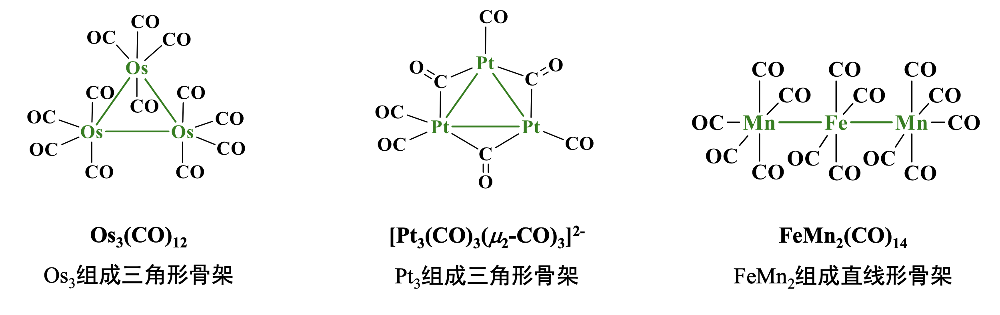

> [!quote] $\ce{ NaCl}$
> 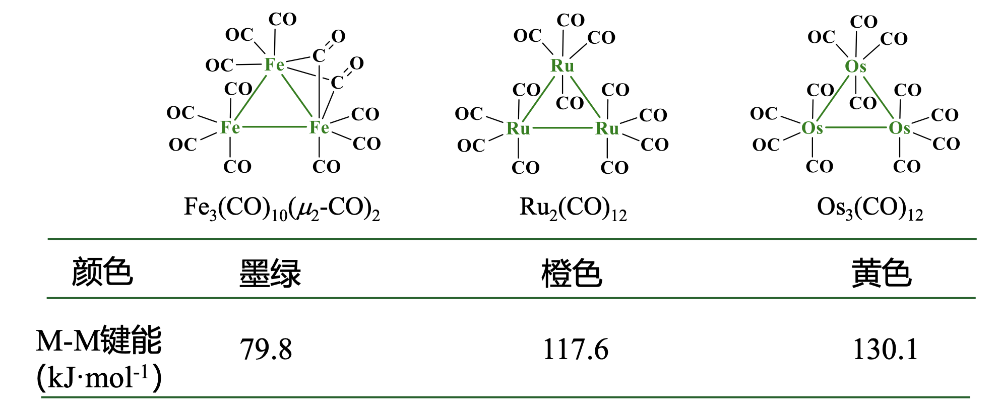

**立方晶胞特殊位置的分数坐标**
- 顶点 $(0,0,0)$
- 面心 $\left( \frac{1}{2}, \frac{1}{2},0 \right)$
- 体心 $\left( \frac{1}{2}, \frac{1}{2}, \frac{1}{2} \right)$
- 棱心 $\left( \frac{1}{2}, 0,0 \right)$
- $\frac{1}{8}$小立方体的中心 $\left( \frac{1}{4}, \frac{1}{4}, \frac{1}{4} \right),\quad\left( \frac{1}{4}, \frac{3}{4}, \frac{3}{4} \right)$
#### 4. 晶系、晶面和晶面指标
##### 晶系和布拉菲Bravais格子
空间点阵一共有七个晶系、 14种Bravais格子
##### 晶向指数
点阵中穿过若干阵点的直线方向，其指数为$[uvw]$，称为**晶向指数**
**晶向指数**代表一组平行直线，**对称关系等同的一组晶向称为晶向族**，用$\left< uvw \right>$表示。同一晶向族中的晶向可通过旋转、镜像等对称操作相互转换。
- e.g. $\left< 100 \right>$ 晶向族包括 $[100]\,[\bar{1}00]\,[010]\,[0\bar{1}0]\,[001]\,[00\bar{1}]$，这六个方向可以通过对称操作相互转化
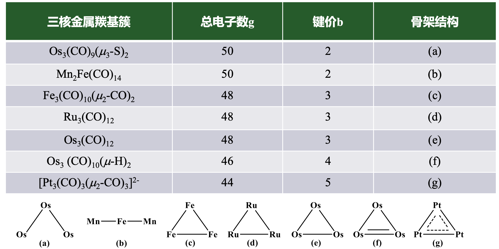
##### 晶面和晶面指数
晶体中有不同方向的**晶面**，由于原子排列不同，一般具有不同的性质，即晶体的**各向异性**。
为方便描述，晶体学给不同方向晶面以不同指标，称为**晶面指标** $(h,k,l)$，确定方式：
1. 量出晶面与三个晶轴的截距：$r,s,t$
2. 写出三个截距的倒数：$\displaystyle{ \frac{1}{r}, \frac{1}{s}, \frac{1}{t} }$
3. 化成三个简单**整数**：$(h,k,l)$
空间位向不同、性质相同的晶面属于同一**晶面族**中的**等同晶面**，用$\{h\,k\,l\}$表示。同一晶面族中的晶面可通过旋转、镜像等对称操作相互转换。
- e.g. $\{1 1 1\}$ 晶面族包括$(1, 1, 1)\, (-1, 1, 1)\, (1, -1, 1)\, (1, 1, -1)\,(-1, -1, 1)\, (-1, 1, -1) \,(1, -1, -1) \,(-1, -1, -1)$
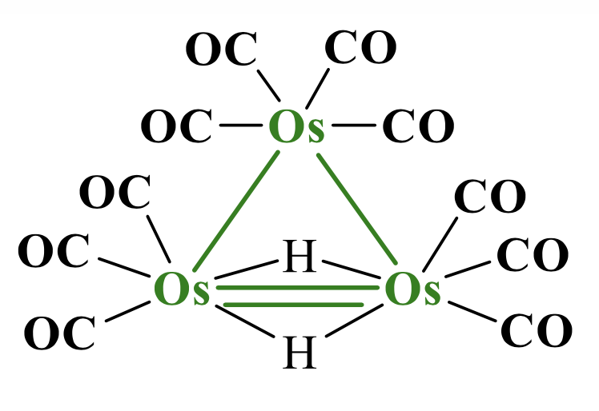

> [!quote] e.g. 点阵面的指标
> 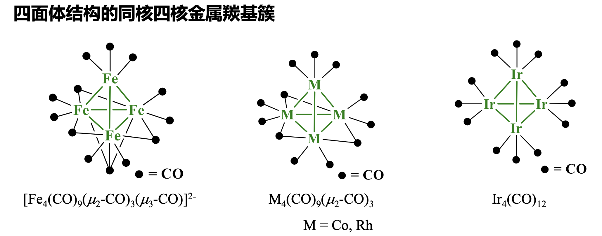

**晶面间距**：任三个晶轴上截数为整数的一族晶面中，相邻晶面间的垂直距离
立方晶系：
$$d_{(h^{*}k^{*}l^{*})}=\frac{1}{\sqrt{ \displaystyle{ \left(\frac{h^{*}}{a}\right)^{2} }+\left( \frac{k^{*}}{a} \right)^{2}+\left( \frac{l^{*}}{a} \right)^{2} }}=\frac{a}{\sqrt{ h^{*2}+k^{*2}+l^{*2} }}$$
正交晶系：
$$d_{(h^{*}k^{*}l^{*})}=\frac{1}{\sqrt{ \displaystyle{ \left(\frac{h^{*}}{a}\right)^{2} }+\left( \frac{k^{*}}{b} \right)^{2}+\left( \frac{l^{*}}{c} \right)^{2} }}$$
四方晶系：
$$d_{(h^{*}k^{*}l^{*})}=\frac{1}{\sqrt{ \displaystyle{ \left(\frac{h^{*}}{a}\right)^{2} }+\left( \frac{k^{*}}{a} \right)^{2}+\left( \frac{l^{*}}{c} \right)^{2} }}$$
六方晶系：
$$d_{(h^{*}k^{*}l^{*})}=\frac{1}{\sqrt{ \displaystyle{ \frac{4}{3a^{2}} }(h^{*2}+h^{*}k^{*}+k^{*^{2}})+\left( \frac{l^{*}}{c} \right)^{2} }}$$
#### 晶体对称性
###### 回顾群的定义
**群**：对于一个集合$G$ $\{a, b, c,…\}$，我们定义群的二个元素之间的乘法法则，其内部元素满足
1. 封闭性：任意两元素之积属于该群 $\forall a,b \in G, a\times b \in G$
2. 结合律：$a,b \in G, a\times(b\times c)=(a\times b)\times c$
3. 存在逆元：$\forall a\in G, \exists b=a^{-1}\in G$
4. 存在单位元：对于群$G$，$\exists E\in G,\forall a \in G, E\times a=a\times E$

对于任意一个群中的元素而言，其逆元为存在且唯一的。
我们将群G中的元素数量称为群的阶，记为$n =G$。

**点群**：是指固定一点不动的几何对称操作的群。
###### 正方形的8个对称操作
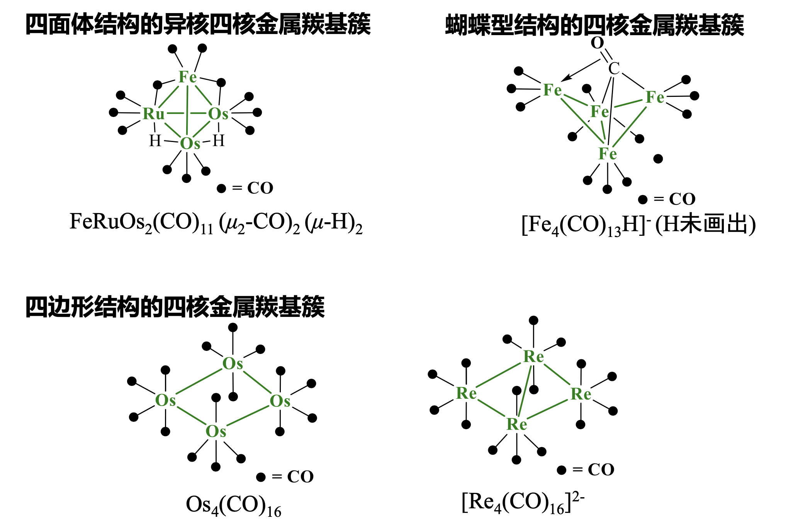
##### 晶体的宏观对称性：晶体学点群
晶体宏观对称性是指晶体的外形的对称性。**晶体的宏观对称性与分子对称性一样，是点对称元素**。
由于晶体的空间点阵结构限制（14种Bravais lattice），描述**晶体宏观对称性的点群只有32个**。
晶体的宏观对称性有4类对称元素：**旋转轴、镜面、对称中心、反轴**。
图：晶体对称性与分子对称性习惯表示的差别
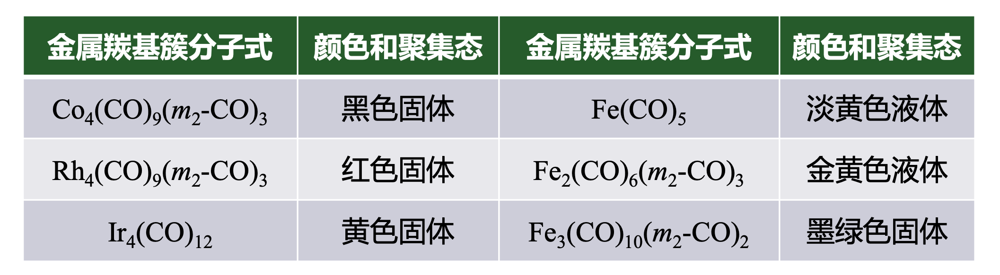
###### 旋转-旋转轴
axis of symmetry
晶体绕一个轴转动角度$\displaystyle{ \alpha=\frac{2\pi}{n} }$，则称旋转轴为$n$重旋转轴。能够和空间点阵共存的旋转轴仅有5种，即使1, 2, 3, 4, 6重轴，记为$n$。
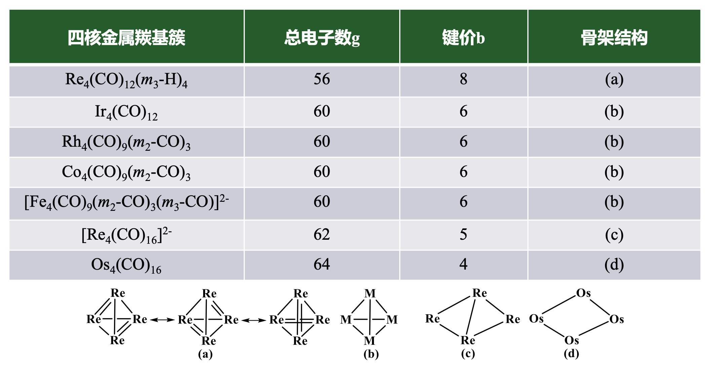
###### 旋转反演-反轴
rotoinversion axis
复合操作，即绕轴旋转$2π/n$, 再按照对称中心反演后，图形能够复原，这个轴称为反轴，记为$\bar{n}$。
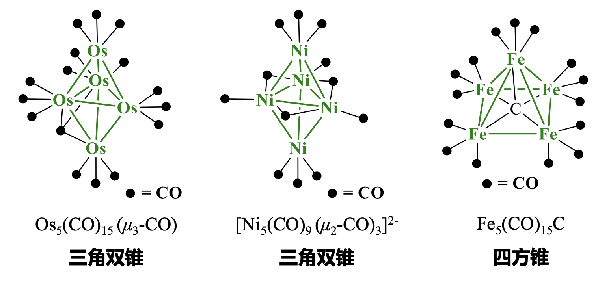
##### 晶体体系点群
点群通常采用熊夫利 Schöflies 记号，晶体学中常用国际符号（赫尔曼–莫甘 Hermann-Mauguin）表示。国际符号用晶体在某特定方向上的对称元素来表示32个点群，该特定方向称为位方向。
e.g. 立方晶系的3个位方向为$\mathbfit{a},\mathbfit{a+b+c},\mathbfit{a+b}$

先根据晶系确定晶轴，依次找出位方向
- 在某方向出现的轴对称元素，指和该方向平行的轴(旋转轴，反轴)
- 在某方向出现的镜面指与该方向垂直的镜面

各晶系空间群国际记号种的3个位方向
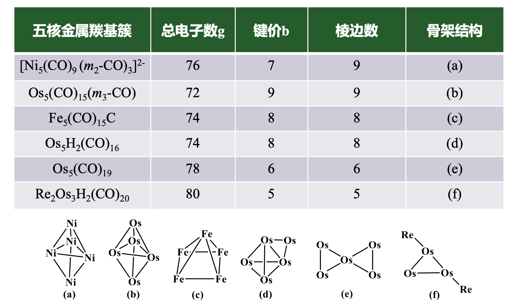

32个晶体学点群
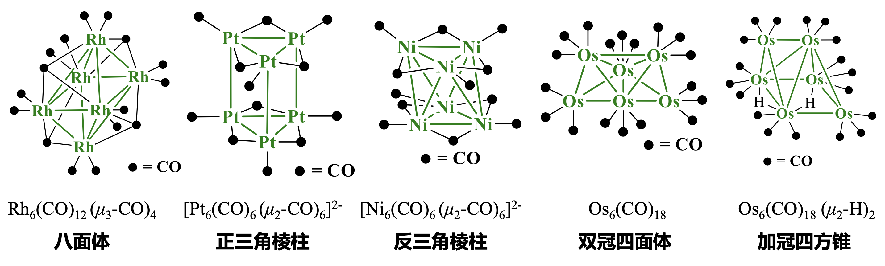
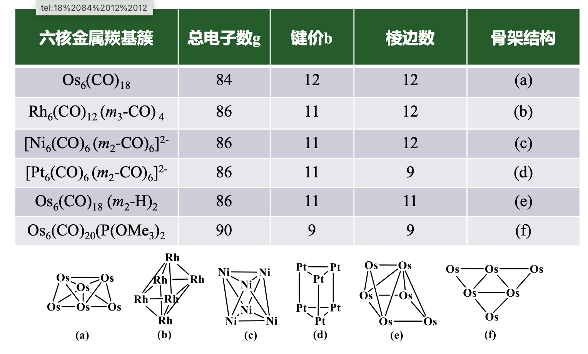

> [!quote] e.g. 长方体外形的晶体
> 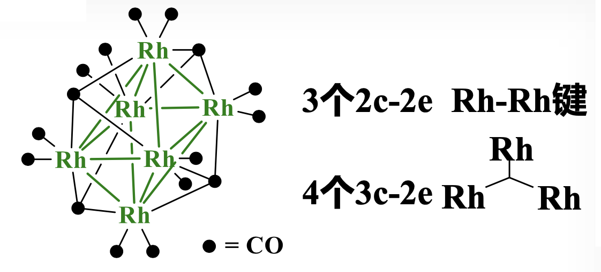

> [!quote] 立方体外形的晶体
> 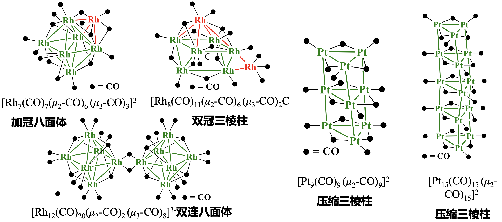

32个点群的关系
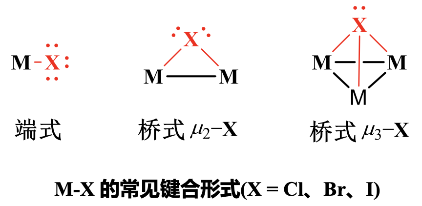
##### 晶体的微观对称性：空间群
晶体微观结构还包括平移对称及包括平移部分的对称操作，其微观对称操作的集合称为**空间群**。
晶体的宏观对称性分别属于32个点群，加上微观平移操作，引出**230个空间群**。
$$7大晶系 \left. \begin{aligned}
& \xrightarrow[]{ 增加中心 } \text{14种Bravais格子}\\&\xrightarrow[]{ 旋转，反映，反演 } 32种点群
\end{aligned} \right\}\xrightarrow[螺旋+滑移]{ 点群+平移 }230种空间群$$
同一点群的各种晶体可以隶属于不同的空间群。
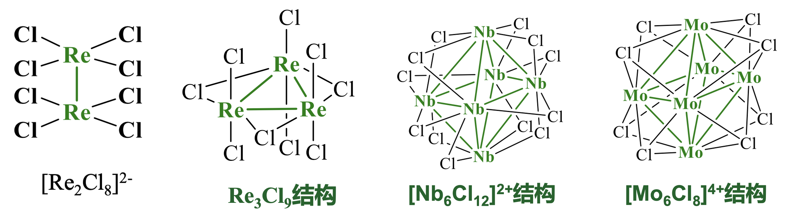
晶体的微观对称性：平移对称以及包括平移对称部分的对称操作。
晶体的微观对称元素包括**平移、螺旋轴、滑移面**三类。
###### 平移对称
周期性是晶体微观结构基本特点之一，可用空间点阵与平移群来描述晶体结构的周期性。
平移对称操作是指沿着平移群$T$中任意一个方向移动后与原来的环境完全相同。平移对称是晶体最基本、最普遍的对称元素。
###### 螺旋轴
screw axis
由旋转加平移组成，是**晶体点阵对称所特有**的。螺旋轴用$n_m$符号表示，即晶体点阵在螺旋轴作用下转动$2π/n$的过程中，还沿着旋转轴平移$m/n$个单位。
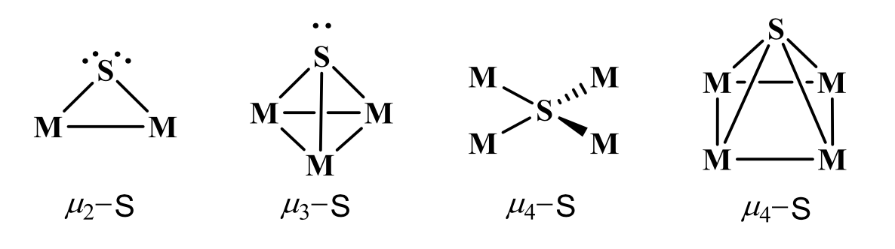
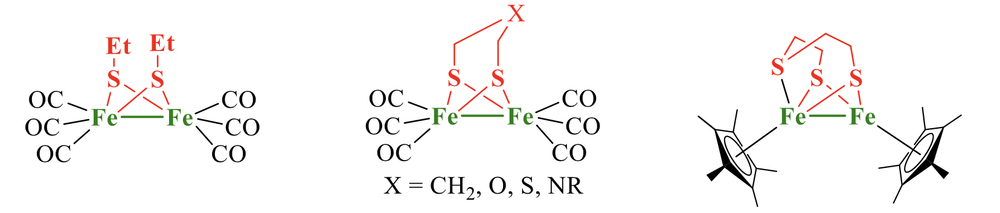
###### 滑移面
glide plane
按对称面反映后沿着反映面某方向平移$1/n$个单位可复原。滑移面也是**晶体点阵对称所特有**的。
- 反映后沿$a, b, c$晶轴平移$1/2$个单位，分别称为$a, b, c$**轴滑移面**
  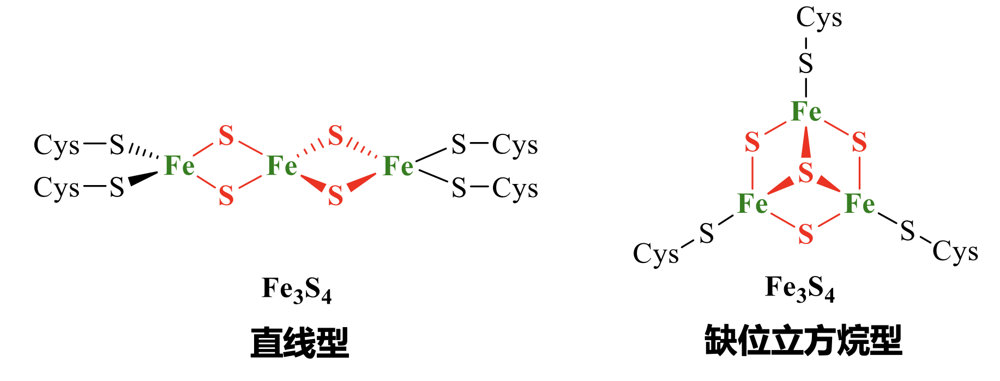
- 反映后沿$a, b$轴或$a, c$轴或$b, c$轴对角线方向平移$1/2$个单位，称为**对角滑移面**，记为$n$
  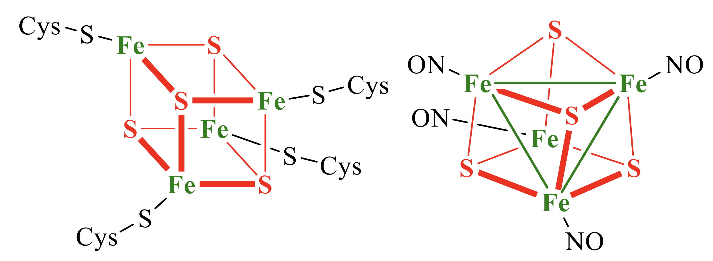
- 在金刚石结构中存在的滑移面，反映后沿$(a+b), (b+c), (a+c)$方向平移$1/4$单位，记为$d$滑移面，也称为**金刚石滑移面**
  e.g. 位于原点的0号原子(000)经过平面c/8映射再平移$\frac{\mathbfit{a+b}}{4}$，到达1号原子$\left( \frac{1}{4}, \frac{1}{4}, \frac{1}{4} \right)$；重复操作到达2号、3号原子，...。
  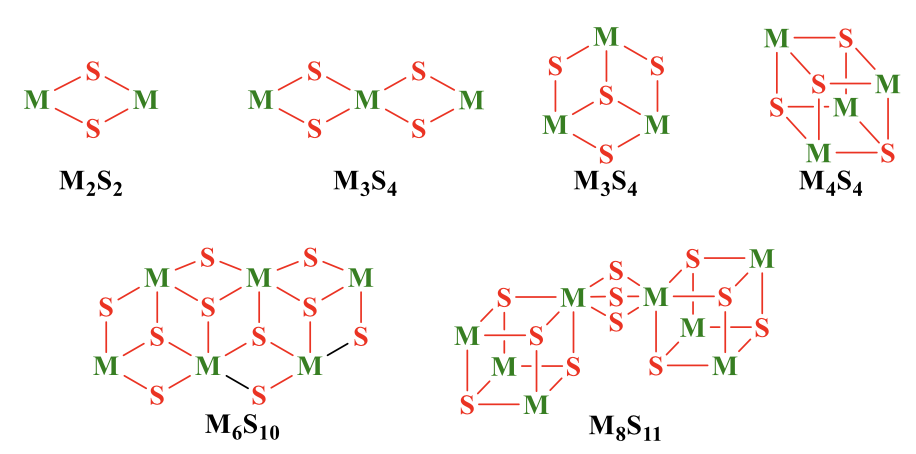

晶体对称元素的符号
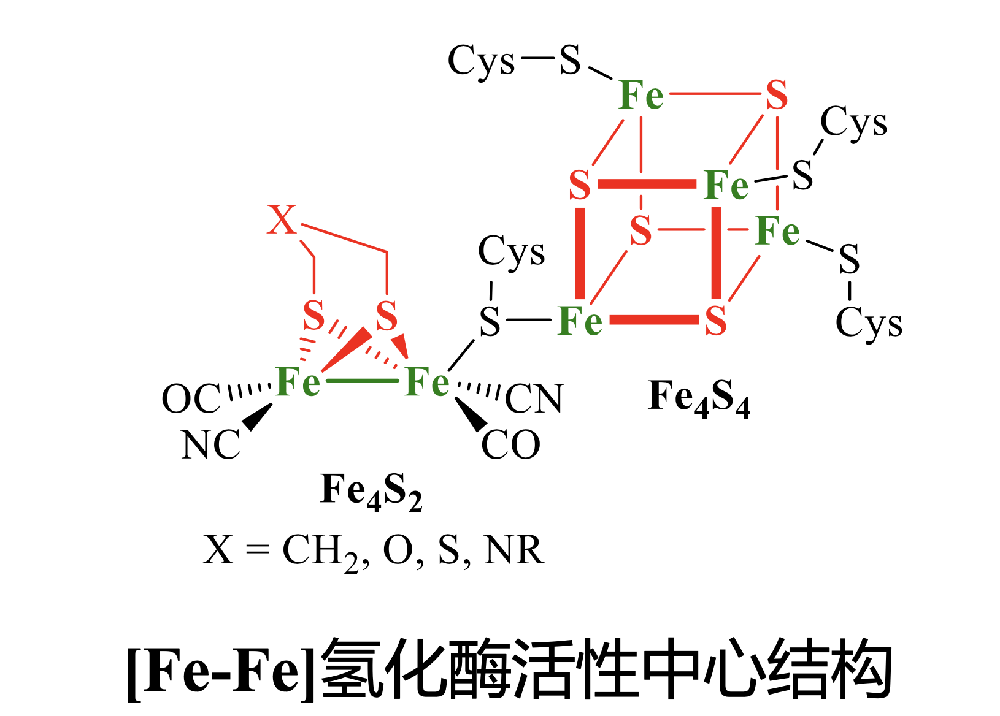
空间群用**一组对称元素系图和一个等效点系图**来表示，见
[Crystallographic Space Group Diagrams and Tables](https://img.chem.ucl.ac.uk/sgp/mainmenu.htm)
#### 晶体视图软件与网络数据库
VESTA: Visualisation for Electronic and Structural Analysis
##### 网络数据库
[CCDC](https://www.ccdc.cam.ac.uk): 小分子及金属有机分子晶体的结构数据库
[ICSD](https://icsd.fiz-karlsruhe.de/index.xhtml;jsessionid=5DC1A59A6564683C2964EAA8B08D7FFF)
[COD](https://www.crystallography.net/cod/): 有机、无机、金属有机等，不包括生物聚合物
[RCSB Protein Data Bank](https://www.rcsb.org): 蛋白质数据库

[Bravais Lattices: Rhombohedral](https://pd.chem.ucl.ac.uk/pdnn/symm1/rhomb.htm)
