### 第一节 原子簇基本概念
#### 原子簇的定义和分类
原子簇通常是指以**三个或三个以上的原子直接键合**，组成以分立的多面体或缺顶点多面体骨架为特征的分子或离子。
大多数原子簇以**三角面为基本结构单元**构成，键合原子占据多面体顶点。如果是两个金属原子以多重键相结合，则称为**二核簇合物**。
原子簇的分类

#### 原子簇的结构规则
主要讨论硼烷及其衍生物

---
#### \*硼族元素概述

^c421cb

##### 缺电子化合物
硼族 $\ce{Ⅲ A: B, Al, Ga, In, Tl}$
价电子构型：$\ce{ ns^{2}np^{1}}$
**缺电子化合物**：成键电子对数 < 价层轨道数 
- e.g. $\ce{ BF_{3}, H_{3}BO_{3}}$
- 注意：$\ce{ HBF_{4}}$不是缺电子化合物
缺点子化合物特点：
- 易形成配合化合物
	- e.g. $\ce{ HBF_{4}: HF\rightarrow BF_{3}}$
- 易形成双聚物
	- e.g. $\ce{ Al_{2}Cl_{6}}$
##### 硼单质
同素异形体：无定形硼-棕色粉末，晶形硼-深灰色
化学活性高，硬度大，熔沸点高
晶形硼$\ce{ B_{12}}$的点群：$I_{h}$，二十面体群
##### 硼的化合物
###### 硼的氢化物
硼烷分类：$\ce{ B_{2}H_{6}}$与$\ce{ B_{n}H_{n+6}}$
- e.g. $\ce{ B_{2}H_{6}}$ 乙硼烷，$\ce{ B_{4}H_{10}}$ 丁硼烷
最简单的稳定硼烷为$\ce{ B_{2}H_{6}}$，其结构为
- B的$sp^3$**杂化**轨道与H形成**三中心两电子键**（**氢桥**）

三中心两电子：一个B原子提供一个电子，一个B原子提供空轨道，H原子提供电子

---
#### Lipscomb多中心定域键理论

^a8fdcd

Lipscomb利用**低温X射线衍射**等方法测定并证实了多种硼烷的结构，提出“拓扑法”对硼烷结构进行详细分析，同时也描述了硼烷结构中的定域键。**Lipscomb的多中心定域键理论**通常也被称为**styx数分析法**。

假定硼烷$\ce{B_{n}H_{n+m}}$分子中每个硼原子都有一个外向的$2c−2e$（两中心两电子）端氢键；
- 分子中含有 $s$ 个 $3c−2e$（三中心两电子） $\ce{ B-H-B}$ 键。
- 分子中含有 $t$ 个 $3c−2e$ 的 $\ce{ B−B−B}$键。
- 分子中含有 $y$ 个 $2c−2e$（两中心两电子）的 $\ce{ B-B}$ 键。
- 分子中含有 $x$ 个除了 $n$ 个端氢键以外的 $2c−2e$ $\ce{B−H}$ 键。
##### Lipscomb拓扑法的基本假设
硼烷分子中每个硼原子形成4个键，可能是$\ce{2c -2e}$的$\ce{B−H}$或$\ce{B−B}$键，也可能是$\ce{3c −2e}$的$\ce{B−H−B}$或$\ce{B−B−B}$键。因为每个硼原子仅能提供3个价电子，每个氢原子仅提供1个价电子，所以可从硼烷分子式$\ce{B_n H_{n+m}}$来计算各种类型化学键的数目，从而得到硼烷结构的拓扑图像。

$s,t,y,x$的关系
- $m=s+x$：骨架H原子数平衡，分子中除了$n$个端氢外，还有$m$个H原子可形成$s+x$个含氢键
- $n=s+t$：由于每个B原子都有4个价轨道而只有三个价电子，故形成$3c-2e$键可以解决B原子的缺电子问题，因此B原子数和三中心键数相等
- $2y=s-x$：由于$\ce{B_n H_{n+m}}$分子共有$4n+m$个价电子，而总价键数为$[n+s+t+y+x]$，每个价键中所含电子数为2，则有$4n+m=2[n+s+t+y+x]$，将上两式代入即得
- $\frac{m}{2}\leq s\leq m$：$m=s+x,\quad 2y=s-x \to s= \frac{m}{2}+y\geq \frac{m}{2}$；$m=s+x\geq s$

##### Lipscomb拓扑规则
每对相连的B原子至少由**一个B-B键、B-B-B键或B-H-B键连接**；
两个B原子间**不能同时存在**$2c-2e$的B-B键和$3c-2e$的B-H-B键和B-B-B键；
每个B原子利用它的4个价轨道成键，以达到**8电子组态**；
已知硼烷的结构至少有一个**对称平面**。

> [!quote] 用styx数分析法分析乙硼烷的拓扑结构。
> $$\ce{ B_{2}H_{6}}: n=2, m=4 \implies \left\{\begin{aligned} & s+x=4 \\ &s+t=2 \\ & 2y=s-x \\& 2\leq s\leq 4\end{aligned}\right. \implies \left\{\begin{aligned} &s=2\\&t=0\\&x=2\\&y=0 \end{aligned}\right. , \left\{\begin{aligned} &s=3\\&t=-1\\&x=1\\&y=1 \end{aligned}\right.(舍) , \left\{\begin{aligned} &s=4\\&t=-2\\&x=0\\&y=2 \end{aligned}\right.(舍)$$
> $$\implies \left\{\begin{aligned}&s=2\\&t=0\\&x=2\\&y=0 \end{aligned}\right. \implies \left\{\begin{aligned} &2个\ce{ B-H-B键}\\&0个\ce{ B-B-B键}\\ & (2+2)个\ce{ B-H}键 \\&0个\ce{ B-B}键 \end{aligned}\right.$$

> [!quote] 用styx数分析法分析丁硼烷的拓扑结构。
> $$\ce{ B_{4}H_{10}}: n=4, m=6 \implies  \left\{\begin{aligned} &s+x = 6 \\& s + t = 4 \\ & 2y =s-x \\& 3\leq s\leq 6 \end{aligned}\right. \implies  \left\{\begin{aligned} & s= 3 \\ &t=1 \\ &x=3 \\ & y = 0 \end{aligned}\right. , \left\{\begin{aligned} &s = 4 \\ & t = 0 \\ &x = 2 \\ & y = 1\end{aligned}\right.$$
> 因此，有两种styx组合
> 
> 4012结构具有对称平面，构象更有优势

##### Wade规则
1971年，K.Wade提出了硼烷骨架成键电子对理论，即Wade规则：**硼烷和碳硼烷结构都是以三角形为棱面的多面体，其骨架键对数与其结构类型有关。**
$\ce{ CH}$和$\ce{ BH-}$是等电子体，硼烷中的$\ce{BH-}$可以被$\ce{CH}$取代形成碳硼烷，同理，有金属硼烷衍生物用Wade规则判据时的等价方式
$$\ce{ C\equiv B^{-} (BH),\quad P\equiv BH- (BH_{2}),\quad S\equiv BH^{2-} (BH_{3})}$$

> [!quote] e.g. 闭式十二硼烷阴离子$\ce{[B12H12]^2-}$
> 

硼烷$\ce{ B_{n}H_{n+m}}$共(4n+m)个价电子，除去形成外向B-H键的2n个电子外，骨架成键电子对数为
$$P=\frac{1}{2}(2n+m\pm {\color{teal}{Z \,离子电荷}})$$
Wade规则把骨架电子对数和骨架的成键分子轨道数联系起来

> [!quote] e.g. 用Wade规则判断$\ce{ B_{6}H^{2-}_{6}}$的结构类型。
> $$\ce{ B_{6}H^{2-}_{6}}:n=6\implies P_{s}=\frac{1}{2}(6+6+2)=7$$
> 结构类型：闭合型，几何构型：八面体
> $\ce{B6H^2-_6}$的18个原子轨道（每个B有三个价轨道：1个sp杂化轨道和2个p轨道）相互作用，产生7个成键分子轨道

> [!quote] e.g. 用Wade规则判断$\ce{ B_{5}H_{9}}$和$\ce{ B_{4}H_{10}}$的结构类型。
> 

**碳硼烷**$\ce{ [(CH)_{a}(BH)_{p}H_{q}]^{c-}}$，其骨架顶点数$n=a+p$，$q$是除$\ce{ CH, BH}$单元外的氢原子数目。骨架成键电子对数
$$P_{s}=n+\frac{1}{2}(a+q+c)$$
与骨架结构的关系为

前已述 $\ce{ CH\equiv BH^{-}}$，则实际上有$\ce{ [(CH)_{a}(BH)_{p}H_{q}]^{c-}\sim (BH)_{a+p}H_{c+a+q}}$，显然上表成立。
#### 原子簇化合物中的金属-金属键

^941f6d

过渡金属原子簇中存在金属-金属键，其发现史

##### 1. 原子簇化合物中M-M多重键的类型
在原子簇化合物中，金属原子之间可以形成单键、双键、叁键和四键，下仅介绍四重键。
###### M-M四重键
上面$\ce{ [Re_{2}Cl_{8}]^2-}$分子结构为重叠型，属于$D_{4h}$点群。Re-Re键的键长为224 pm，小于金属晶体中的Re-Re键键长276 pm；Cl-Cl原子间间距为332 pm，小于Cl原子范德华半径的两倍 340-360 pm。
**为什么Cl原子不因空间位阻而相互错开，而是形成重叠式结构？**
Re-Re原子间形成了强四重键（键能达$\pu{ 480-546kJ.mol-1}$），使得$\ce{ [Re_{2}Cl_{8}]^2-}$分子可稳定存在。

###### 乙酸亚铬

Cr的键级为4，高度稳定。
##### 2. 形成M-M键的判据
**键能**：M−M键能>$\pu{80kJ.mol−1}$
- 可从热化学数据或光谱数据求得，但数据少比较起来不容易
**键长**：M−M键键长 < 金属晶体相邻原子间距离
- 判断是否有M−M键的重要标准。但有时会受到金属氧化态和桥基配体的影响
**磁矩**：M−M键形成，电子自旋成对，磁化率变小
- 磁化率比较容易测量，所以该值也可作为M−M键是否存在的判据。但在较重的过渡元素中，由于自旋－轨道的耦合，也会导致较低的磁化率，所以要考虑该因素的影响

金属-金属键的形成受到多个成键因素的影响，
- 当金属原子**氧化值较低**时，金属—金属**容易成键**。通常当金属氧化值为+2或更低时，有利于形成M-M键；
- 如果低氧化值金属同时具有**4d、5d的价轨道电子**，则形成M-M键更加容易。因此**重过渡系金属比轻过渡系金属更容易形成金属簇合物**。
- 但如果具有较高氧化值（+3）的金属，如果具有合适的电子组态，也有利于形成M—M键。
#### 小结
大多数原子簇以三角面为基本结构单元，两金属原子以多重键相结合称二核原子簇化合物。
通过Lipscomb多中心定域键理论、Wade规则，能够对原子簇化合物的结构进行推断。应用Lipscomb多中心定域键理论可以判定很多**巢型和网式硼烷**的拓扑结构，但此理论**不适用于闭合式硼烷阴离子**。
使用键能、键长和磁矩等数据可以判断原子簇化合物中是否存在金属−金属多重键。
### 第二节 非金属原子簇
#### 硼烷及其衍生物

^75509d
**硼烷的性质**
- 热稳定性差，$\Delta _{f}G_{m}^{\ominus}$和$\Delta _{f}H_{m}^{\ominus}$均为正，故为吸热化合物；
- 化学稳定性差，易自燃、水解；
- 燃烧值大：$\ce{ B_{n}H_{m} + O_{2} -> B_{2}O_{3} + H_{2}O}$，有$\Delta H_{f}=\pu{ -1273kJ.mol-1}$
- 毒性大
##### 硼烷的分类与命名
硼烷包括硼烷阴离子化合物和中性硼烷，按组成可分为少氢型（$\ce{B_nH_{n+4}}$）和多氢型（$\ce{B_{n}H_{n+6}}$）
根据结构分类：

**1. 闭式硼烷 closo**
通式为$\ce{B_nH_n^2-} (n = 6-12)$二价阴离子。其骨架结构均为由三角面组成的完整多面体。硼原子占据多面体的顶点并与一个氢原子键合。这种端梢B-H键由骨架向四周散开，被称为**外向B-H键**，其氢原子被称为**外向氢**。
**2. 巢式硼烷 nido**
通式为$\ce{B_nH_{n+4}}$，其骨架结构可以看成是由闭式硼烷的多面体**脱掉一个顶点硼原子**衍生而成。在巢式硼烷中，存在两种结构不同的氢原子，其中有n个端梢向外的端氢，还有4个与两个硼原子相连的氢原子，这种氢原子也被称为**桥氢**。
**3. 蛛网式硼烷 arachno**
通式为$\ce{ B_{n}H_{n+6}}$，其骨架结构可以看成是由闭式硼烷的多面体**脱掉两个顶点硼原子**衍生而成。蛛网式硼烷中存在三种结构不同的氢原子：外向氢、桥氢、**切向氢**。切向氢是一种端梢氢原子，B-H键指向其对应的完整多面体的外接球面的切线方向。

巢式和蛛网式硼烷的结构都不是闭合的多面体，因此它们又被总称为**开式硼烷**。
除上三种基本结构类型外，还存在两类较罕见的结构，分别是通式为$\ce{B_nH_{n+8}}$的**敞网式 hypho**和通式为$\ce{B_nH_{n+10}}$的**枝式 klado**。此外，还有一类**连接型硼烷 conjuncto**，由闭式、巢式或蛛网式硼烷组合而成，大体上可分为单边、双边、共边和共面等类型。
##### 硼烷的结构与成键
乙硼烷$\ce{ B_{2}H_{6}}$分子具有$D_{2h}$对称性，2个$\ce{ BH_{2}}$基团位于同一平面内，垂直该平面的另一平面内存在2个$\ce{ B-H-B}$三中心二电子键 (3c-2e)，硼原子间不直接成键。
每个硼原子为$sp^{3}$杂化，两个$sp^{3}$杂化轨道与2个氢原子的1s轨道相互作用形成二中心二电子 (2c-2e)的$\ce{ B-H}$共价单键。两个硼原子的各一个$sp^{3}$杂化轨道与氢原子的1s轨道相互作用可组成3个分子轨道，包括1个成键、1个非键和1个反键分子轨道，2个电子填入成键轨道，形成位于yz平面内的$\ce{B-H-B}$ 3c-2e键。
##### 乙硼烷的合成
实验室制备：
$$\ce{ 2NaBH_{4} + I_{2} = B_{2}H_{6} + 2NaI + H_{2}\uparrow}$$
$$\ce{ 3NaBH_{4} + BF_{3} = 2 B_{2}H_{6} + 3 NaF}$$
$$\ce{ 2NaBH_{4} + H_{2}SO_{4}(浓) = B_{2}H_{6} + Na_{2}SO_{4}}$$
工业制备：
$$\ce{ 2Al + 2 B_{2}O_{3} + 9 H_{2}(高压)\xlongequal{ \pu{ AlCl_{3}} }2B_{2}H_{6} + Al_{2}O_{3} + 3H_{2}O}$$
##### 硼烷的反应
**硼烷缩合**：乙硼烷可以与低级硼烷阴离子缩合，生成高级硼烷阴离子
$$\ce{ 2B_{2}H_{6} = B_{4}H_{10} + H_{2}}$$
**还原性**：几乎所有的硼烷对氧化剂都极为敏感。$\ce{ B_{2}H_{6}}$和$\ce{ B_{5}H_{9}}$在室温下遇空气即激烈燃烧，温度高时会发生爆炸。在中性硼烷中，只有分子质量相对较大的$\ce{ B10H14}$在空气中稳定。
$$\ce{ B_{2}H_{6} + 3O_{2} =B_{2}O_{3} + 3H_{2}O}$$
$$\ce{ B_{2}H_{6} + 3O_{2} =2B(OH)3}$$
乙硼烷和较大Lewis碱反应生成$\ce{ BH_{3}}$的**lewis碱配合物**，发生**对称裂解**。
$$\ce{ B_{2}H_{6} + 2NMe_{3} = 2BH_{3}.NMe_{3}}$$
而与较小Lewis碱反应时发生**不对称裂解**，生成**两分子Lewis碱稳定**的$\ce{ [BH_{2}]+,[BH_{4}]-}$
$$\ce{ B_{2}H_{6} + 2NH_{3} = [(NH_{3})2BH_{2}][BH_{4}]}$$
**质子酸性**：**巢式和蛛网式硼烷中的桥氢**具有质子酸性，可用强碱除去得到硼烷阴离子。由于硼烷多面体顶角带较多负电荷，硼烷的顶角硼原子上的端氢可以被亲电试剂取代。例如B12H122-可以与卤素发生反应，将其所有的氢全部用卤原子取代。
##### 碳硼烷
$\ce{CH}$和$\ce{BH-}$单元是等电子体，因此硼烷中$\ce{BH-}$可被$\ce{CH}$取代，形成碳硼烷。
最常见的碳硼烷是闭式二碳代十二硼烷$\ce{C2B10H12}$。其具有二十面体结构，并存在三种异构体，分别是邻位的$\ce{1,2-C2B10H12}$、间位的 $\ce{1,7-C2B10H12}$ 和对位的 $\ce{1,12-C2B10H12}$。异构体的稳定性次序为**对位>间位>邻位**。
邻位$\ce{C2B10H12}$碳硼烷可以通过$\ce{B10H14}$和乙炔的反应制备，间位和对位$\ce{C2B10H12}$碳硼烷则可以通过邻位碳硼烷的异构重排反应制得。
###### 碳硼烷的反应性
由于碳硼烷的C-H键为sp杂化，因此C-H键的H呈弱酸性。例如邻位$\ce{C2B10H12}$碳硼烷可以与正丁基锂反应生成$\ce{Li2C2B10H10}$，并以其为原料合成多种取代的碳硼烷。
谢作伟院士团队：基于碳硼炔实现碳硼烷衍生化
碳硼炔主要存在两种共振形式，一种具有**碳-碳或碳-硼多重键**，另一种具有**碳-碳双自由基**或者**分子内碳-硼两性离子**。由于碳硼笼的结构限制，碳硼炔具有很高的化学活性，可以与含碳-碳不饱和键的化合物发生环加成反应，也可以发生C-H键的加成反应。

碳硼烷可以被应用于金属**有机笼状化合物**的构筑。由于硼原子端氢带有一定的负电荷，H(2.20)原子的电负性要比B (2.04)原子高，所以B-H键被极化为$\ce{B^δ+ - H^δ−}$的形式，其可以与烷烃的带有正电荷的氢发生B-H⋯H-C的双氢键作用(C (2.55))，通过配体骨架调控，能够使金属有机笼状化合物**选择性吸附**己烷异构体，从而实现烷烃异构体的分离。

##### 不饱和硼化合物
与不饱和有机物不同，含不饱和硼硼双键或三键的化合物在没有配体稳定的条件下，因为硼中心既有**空p轨道又有富电子的π轨道**，所以极不稳定，目前尚没有被成功分离的报道。
以**有机膦**或**卡宾**等路易斯碱为配体，通过其独对电子与硼原子空p轨道作用，可以有效稳定含有硼硼双键或三键的化合物，从而实现它们的合成与表征。

###### 硼烯 diborene
由还原氮杂环卡宾配位的二氯硼烷制备，硼烯可发生硼氢化反应，将硼硼双键还原为单键

###### 硼炔 diboryne
由还原氮杂环卡宾配位的四溴二硼化合物制备，与不饱和有机物类似，硼硼三键可与金属离子配位

> [!hint] 小结
> 硼的缺电子特性导致硼烷中普遍含有三中心两电子键；
> 硼烷可以作为Lewis酸与Lewis碱发生反应；
> 硼硼之间可以通过π键形成稳定的双键或三键化合物。

#### 富勒烯及其衍生物

^e7f8a0

由五元环、六元环构成的封闭式空心球形或椭球形结构的共轭烯。
##### 富勒烯的产生
Smalley's cluster apparatus

> [!quote] 用于发现富勒烯的超音速激光气相沉积喷嘴源的剖面示意图。
> 注意标有“积分杯”的区域，该区域发生的团簇“烹饪”反应使得$\ce{ C_{60}}$团簇的强度达到附近尺寸范围内其他任何团簇的 50 倍以上。这些与小碳链和碳环发生的向上聚集反应几乎消耗了除$\ce{ C_{60}}$以外的所有团簇；而$\ce{ C_{60}}$因其完美的对称性得以存留。
> 

1. ​**激光脉冲​**​：一束高能激光被发射出来，轰击靶材
2. ​**旋转石墨盘​**​：激光轰击的靶材，由纯碳（石墨）制成。旋转的目的是为了让激光每次都能打到一个新的表面，保证实验的持续和稳定
3. ​**高压氦气**：激光轰击石墨的瞬间高压氦气流喷出，冷却被激光汽化产生的碳原子蒸气，并通过碰撞使碳原子聚集、形成各种大小的碳原子团簇。
4. ​**膨胀**​：氦气与碳团簇的混合物随后向真空室中膨胀，进一步冷却
5. ​**最终检测**​：所有形成的团簇最终被送入**质谱仪**，精确测量区分不同碳原子数的团簇

**质谱图**：
- 无积分杯，低氦背压：产生的碳团簇大小分布很宽，连续且杂乱。$\ce{ C_{60}}$虽然存在，但并不突出。这说明在条件不理想时，碳原子随机成团。
- 无积分杯，全氦背压​：分布开始出现明显的双峰，在$\ce{ C60}$和$\ce{ C70}$附近出现了明显的峰值，尤其是$\ce{ C60}$的信号突然变得非常强，这强烈暗示$\ce{ C60}$是一个极其稳定的特殊结构
- 有积分杯，全氦背压​：最优条件，​氦气压力最高，并且使用了积分杯​，让高温的碳团簇蒸气与高压氦气有更长的混合碰撞时间，形成结构最稳定、能量最低。其他大小的团簇几乎完全消失，而$\ce{ C60}$形成了一个极其尖锐、孤立的巨峰，$\ce{ C_{70}}$也是一个非常明显的峰。

$\ce{ C60}$具有$I_{h}$点群，$\ce{ C_{70}}$具有$D_{5d}$点群，具有高度对称性，故其结构稳定，能量低。
富勒烯的分子结构为由五边形和六边形构成的球形多面体（截顶多面体），碳原子位于截顶多面体顶点，所有的碳原子都是等价的。每个C原子和相邻3个C原子相连，每条棱和两个C原子相连，又有欧拉定理，因此面数$F$、顶点数$V$和棱数$E$满足
$$\left\{\begin{aligned}&F+V=E+2\\&3V=2E\\&2E=5F_{5}+6F_{6}\\&F=F_{5}+F_{6}\end{aligned}\right. \implies \left\{\begin{aligned} &F_{5}=12\\ &F_{6}=\frac{1}{2}V-10\end{aligned}\right.$$
因此，富勒烯的构成为12个五边形，C数每增加2，六边形个数增加1。

> [!quote] 富勒烯系列
> 

$\ce{ C_{60}}$：12个五边形，20个六边形。
$\ce{C_60}$分子内径为0.71 nm，碳原子杂化为介于$sp^{2}$和$sp^{3}$之间的$s^{0.9}p^{2.28}$。三个C原子形成的3个$\sigma$键的键角总和为348º，小于平面三角形内角和360°，因而呈**球面形**。剩余的轨道和每个碳原子未杂化的p轨道形成一个非平面的离域大$\pi$键，化学稳定性较一般芳香族化合物差。

$\ce{ C_{60}}$晶体为棕黑色，晶体结构测定表明其分子间仅靠范德华力结合。
- 室温时，空心球体不断旋转，分子在固体中处于一种**热力学无序态**，且有**各向异性**。
- < 249 K，分子取向有序，具有**面心立方**结构；
- 5 K时，中子衍射法测得$\ce{ C_{60}}$属于立方晶系。

> [!quote] C60分子的波谱数据
> | 红外光谱（cm⁻¹） | 拉曼光谱（cm⁻¹） | 核磁共振谱（ppm） | 紫外-可见光谱（nm） |
|------------------|-----------------|-------------------|---------------------|
| 1430             | 1429            | 143.2             | 213（s）            |
| 1183             | 497             |                   | 257（s）            |
| 577              | 273             |                   | 329（s）            |
| 527              |                 |                   | 440-470             |

$\ce{C_60}$固体$\ce{^13C}$-NMR谱只有单谱线，表明其60个碳原子完全等价。
$\ce{ C_{60}}$共有174种振动模式和42种不同对称性，但IR中只有四个强峰，表明仅有四种$T_{1u}$振动具有红外活性。
$\ce{ C_{60}}$的电子吸收光谱有三个强峰，为$^{1}A_{g}\to \\^{3}T_{1u}$跃迁。

富勒烯具有缺电子烯性质，同时又兼备给电子能力，因此可进行有效化学修饰。对富勒烯的化学修饰研究主要集中于氢化、卤化、氧化还原、环加成、光化与催化及自由基加成等多种化学反应，其中以环加成反应的研究最多。
富勒烯具有中空结构，将其开环形成开口结构并将原子直接引入空腔内，就可以形成富勒烯包合物。
$\ce{ C60}$表面是很大的共轭结构，电子在分子轨道上离域使外来电子稳定化，具有较好电子传输能力。$\ce{ C60}$与电子给体聚合物有较好能级匹配，光照下发生激发态电荷转移至受体$\ce{ C60}$衍生物，所产生的空穴转移至给体共轭聚合物。因此，可用共轭聚合物和$\ce{C_{60}}$衍生物制备薄膜光伏器件。
##### 离子型化合物：富勒烯超导化合物
$\ce{C_{60}}$分子本身不导电，但碱金属嵌入后形成的系列化合物（称**金属富勒烯**）转变为**超导体**。晶体中含$\ce{ C^{3-}_{60}}$和$\ce{ A+}$离子。
- $\ce{ K_{3}C60}$：面心立方晶体，球形$\ce{ C^{3-}_{60}}$为立方最密堆积成面心立方结构，不能自由旋转，$\ce{ K+}$填入全部八面体和四面体空隙。$\ce{Rb_{3}C60,Cs_{3}C60}$类似。
- 此外，还能形成$\ce{A_{4}C60(A = K,Rb)}$型和混合型离子化合物。

##### 共价型化合物
$\ce{ C_{60}}$中有30个六边形交界的C-C双键，可和无机小分子、过渡金属化合物和有机化合物等分步加成，形成众多化合物。

形式上最简单的即和氢气及卤素形成的加合物。
- 如$\ce{ C_{60}H_{x}}(x = 2,4,5,18,36)$等，可通过金属还原制备；
	- 合成**氢化富勒烯**的方法有Birch还原、硼氢化反应、催化氢化、电弧放电等。这类反应易生成多加成氢化产物，最终得到的产物多为含异构体的混合物。
- 加热下，棕黑色的$\ce{ C_{60}}$粉末能分步氟化形成$\ce{ C_{60}F_{x}}(x = 6,42,60)$等白色粉末。
	- 富勒烯$\ce{C84}$在500°C下与氟化试剂$\ce{MnF3}$或$\ce{CoF3}$反应得到**氟化衍生物**$\ce{C84F40}$和$\ce{C84F44}$。$\ce{C84F44}$是目前已分离出的具有最强芳香性的富勒烯衍生物。在$\ce{C84F40}$分子中含有四个苯环和两个萘环，每个苯环周围含有6个$sp^{3}$杂化的C原子，每个萘环周围含8个$sp^{3}$杂化C原子，F原子加成使$\ce{C84F40}$结构满足最大离域性。

$\ce{ C_{60}}$可和一系列过渡金属（尤其是第VⅢ族）化合物反应，一般形成$\ce{ \eta^{2}-}$型化合物。

> [!quote] 富勒烯可能的哈普托数 hapticities
> 

由于双键个数多，加成反应复杂化，常形成多种异构体。如
$$\ce{ C_{60} + OsO_{4} + py -> C_{60}O_{2}OsO_{2}(py)2 + C_{60}[O_{2}OsO_{2}(py)2]2}$$

$\ce{ C60}$还能和许多有机化合物甚至一些较为复杂的有机分子形成有机富勒烯。
- $\ce{ C_{60}}$与有机电子给体形成的**电荷转移化合物 CTC**，有望用于光电转移器件或光电材料，如D-A反应制得下面化合物 该化合物含二甲基苯胺给电子体，是一个典型的球-链体系，给体和受体分子片间通过类降冰片桥相连，存在电子和能量的转移。由于化合物中给体和受体间的距离较远，可有效地阻止电子迅速返回。这正是光解水的设计中一个很重要的问题。
##### 富勒烯金属包合物
富勒烯空心笼内能容纳一个或几个金属原子，形成**富勒烯金属包合物** EMF。绝大多数仅包入1个原子，少数包入2个，个别包入3个，形成包合物的富勒烯。$\ce{ La@C80}$为首例制备出来的富勒烯包合物，其中@表示左边原子包在右边富勒烯笼中。
- 单金属：$\ce{ La@\\82}$，双金属：$\ce{ Sc_{2}@\\82}$，三金属：$\ce{ Sc_{3}@\\82}$，杂原子：$\ce{ Sc_{3}N@\\80}$
- 典型单金属包合物为$\ce{M@C82}$。$\ce{C82}$理论上有9种异构体，但实验中仅发现了具有$\ce{C_2}$对称性的3种异构体，三者比例为8: 1: 1。
- 典型富勒烯双金属包合物为$\ce{Sc2@C84}$。$\ce{C84}$有24种异构体，具有D2和D2d对称性的两种异构体丰度最高且最稳定。当两个$\ce{ Sc}$原子位于D2d结构的$\ce{C84}$的C2轴上，并分别靠近两个六元环时，这种金属包合物最稳定。对于具有D2结构的$\ce{C84}$双金属包合物，其稳定性低于空心富勒烯。
金属富勒烯包合主要用同步合成法制备：用电弧、激光或电阻加热法蒸发含有被包入原子的碳原料来合成包合物，其特点是空心富勒烯与其包合物同步合成。
金属富勒烯包合物具有特殊电学和磁学性质，如$\ce{ La_{2}@C_{80}}$笼内静电势能几乎是同心圆，两La原子可在笼内环形运动而不引起很大能量变化，可通过调节温度来控制：降低温度，运动停止；升高温度，环形运动又复始。

> [!quote] 过渡金属富勒烯配合物
> 羧酸铜(I)配合物：氟代羧酸配合物——从六核到二十四核；
> 高核铜(I)氯化物：五层开普勒配合物；
> 30核饱和配位配合物。
> [Icosidodecahedral Coordination-Saturated Cuprofullerene](https://onlinelibrary.wiley.com/doi/10.1002/anie.202312698)
### 第三节 金属原子簇
#### 金属羰基簇
含有直接而明显键合的两个或以上金属原子的羰基配合物称为金属羰基簇。CO是一种较强的σ电子给予体和π电子接受体，羰基原子簇比较稳定，数量较多。
按配体种类划分：全金属羰基簇、混合配体金属羰基簇
按金属带电划分：中性金属羰基簇、阳离子或阴离子金属羰基簇
按金属数目划分：二核簇、三核簇、四核簇、五核簇、六核簇、高核簇
金属羰基簇的基本特征：
- 金属形式氧化数介于-1到+1之间，故又称低价金属羰基簇
- 金属-金属键一般较长
- 金属除了第二、三过渡系元素外，第一过渡系的Fe, Co, Ni也能成簇
##### 二核金属羰基簇
二核簇中，金属原子骨架为**直线型**，羰基既有端式，也有桥式$(\mu _{2})$键合形式。

##### 三核金属羰基簇
三核金属羰基簇中，金属原子骨架以**三角型**为主，也有直线型和角型（均为两条M-M键）。羰基既有端式，也有桥式（$\mu_{2}$）键合形式。

以羰基为配体的三核金属羰基簇的代表是$\ce{M3(CO)12 \quad M=Fe, Ru, Os}$，结构和性质如下：

同一过渡金属族由上到下，桥基配位倾向减小，颜色由深变浅，稳定性增强，M-M键稳定性升高。$\ce{Ru, Os}$比$\ce{Fe}$有更强原子簇M-M键，在取代反应中骨架更不易被破坏。

> [!hint] 三核金属羰基簇实例
> 

**18电子规则**在金属羰基簇中应用：金属簇总电子数$g$及键价$b$计算
金属羰基簇：$\ce{ [M_{n}L_{p}]^{q-}}$：键价$b$为$n$个金属原子形成共价键的总数。
$$b=\frac{18n-g}{2}$$
其中$g$包括$n$个金属原子的价电子，配位体提供的价电子和簇合物的净电荷。

> [!quote] 以$\ce{ Os_{3}(CO)10(\mu_{2}-H)2}$为例
> $\ce{ Os}: 5d^{6}6s^{2}\to \ce{ Os^{2+}3}$提供价电子数 = 3\*8 - 2 = 22，配体提供价电子数 = 10\*2 + 2\*2 = 24，总电子数$g=46$，代入得键价$b=4$
> 因此，3个M原子4条金属键，表明可能为联烯或环丙烯排布，结构分析确定为后者。
> 
##### 四核金属羰基簇
四核金属羰基簇中，金属原子骨架以**四面体**(六条M-M)为主，也有**四边形**(四条M-M)和**蝶形**(五条M-M)。羰基既有端式，也有桥式（$\mu_{2}$）和桥式（$\mu_{3}$）键合形式。

四核羰基簇的颜色变化规律同三核簇相似，也是按照过渡金属族从上到下依次**变浅**。对同一种金属的原子簇而言，一般来说，簇中**金属原子数越多，颜色越深**。

> [!hint] 四核金属羰基簇实例
> 

##### 五核金属羰基簇
五核金属羰基簇比较少见，金属原子骨架一般有**三角双锥**(九条M-M)和**四方锥**(八条M-M)两类结构。

> [!hint] 五核金属羰基簇实例
>

##### 六核金属羰基簇
六核金属羰基簇成簇金属多属Fe、Co、Ni分族，结构复杂，金属原子骨架有**八面体（12条M-M）、正三角棱柱（9条M-M）、反正三角棱柱（12条M-M）、双冠四面体（12条M-M）、加冠四方锥（11条M-M）**等结构。

> [!hint] 六核金属羰基簇实例
>

> [!quote] 18电子规则的局限性
> **18电子规则**对三核、四核原子簇的应用比较成功，但对其他高核原子簇有时就不太行得通。原因在于，18电子规则建立在电子对定域的基础上，而在多核原子簇中**电子高度离域**，随着金属原子基团增大，非定域化程度增加。
> 以$\ce{ Rh_{6}(CO)12(\mu_{3}-CO)4}$为例：
> 价电子数：$\ce{ Rh}: 4d^{8}5s$，6 \* 9 =54，配体 12 \* 2 + 4 \* 2 = 32
> 故总电子数$g=86$，键价$b=\frac{18n-g}{2}=11$
> $\ce{ Rh_{6}}$组成八面体骨架，棱边数多于键价数，说明结构中存在三中心两电子3c-2e金属键，结构分析表明配合物具有3个2c-2e金属键和4个3c-2e金属键。
> 
> 
##### 高核金属羰基簇
六核以上的金属羰基簇的骨架结构复杂多样，一般以**八面体和三棱柱**为基本结构单位。

##### 金属羰基簇的合成
**1. 氧化还原**
$$\ce{ OsO_{4} + CO(g)\xlongequal[MeOH]{175^{\circ} C }Os_{3}(CO)12}$$
$$\ce{ 2Rh_{2}(CO)4Cl_{2} + 4Cu + 4 CO(g)\xlongequal[n-hexane]{ r.t. }Rh_{4}(CO)12 + 4CuCl}$$
$$\ce{ 2[Ni_{6}(CO)12]^{2-} + 2H+\xlongequal[H_{2}O]{ pH\approx4 }[Ni12(CO)21H_{2}]^{2-} + 3CO(g)} $$
**2. 氧化还原缩合**
两个低核数的金属羰基簇可以通过氧化还原缩合反应制备高核数的金属羰基簇，这是一条制备高核数金属羰基簇的高效路径。该反应在常温下即可发生，且产率高。通常该反应都会形成新的M-M键，得到核数相加后新的金属羰基簇，同时释放出CO。
$$\ce{ [Rh(CO)4]- + Rh_{4}(CO)12 \xlongequal[THF]{ 25 ^{\circ}C}[Rh_{5}(CO)15]^{-} + CO(g)}$$
$$\ce{ [Rh(CO)4]- + [Rh_{4}(CO)12]- \xlongequal[THF]{ 25 ^{\circ}C}[Rh_{5}(CO)12]^{2-} + 4CO(g)}$$
$$\ce{ [Rh(CO)4]- + [Rh_{6}(CO)15]^{2-} \xlongequal[THF]{ 25 ^{\circ}C}[Rh_{7}(CO)16]^{3-} + 3CO(g)}$$
$$\ce{ Fe(CO)5 + [Fe_{3}(CO)11]^{2-} \xlongequal[THF]{ 25^{\circ}C }[Fe_{4}(CO)13]^{2-} + 3CO(g)}$$
**3. 热缩合**
热缩合反应和氧化还原缩合反应相比，反应产物往往很难控制，导致产率低且分离困难。不同的温度下进行热缩合反应，得到的产物和产率又会有所不同。
$$\ce{ Os_{3}(CO)12 \xlongequal[12 h]{ 210^{\circ}C }\underset{ 7\% }{ Os_{5}(CO)16 } + \underset{ 80\% }{ Os_{6}(CO)18  }+ \underset{ 20\% }{ Os_{7}(CO)21 } + \underset{ 5\% }{ Os_{8}(CO)23 }+ \underset{ 8\% }{ Os_{8}(CO)23 }}$$
##### 金属羰基簇的化学反应性
金属羰基簇由于其结构的多样性，所涉及的反应是非常丰富的。
**1. 配体取代反应**
在配体取代反应中，金属羰基簇的**骨架不发生变化**，只是金属原子上的**配体**发生局部变化。
$$\ce{ Rh_{6}(CO)16 + MX \xlongequal[THF]{ 25^{\circ}C }M[Rh_{6}(CO)15X] + CO(g)}$$
$$\ce{ Os_{3}(CO)12 + n PPh_{3} = Os_{3}(CO)_{12-n}(PPh_{3})_{n} + n CO(g)}$$
**2. 配体插入反应**
在配体插入反应中，金属羰基簇的**骨架不发生变化**，但是整个**分子结构**发生变化。
$$\ce{ \underset{ Co_{4}四面体 }{ Co_{4}(CO)12  }+ RC\equiv CR \xlongequal[\qquad ]{  } \underset{ Co_{4}蝴蝶型 }{ Co_{4}(CO)10(RC\equiv CR) } + 2CO(g)}$$
**3. 降解反应**
降解反应在配体取代和氧化还原时都会发生，多面体骨架降解使较大的金属羰基簇转变成较小的羰基簇。氧化还原降解反应是氧化还原缩合反应的逆反应。在降解反应中，金属羰基簇**骨架发生变化**。
$$\ce{ [Rh_{6}(CO)15]^{2-} + 4 CO(g) \xlongequal[THF]{ -70^{\circ}C } [Rh_{5}(CO)15]- + [Rh(CO)4]-}$$
$$\ce{ 10[Co_{6}(CO)15]^{2-} +22Na = 9[Co_{6}(CO)14]^{4-} + 6[Co(CO)4]- + 22Na+}$$
**4. 分解反应**
在分解反应中，金属羰基簇的**骨架发生变化**。
$$\ce{ Fe_{3}(CO)12 + 6PPh_{3} = 3 Fe(CO)4(PPh_{3})2}$$
##### 金属羰基簇的应用
**均相催化**：一种高效的均相催化剂，如加氢，环化烯烃的醛基化以及水煤气的变换等。
$$\ce{ CO +H_{2}O \xlongequal[]{ Ru_{3}(CO)_{12} }H_{2} + CO_{2}}$$
**多相催化**：金属羰基簇应用于多相催化剂的制备，一是键合在载体上形成多相催化剂，二是作为前体负载后再进行热分解，得到特定原子数的高分散金属催化剂。例如使用$\ce{[FeCo3(CO)12]-}$可制备Fe/Co 为1:3的双金属催化剂。
**材料科学**：金属羰基簇作为前驱体构筑金属薄膜，例如：利用$\ce{[HFe3(CO)12]^{-}[BH4]+}$作为制备玻璃$\ce{Fe75B25}$前驱体，构筑了$\ce{Fe3B}$的多空薄膜材料。
**表面科学**：金属羰基簇作为金属表面的模型，例如：$\ce{[Rh13(CO)24H]4-}$和$\ce{[Pt38(CO)44]^2-}$可被看作是一小块金属和吸附在其表面的CO。
##### 小结
金属羰基簇结构稳定，数量多；羰基的键合形式有端式、$\mu_2-$桥式和$\mu_3-$桥式；

同一过渡金属族中，由上到下桥基配位倾向减小，颜色由深变浅，稳定性增强；
金属羰基簇的骨架结构，二核簇为直线形，三核簇以三角形为主，四核簇以四面体为主，五核簇以三角双锥和四方锥为主，六核以八面体和三角棱柱为主。核数越大，其结构越复杂；
金属羰基簇的合成主要有氧化还原、氧化还原缩合和热缩合三条路径；
金属羰基簇的化学反应包括配体取代反应、配体插入反应、降解反应和分解反应，前两者反应中金属羰基簇的骨架不发生变化，后两者则发生变化；
金属羰基簇在均相催化、多相催化、材料科学和表面科学等领域都得到了广泛应用。
#### 金属卤素簇
配体为卤素，含有直接而明显键合的两个或两个以上金属原子化合物称为金属卤素簇。
- 卤素电负性较大，不是一个好的σ电子给予体，且配体相互间排斥力大，导致骨架不稳定；
- 卤素的$π*$反键轨道能级太高，不易同金属生成$dπ→π*$反馈键，导致分散中心金属离子的负电荷累积能力不强；
- 金属$d$轨道多用来参与形成金属之间的多重键，只有少数用来参与同配体形成$σ$键；
- 中心金属原子氧化态一般较高，$d$轨道紧缩，不易参与生成$dπ→π*$反馈键。
	- 如果中心金属原子氧化态低，卤素负离子$σ$配位将使负电荷累积。只有当中心金属原子氧化态高时，才有利于中和这些负电荷；
- 由于卤素不易用$π*$轨道从金属移走负电荷，所以中心金属的负电荷累积造成大多数卤素簇不遵守18或16电子规则。
##### 金属卤素簇的结构
金属卤素簇大多为二核（比如$\ce{[Re2Cl8]^2-}$等），也有三核（比如$\ce{Re3Cl9, [Re3Cl12]^3-}$等）和六核（主要有$\ce{[M6X12]^n+}$和$\ce{[M6X8]^4+}$）。铌和钽以三核为主，钼和钨以六核为主，除同核的金属卤素簇外，异核的金属卤素簇也有很多实例。
###### 二核金属卤素簇
典型代表是$\ce{ [Re_{2}Cl_{8}]^{2-}}$：每个$\ce{ Re}$连4个$\ce{ Cl}$，两个$\ce{ Re}$间成键。
配体提供价电子数 = 8×2 = 16，金属$\ce{ Re^{3+}}$ = 2×4 = 8，总电子数$g=24$，M-M键数$b=\frac{18n-g}{2}=6$
$\ce{ Re_{2}Cl_{8}^{2-}}$离子共有24个价电子，平均一个Re有12个。因此，必须和另一个金属Re生成四重金属键才能达到16e结构（Cl接受反馈$\pi$键的能力较弱，不能分散中心金属原子的负电荷累积，只能达到16e结构）。
###### 三核金属卤素簇
典型代表是$\ce{Re3Cl9}$：$\ce{Re3}$呈现平面三角形骨架，$\ce{Re-Re}$键长为$\pu{2.49 Å}$，$\ce{Re3}$三角形的每条边上有一个桥式$\ce{\mu_2-Cl}$，每个$\ce{ Re}$和三个端式$\ce{ Cl}$连接，3个是位于三角形平面内的桥基，6个是三角形平面外的端氯。因此，其结构式实际为$\ce{Re3Cl6(\mu_2-Cl)3}$。
以卤素为配体的三核金属卤素簇及其衍生物有$\ce{[Re3X12]^3-, [Re3X11]^2-, [Re3X10]^-, Re3X9L3, Re3X9L2}$（X = 卤素， L = 水、膦、吡啶等中性双电子配体）等，其中对$\ce{Re3X9}$和$\ce{[Re3X12]^3-}$研究最为广泛。
###### 六核金属卤素簇
$\ce{[Nb6Cl12]^2+}$：$\ce{Nb6}$的6个原子处在正八面体顶点，$\ce{Nb-Nb}$键长为$\pu{2.85 Å}$。正八面体12条棱上均有一个桥式$\ce{\mu_2-Cl}$，$\ce{Nb-Cl}$键长为$\pu{2.41 Å}$。因此其结构式实际为$\ce{[Nb6(\mu_2-Cl)12]^2+}$。
$\ce{[Mo6Cl8]^4+}$：6个$\ce{ Mo}$原子也处在正八面体顶点，$\ce{Mo-Mo}$键长为$\pu{2.64 Å}$。8个Cl位于$\ce{Mo6}$正八面体8个面上，以桥式$\ce{\mu_3-Cl}$与金属原子键合。因此其结构式实际为$\ce{[Mo6(\mu_3-Cl)8]^4+}$。
以卤素为配体的六核金属卤素簇及其衍生物有$\ce{(PyH)2[(Nb6Cl12)Cl6]}$, $\ce{(NMe4)2[(Nb6Cl12)Cl6]}$, $\ce{K4[(Nb6Cl12)Cl6].6H2O}$, $\ce{(Ta6Cl12)Cl2.7H2O}$, $\ce{Os2[(W6Cl8)Br6]}$等，其中括号内$\ce{Cl}$是桥式$\ce{\mu_2-Cl}$或$\ce{\mu_3-Cl}$，括号外的Cl是端式。
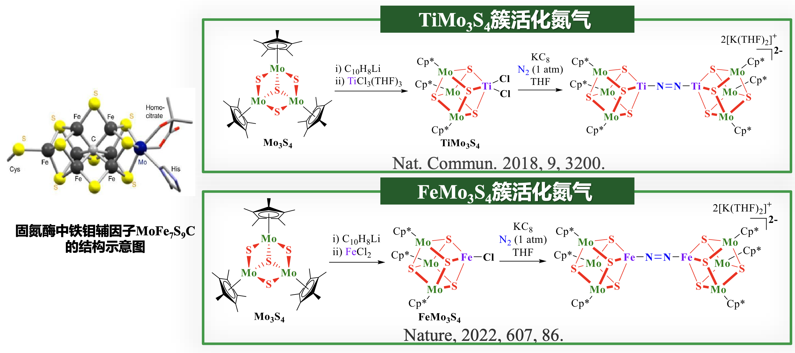
###### 小结
卤素簇数量远不及羰基簇多。卤素簇中卤素的键合形式有端式、$\ce{\mu_2 -}$桥式和$\ce{\mu_3 -}$桥式。卤素簇的结构特点取决于卤素的特性，二核（直线形），三核簇（三角形）、六核（八面体）卤素簇研究较多。
#### 金属硫簇
金属硫簇是一类重要的金属原子簇，其中硫元素多以无机硫供体基团或有机硫配体的形式配位于过渡金属中心，并与金属原子共同组成原子簇的多面体骨架。
金属硫簇的**主要合成策略**包括：单核簇之间的组装反应，双多核簇自身或相互重组生成更高核簇，配体或金属中心的调变生成新簇，及高核金属硫簇的拆分反应。

> [!quote] 金属硫簇中M和S的键合形式
> 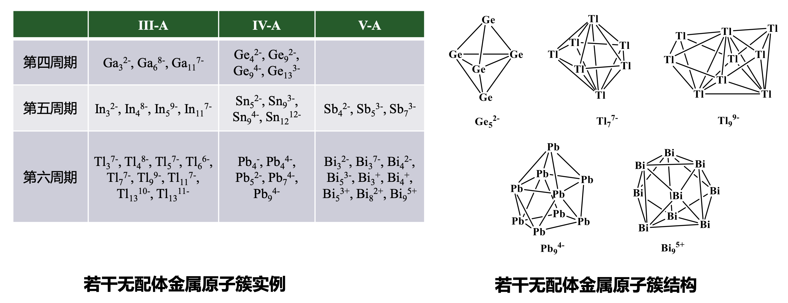

金属硫簇是一类重要的金属原子簇，其在生物酶和生物蛋白中作为起重要作用的活性中心的模型化合物进行研究。金属硫簇包括两类：一是**有机硫配体的硫原子作为配位原子**的金属硫簇；另一是**无机硫供体基团的硫原子代替了部分金属原子**的金属硫簇。
##### 二核金属硫簇
这是一类由有机硫配体的硫原子作为配原子的金属硫簇，硫原子上连有有机基团，而金属原子中心连有其他配体。这类结构与$\ce{[Fe-Fe]}$氢化酶活性中心有非常大的相似性，因而受到广泛研究和关注。
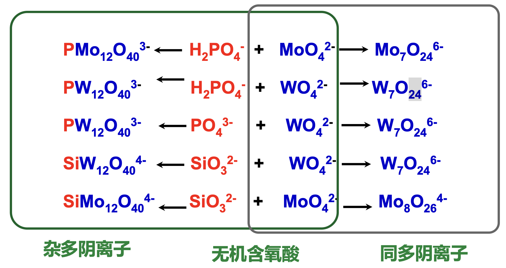
##### 三核金属硫簇
$\ce{Fe3S4}$原子簇是典型三核金属硫簇，$\ce{Fe3S4}$中心有**直线型**和**缺位立方烷型**两种几何构型，其中金属中心同时连有无机硫供体基团和有机硫配体。这类结构自然界中常见，由内部铁硫中心和外侧的氨基酸残基组成。这些**低级铁硫簇**可以按照一定规则形成更高级的**高核铁硫簇或杂金属硫簇**。
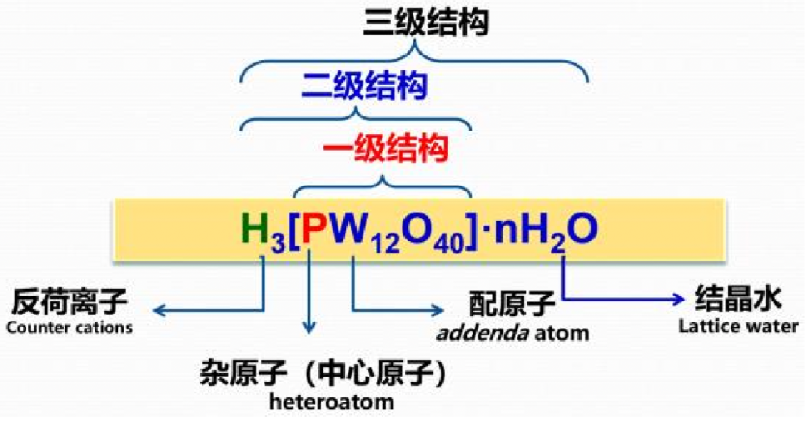
##### 四核金属硫簇
**四核硫簇**是诸多金属硫簇中被研究最多的一类结构，尤其是核心部分具有$\ce{M4S4}$形式的原子簇。这是由于**固氮酶活性中心钼铁辅基**结构中含$\ce{MFe3S3C (M = Mo, Fe)}$不完整类立方烷二聚体，金属硫簇是活性中心，因此$\ce{M4S4}$原子簇作为固氮酶活性中心的模型化合物受到了特殊重视。
$\ce{M4S4}$金属硫簇中，金属原子占据四面体4个顶点，4个面上各加一个S原子顶，从而构成$\ce{M4S4}$多面体骨架，也可以看成是畸变立方体，金属原子和硫原子相间占据立方体的8个顶点。这种几何形状类似于碳氢立方烷$\ce{C8H8}$，因此$\ce{M4S4}$原子簇也称**类立方烷原子簇**。
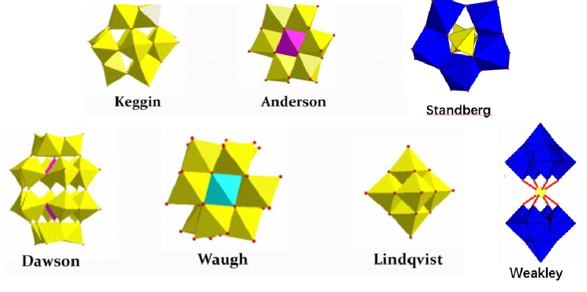
$\ce{M4S4}$金属硫簇可用于构筑更高核铁硫簇，还涉及电子传递、固氮过程等生物化学过程，其中铁具有**多种价态**，可以作为反应电子源或受体，因此在金属硫簇氧化还原过程中具有重要作用。
$$\ce{ Fe_{4}S_{4} <=>[-e][+e][Fe_{4}S_{4}]+<=>[-e][+e] [Fe_{4}S_{4}]^{2+}<=>[-e][+e][Fe_{4}S_{4}]^{3+}}$$
$\ce{[Fe4S4]^2+}$形式上应由2个$\ce{Fe^2+}$和2个$\ce{Fe^3+}$组成。但实验表明四个铁离子都处于**同种氧化态**，即$\ce{Fe^{2.5+}}$，这是因为在此混价金属硫簇中多余电子是不定域的，两个铁中心之间为纯粹的铁磁耦合。
##### 金属硫簇骨架的常见结构
平面型或蝴蝶型$\ce{M2S2}$簇可通过不同组装方式形成线型双菱形四元环$\ce{M3S4}$簇、缺位立方烷型$\ce{M3S4}$簇、类立方烷型$\ce{M4S4}$簇、竹排型$\ce{M6S10}$簇、双类立方烷型$\ce{M8S11}$簇等各种金属硫簇。
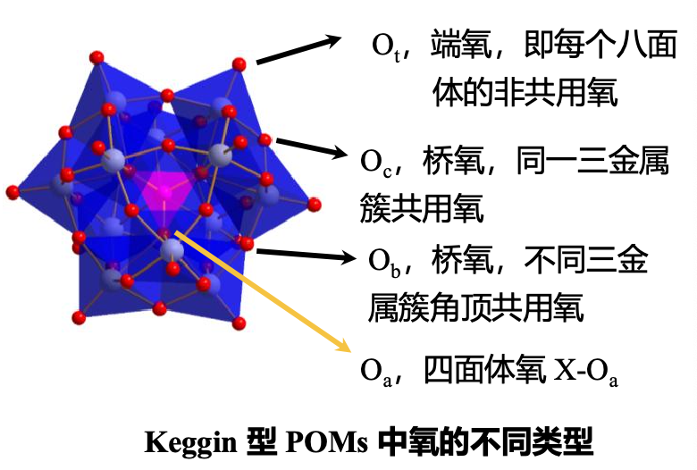
##### 金属硫簇的应用
**氢化酶**是一类能够可逆催化氢气的氧化和质子的还原的金属蛋白酶。
$\ce{[Fe-Fe]}$氢化酶活性中心结构由一个$\ce{Fe2S2}$簇和一个$\ce{Fe4S4}$立方烷簇构成，其中$\ce{Fe4S4}$立方烷簇通过一个半胱氨酸配体的硫原子与$\ce{Fe2S2}$簇中一个铁原子相连。
在催化过程中，$\ce{Fe4S4}$立方烷簇起电子传递的作用，$\ce{Fe2S2}$簇作为真正催化质子还原成氢气或活化氢分子的反应中心。在还原活化过程中，$\ce{Fe4S4}$立方烷簇中铁的价态由+2价变为+1价，将电子等当量地转移给$\ce{Fe2S2}$簇。 $\ce{Fe2S2}$簇含有$\ce{S, CN}$等配体，可以作为质子给体或受体的碱性基团。
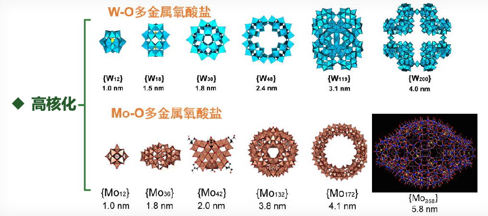
金属硫簇是一类重要的**固氮酶**模型
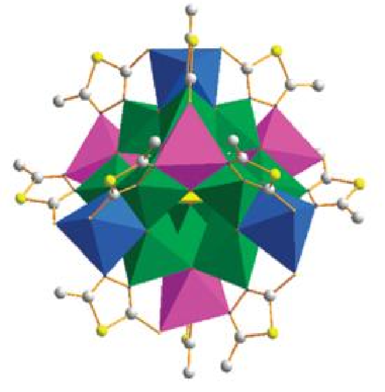
##### 小结
金属硫簇是一类重要的金属原子簇，是由硫和金属原子共同组成原子簇的多面体骨架；
金属硫簇中硫的键合形式有$\mu_{2}-$桥式、$\mu_{3}-$桥式和$\mu_{3}-$桥式；
金属硫簇作为生物酶和生物蛋白中起重要作用的活性中心的模型化合物进行研究，比如其是重要的氢化酶和固氮酶模型。
#### 无配体金属原子簇
无配体金属原子簇是一类不含任何配体的金属原子簇，分为阴离子簇和阳离子簇，结构为以三角面为基本结构单元的多面体，主要来自P区金属元素，如ⅢA族Ga/In/Tl、ⅣA族Ge/Sn/Pb和ⅤA族Sb/Bi。相较于前述几类含配体金属原子簇，无配体金属原子簇没有配体对于结构和稳定性的调控作用。
无配体金属原子簇与硼烷有很多相似之处，都是以三角面为基本结构单元的多面体，存在**闭式、开式和网式**的结构。
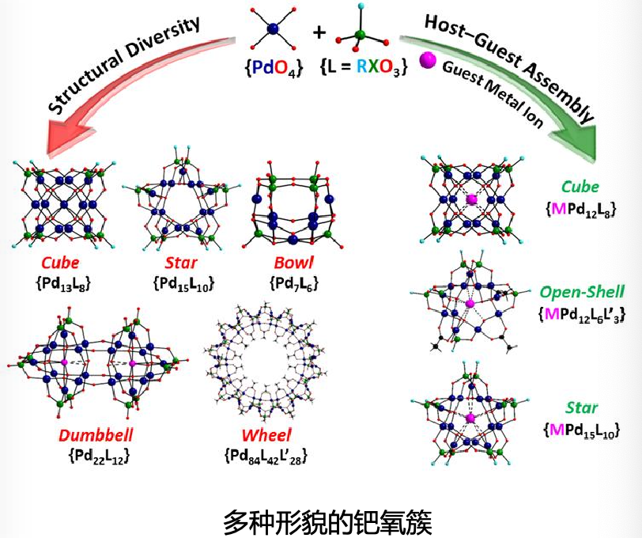
无配体金属原子簇的**合成方法**主要有两种：**溶液相合成法**和**高温固相合成法**。
**溶液相合成法**：通过Zintl相化合物和螯合剂在溶液相中制备。Zintl相化合物是一类具有丰富化学键和结构特征的极性金属间化合物，具有独特的阴离子框架以及弱束缚的阳离子。
$$\ce{KGe_{1.67}\xlongequal[乙二胺, THF]{ 2,2,2-crypt }(2,2,2- crypt-K2)Ge_{5}.THF}$$
**高温固相合成法**：通过高温固相条件下P区金属元素单质和其卤化物的歧化反应制备。
$$\ce{ 8Bi + 2BiCl_{3} + 3 HfCl_{4} \xlongequal[]{ 450^{\circ}C }[Bi_{9}]^{5+}Bi+([HfCl_{6}]^{2-})3}$$
### 第四节 金属氧簇
#### 多金属氧酸盐 POMs
金属$\ce{MO_x}$多面体（如$\ce{MO6, MO4}$等）单元彼此之间，或$\ce{MO_x}$多面体与非金属$\ce{ X}$和$\ce{ O}$形成的多面体 $\ce{XO_y}$之间，通过共角、边或面的方式相连接构成的化合物，称为**多金属氧酸盐 polyoxometalates**，更广义地被称为**金属氧簇 Metal-oxygen Clusters**。其中的金属M包括过渡元素：$\ce{Mo、W、V、Nb、Ta、Ti、Fe、Zr、Mn}$等，主族金属元素：$\ce{Al、Ga、Ge、Sn}$等，稀土元素：$\ce{La, Ce, Eu}$等；非金属元素包括$\ce{P、Si、As、Sb、I、S、B}$等。
早期称这类化合物为多酸，根据其组成不同分为同多酸和杂多酸。
- 同多酸 isopoly acid：由同种无机含氧酸根离子缩合得到的多酸；
- 杂多酸 heteropoly acid：由不同种无机含氧酸根离子缩合得到的多酸。
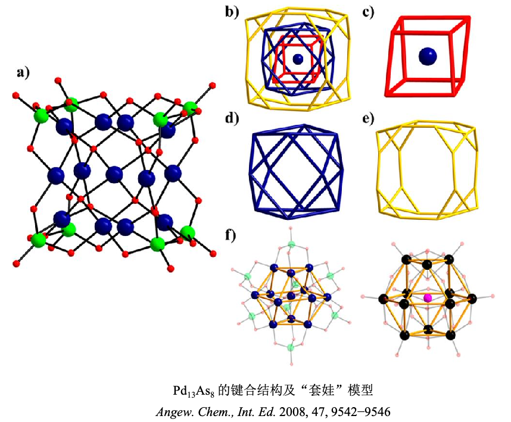
多金属氧酸盐的**特征**：
- 结构明确，且具有纳米尺寸（直径1~10nm）；
- 分子组成（可有70多种元素作杂原子）、结构、电荷（可实现-3到-33）均可调控；
- 具良好氧化还原性，存在多金属氧酸盐经历32个电子还原而结构保持不变；
- 酸性（可做强固体酸，酸强度可达100%硫酸的103 倍）、氧化还原性和热稳定性可调控；
- 富氧表面可活化和修饰，可实现有机-无机杂化和有机衍生化。
**应用**：催化剂；抗腐蚀涂膜；在有机导电或绝缘聚合物体系、溶胶-凝胶无机体系、织物染料涂料/墨水中作添加剂；记录材料；电子照相；光电或光学性氧化物膜前驱体；传感膜；选择性修饰电极；气体传感器；气体吸收与分离；固态电致变色；分析化学；电化学（燃料）电池；电容器；药物；磁性材料；等。
##### 基本结构模型
> [!hint] 多金属氧酸盐的3级结构
> 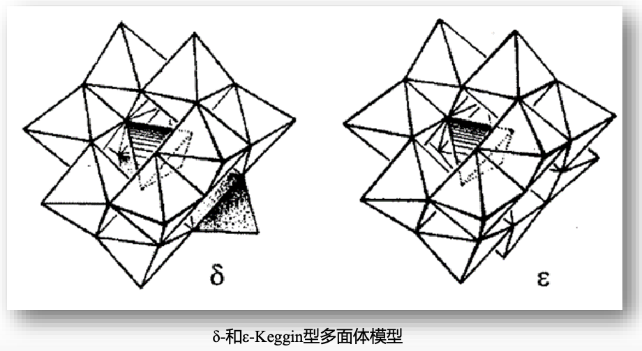

> [!quote] 经典多金属氧酸盐结构类型
> 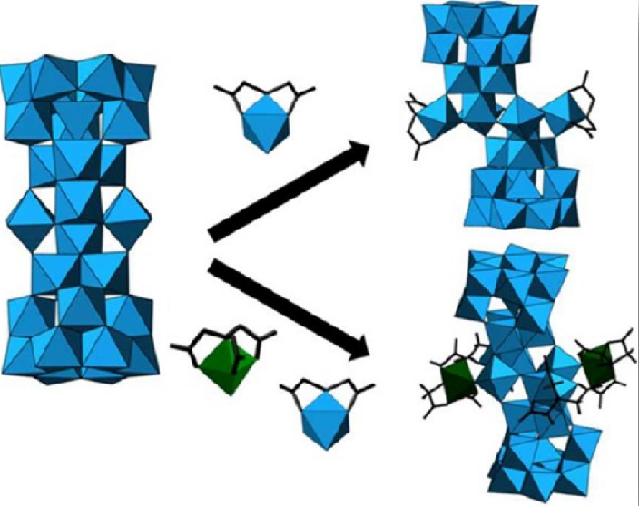
> 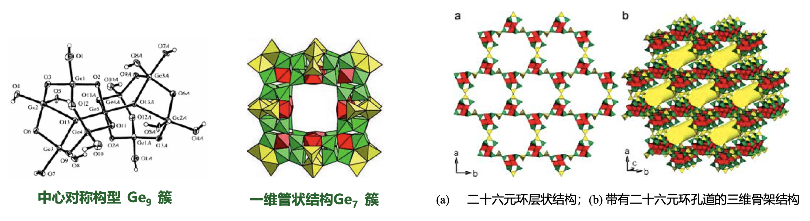

##### 多金属氧酸盐的衍生化
**缺陷型结构**：
- 前面所述八大基本结构类型的 POMs – **饱和结构**
- 去掉一个或多个金属后的 POMs – **缺陷型结构**
- 在缺陷位置配位填充其它金属原子，可达到**新饱和结构**
**有机-无机杂化**：
- POMs 阴离子与有机阳离子间通过离子键结合
- POMs 阴离子与配阳离子的中心金属配位
- POMs 表面通过共价键进行有机分子修饰
- POMs 与有机组分通过超分子作用进行杂化
##### 多金属氧酸盐的前沿研究热点
多金属氧酸盐的高核化

多金属氧酸盐阴离子为构筑单元的多维、多孔化
多金属氧酸盐的仿生化
多金属氧酸盐表面的有机修饰
多金属氧酸盐的结构手性
多金属氧酸盐的生物活性
多金属氧酸盐新的合成策略
多金属氧酸盐新的应用领域
#### 后过渡金属氧簇
与前过渡金属的多金属氧酸盐相比，后过渡金属氧化态相对较低，如形成同样的金属氧簇阴离子，负电荷密度过高难以稳定存在。因此将$\ce{O^2-}$换成低电荷物种如$\ce{F-, OH-, MeO-}$，可构筑类多酸型的后过渡金属氧簇。
##### 铁系过渡金属氧簇
$$\ce{ FeF_{3} + H_{2}O + Py + CH_{3}OH -> [Fe13O_{4}F24(OMe)12]^{5-}}$$
与经典的Keggin结构$\ce{[XM12O40^n-}$相比，除了与中心Fe原子相连的4个氧原子之外，24个桥联的$\ce{O^2-}$被替换为12个$\ce{F-}$和12个$\ce{MeO-}$，而且12个端氧$\ce{O^2-}$也被替换成$\ce{F-}$，大大降低了$\ce{Fe_13}$的负电荷密度。

> [!quote] 八帽 α-Keggin 型氧簇合阴离子
> $\ce{[Ni20(OH)24(MMT)12(SO4)]^2-}$ (MMT = 2-mercapto-5-methyl-1,3,4-thiadiazole/甲基巯基噻二唑)，结构以S为杂原子，12个Ni(II)围绕中心SO4四面体构成α-Keggin型结构，在每个三金属簇中共边镶嵌一个Ni(II)八面体，形成四个帽；在三金属簇之间共角镶嵌一个Ni八面体，也形成四个帽。
> 
##### 贵金属氧簇
贵金属催化剂，特别是含钯材料，是汽车尾气处理及重整生产高辛烷值汽油的主要催化剂。尽管相关研究已经接近两个世纪，这类材料的精确结构在亚纳米级别上仍不明确。
在纳米级别上，结构清晰的钯氧簇（POPs）受到人们的广泛关注，由于 POPs结构和组成的新颖性、溶液中的高稳定性，成为研究贵金属催化剂的理想模型。
在外加含氧酸根（如$\ce{AsO4^3−}$，$\ce{PO4^3−}$，$\ce{SeO3^2−}$等）作为杂原子的前提下，控制平面型 $\ce{Pd^{II}O4}$ 单元水解-缩合过程，获得多核$\ce{Pd^{II}-O}$ 簇，其纳米结构呈现多种形貌，如立方体（cube）、星状（star）、碗状（bowl）、哑铃状（dumbbell）、轮状（wheel）等。

除 Pd 之外，$\ce{[Pt^{III}12O8(SO4)12]^4−}$、$\ce{[Au^{III}4O4(AsO4)4]^8−}$以及含 $\ce{Fe^2+、Cu^2+、Ln^3+}$的贵金属氧簇也已发现，贵金属氧簇的成功合成有望在贵金属模型催化方面取得重要突破。

#### 主族元素氧簇
主族元素氧簇既包含$\ce{O-E-O}$键（E代表主族元素），也包含$\ce{\mu_2-OH-}$桥联以及同时存在水分子配位和简单含氧酸根桥联的氧簇，主要包括两个方面：一是从传统简单氧化物出发构筑链状、环状和笼状簇，二是合成类多酸型的主族元素氧簇。
##### 类多酸型
市售 PAC 是由 Al3+ 水解产生的一系列中间产物脱水聚合而成，其中稳定存在形态为ε-Keggin型聚十三铝$\ce{[Al12(AlO4)(OH)24(H2O)12]^7+}$ (简称$\ce{Al13}$)。

控制$\ce{Al^3+}$溶液陈化条件和反应时间可以进一步得到 $\ce{[Al30O8(OH)56(H2O)24]^18+(Al30)]}$，它还可以与含$\ce{Al^3+}$配离子或含$\ce{Al^3+}$及含 $\ce{Zn^2+}$的两种配离子结合，分别形成：
- $\ce{[(Al(IDA)H2O)2-(Al30O8(OH)60(H2O)22)](2,6-NDS)4(SO4)2Cl4(H2O)40}, \ce{Al_32}$
	- 其中$\ce{IDA}$ = iminodiacetic acid/亚氨基二乙酸, $\ce{2,6-NDS}$ = 2,6 napthalene disulfonate/ 2,6萘二磺酸根
- $\ce{[(Zn(NTA)H2O)2(Al(NTA)(OH)2)2(Al30(OH)60O8(H2O)20]-(2,6-NDS)5(H2O)64,Zn2Al32}$
	- 其中$\ce{NTA}$ = nitrilotriacetic acid
> [!quote] 从$\ce{ Al30}$制备$\ce{ Al32}$和$\ce{ Zn_{2}Al32}$
> 
##### 多种几何构型
与铝相比，锗可以通过丰富的配位模式(四配位、五配位和六配位)，与氧原子相连构筑成四面体、四方锥及八面体等多种几何构型，使之更容易形成原子簇。这些簇状化合物通过共用的氧顶点或其它配体的桥联作用拓展成不同的结构，如一维的链状和管状结构、二维的层状结构、三维网络结构。
- **中心对称构型$\ce{Ge9}$簇**中存在$\ce{[Ge9O14(OH)12]^4-}$阴离子，12 个端氧质子化形成 12 个羟基，阻止该阴离子簇进一步缩合，称为具有分立结构的阴离子氧簇。
- **一维管状结构$\ce{Ge7}$簇**中存在十二元环孔道，12个$\ce{Ge7}$簇通过共用氧原子形成$6^812^6$纳米笼，其空腔内存在$\ce{(H2O)16}$。
- 以**小分子有机胺为模板**还可以构筑**有序$\ce{(Ge, Si)10}$簇孔材料**，其中含有二十六元环孔道，主孔道尺寸达到 1.31 nm × 1.73 nm，尺度介于沸石分子筛和介孔分子筛之间，形貌类似于立方相介孔材料MCM-48。与 MCM-48 无序二氧化硅孔壁相比，该材料具有结晶性良好的孔壁。

##### 小结
金属氧簇具有独特的结构和组成，在催化领域具有广泛的应用前景；
新型金属氧簇的合成是学科发展的推动力；
多种技术引入到新型结构氧簇的合成中，推动后过渡金属氧簇和主族元素氧簇的发展；
理论计算加深对原子簇化合物组成、结构、成键和物理化学性质间的关系的理解，为功能性金属氧簇设计合成提供理论依据。
